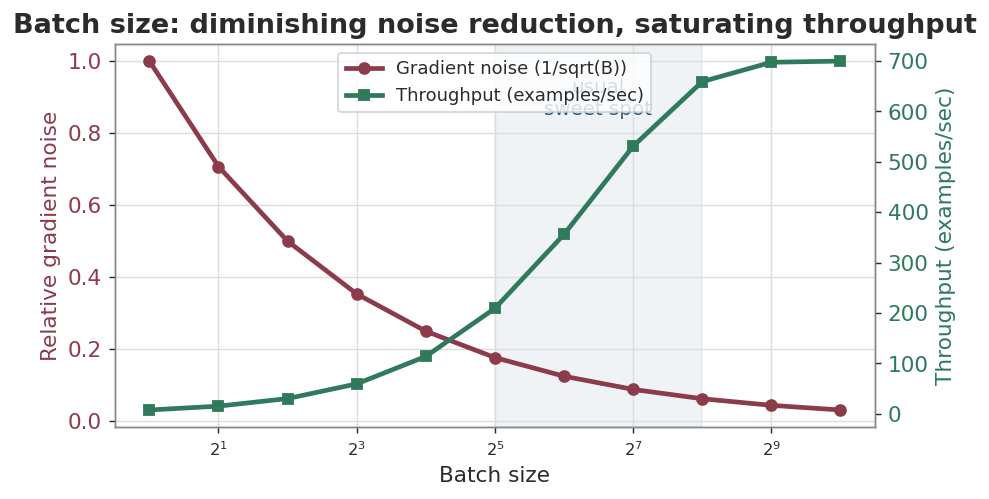
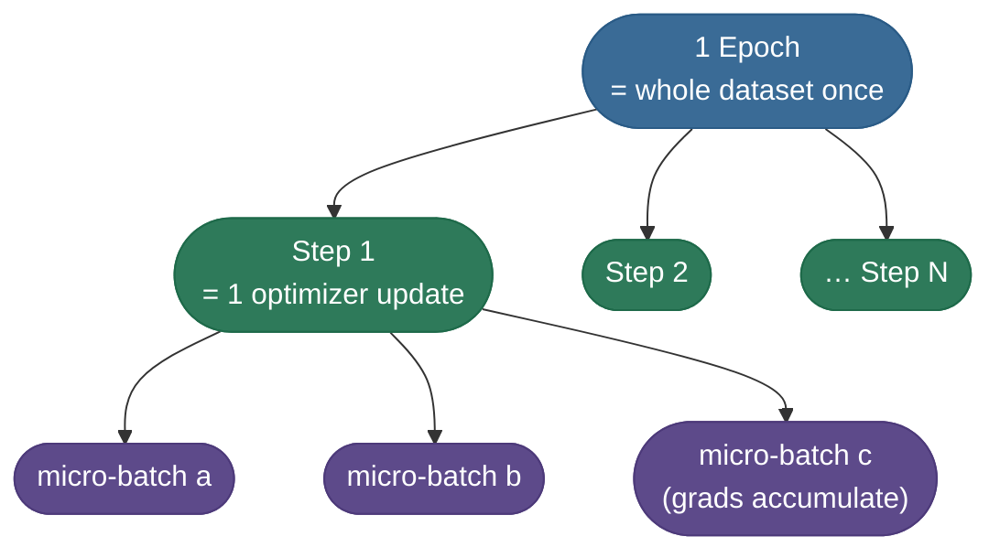
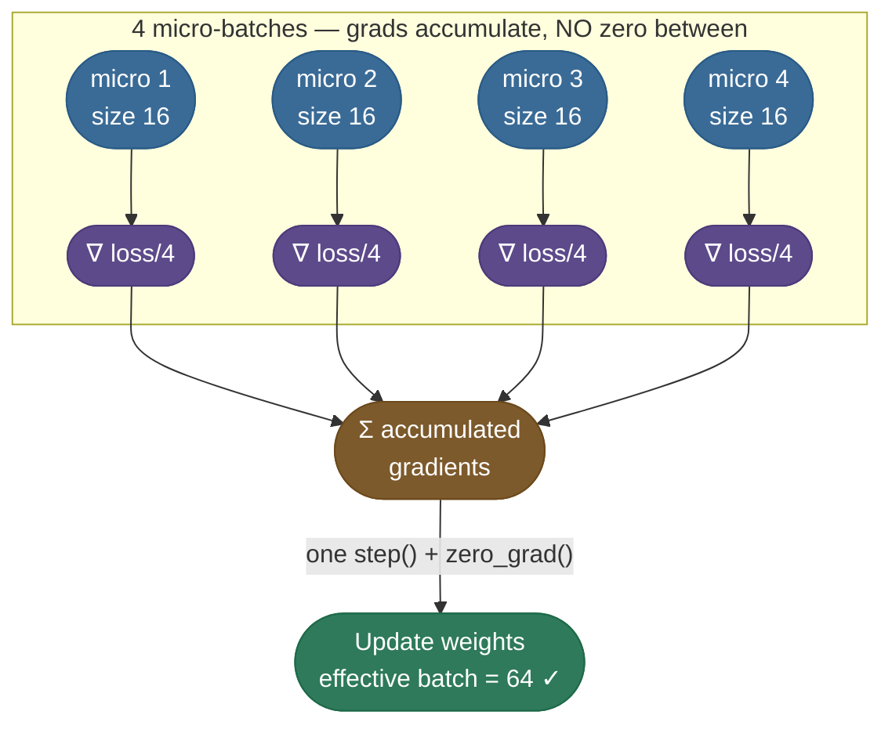
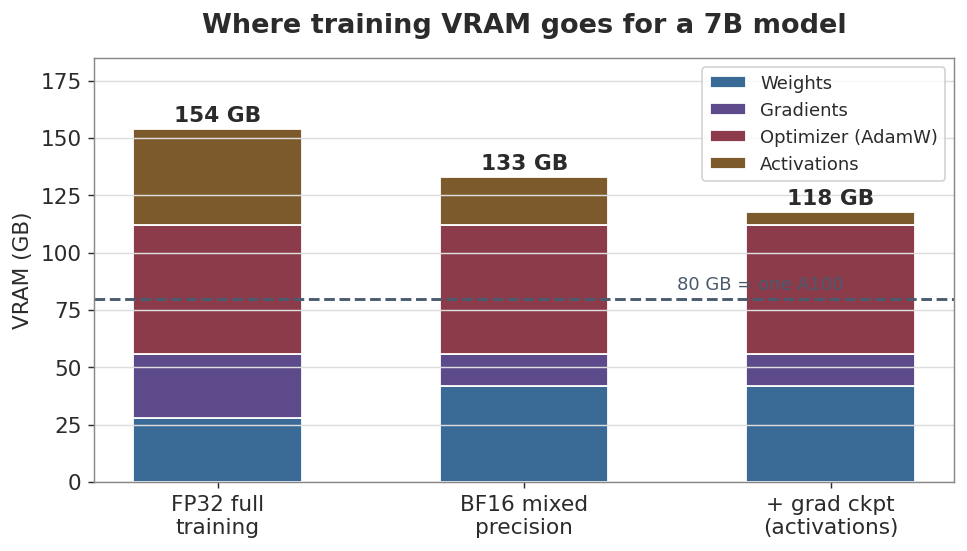

# Batching, precision and memory: the three levers that decide what fits

The [training loop](/ai-ml/ai-ml-learning-resources/model-building/pretraining/pretraining-the-training-loop) works on any batch that fits in memory. This chapter is about what *fits*: how big a batch to use and how to fake a bigger one, when to drop to 16-bit and what loss scaling rescues, and where the VRAM of a real training step actually goes. The main page proves the gradient-accumulation equivalence in code ([the math section](/ai-ml/ai-ml-learning-resources/model-building/pretraining/pretraining#the-math-the-lr-schedule-the-effective-batch-and-6nd)); here it is the mechanism and the numbers you feel on a single GPU.

---

## Batching & Gradient Accumulation

You never feed the whole dataset at once — it wouldn't fit in memory, and pure full-batch updates are slow. Instead you process **mini-batches**. The batch size is one of your most consequential knobs.

### The batch-size trade-off

| Batch size | Gradient quality | Speed / memory | Feel |
|---|---|---|---|
| **Tiny (1–8)** | Noisy, wandering | Low memory, many updates | Jittery; can escape bad minima |
| **Medium (32–256)** | Good estimate | The usual sweet spot | Stable, efficient |
| **Huge (1000s)** | Very smooth | Needs big GPUs; fewer updates | Stable but can generalize worse |

Larger batches give a *more accurate* gradient (an average over more examples), but the accuracy gain shrinks — going from 32→64 helps a lot, 2048→4096 barely moves the needle while doubling memory. The reason is statistical: a mini-batch gradient is an *estimate* of the true gradient, and the noise in that estimate falls like `1/√B`. **Quadrupling the batch only halves the noise.** Trace the numbers: at batch 32 the noise factor is `1/√32 ≈ 0.177`; at 128 it's `1/√128 ≈ 0.088` (4× the memory, half the noise); at 512 it's `1/√512 ≈ 0.044` (16× the memory of batch 32, only a *quarter* the noise). The first doubling buys a lot; the fourth buys almost nothing. Meanwhile throughput (examples processed per second) rises with batch size only until the GPU is saturated, then flattens. Put the two curves together and the sweet spot is obvious — big enough that the GPU is busy, not so big that you're paying memory for noise reduction you can't feel:

*Source: gradient-noise scaling & the critical batch size — McCandlish et al., 2018 — An Empirical Model of Large-Batch Training ([arXiv](https://arxiv.org/abs/1812.06162))*



### One epoch, many steps, many micro-batches

Three words get tangled constantly — pin them down once. A **batch** (more precisely a *micro-batch*) is the chunk of examples in one forward/backward pass. A **step** (or *iteration*) is one optimizer update — possibly accumulating several micro-batches first. An **epoch** is one full pass over the entire training set. You schedule training in epochs but reason about optimization in steps.



### When the batch you want won't fit: gradient accumulation

Say the math says "use batch 64" but your GPU only fits 16. **Gradient accumulation** simulates the big batch: run 4 micro-batches of 16, let their gradients *accumulate* (don't zero between them), then take **one** optimizer step. Effective batch = `micro_batch × accum_steps = 16 × 4 = 64`. TinyReg's code below uses exactly this — `MICRO=32, ACCUM=4`, an effective batch of **128** — on a machine that could trivially fit 128 directly, purely so the mechanism is visible. Put a number on what that buys: by the `1/√B` rule, a single micro-batch of 32 has gradient-noise factor `1/√32 ≈ 0.177`, while the accumulated effective batch of 128 has `1/√128 ≈ 0.088` — **half the noise per step**, for four times the forward/backward work but the *same* peak memory as one micro-batch of 32. That is the whole trade: you pay in wall-clock time to buy a gradient as clean as a batch your GPU could never hold at once.



> **Warning:** Divide each micro-batch loss by `accum_steps` before `backward()`. Otherwise you sum 4 full losses and your *effective* learning rate is silently 4× too big — a classic cause of a loop that diverges only when you turn accumulation on. (See TinyReg's code: `loss = loss_fn(...) / ACCUM`.)

> **Note:** Gradient accumulation trades time for memory — it's slower per effective step (4 forward/backward passes instead of 1), but it lets a small GPU train at a large effective batch size. This is exactly how a single consumer card mimics a multi-GPU batch.

---

## Mixed Precision & Loss Scaling

By default PyTorch trains in FP32 (4 bytes per number). But modern GPUs run **2–3× faster** in 16-bit, and use **half the memory** for activations. **Mixed precision** keeps a master copy of the weights in FP32 while doing the heavy matmuls in FP16/BF16 — best of both worlds.

### FP16 vs BF16 — the one slide

| Format | Bits (sign/exp/mantissa) | Strength | Weakness |
|---|---|---|---|
| **FP16** | 1 / 5 / 10 | High precision in a narrow range | **Tiny range** — small gradients underflow to 0 |
| **BF16** | 1 / 8 / 10 | Same *range* as FP32 — almost no overflow/underflow | Slightly less precision |

FP16's narrow exponent (5 bits) is the catch: gradients smaller than ~`6e-8` round to **zero** and vanish. **That's why FP16 needs a trick — loss scaling — that BF16 mostly doesn't.** The full numerics are in [Loss Scaling for FP16 (4.11)](/ai-ml/ai-ml-intuitions/training-stability/numerical-stability/loss-scaling-intuition).

### Loss scaling — rescuing the tiny gradients

The fix is delightfully simple: **multiply the loss by a big number (e.g. 1024) before `backward()`**. By the chain rule, *every* gradient is multiplied by 1024 too — lifting the tiny ones up out of the underflow zone. Then, right before the optimizer step, **divide the gradients back down by 1024**. The math is unchanged; the bits survive the trip.

*Source: Micikevicius et al., 2017 — Mixed Precision Training ([arXiv](https://arxiv.org/abs/1710.03740))*


In practice you never hand-code this. PyTorch's `torch.cuda.amp.GradScaler` + `autocast` do it for you (it even auto-tunes the scale factor and skips steps that overflow):

```python
# GPU-only: mixed precision needs a CUDA device.
scaler = torch.cuda.amp.GradScaler()
for x, y in loader:
    with torch.autocast("cuda", dtype=torch.float16):   # matmuls run in FP16
        loss = loss_fn(model(x), y)
    scaler.scale(loss).backward()      # scale up, then backward
    scaler.step(optimizer)             # unscale + step (skips if overflow)
    scaler.update()                    # adjust the scale factor
    optimizer.zero_grad()
```

> **Note:** Use BF16 if your hardware supports it (Ampere/A100 and newer) — same range as FP32 means you often skip loss scaling entirely. Use FP16 + `GradScaler` on older cards (e.g. T4, V100). Either way the *master weights* stay FP32; only the matmuls drop to 16-bit.

---

## The Memory Budget: Where Your VRAM Actually Goes

Mixed precision and gradient accumulation are both *memory* levers — so it's worth seeing the full bill they're paying down. The most common beginner shock is "my 14 GB model won't train on a 24 GB GPU." The weights are never the problem; **training overhead is.** Four things live in VRAM at once during a step:

| Component | Size for a 7B model (FP32) | What it is |
|---|---|---|
| **Weights** | ~28 GB | The parameters themselves |
| **Gradients** | ~28 GB | One `∂loss/∂w` per weight (same shape as weights) |
| **Optimizer state** | ~56 GB | AdamW's `m` and `v`, two FP32 numbers per weight |
| **Activations** | varies with batch & length | Cached forward values needed for backprop |

Let's add it up for the 7B model, since the arithmetic is the whole lesson. In FP32 (4 bytes/number): weights `7B × 4 = 28 GB`; gradients another `28 GB` (one per weight); AdamW's two moments `2 × 7B × 4 = 56 GB`; plus activations that grow with batch and sequence length — call it ~40 GB for a modest batch. **That's `28 + 28 + 56 + ~40 ≈ 152 GB` for a model whose weights are "only" 28 GB** — roughly 5× the naive estimate, and well past any single GPU. The same arithmetic at the **125M** scale (the model most people actually train first) lands on a card you own: weights `0.125B × 4 = 0.5 GB`, gradients another `0.5 GB`, AdamW state `2 × 0.125B × 4 = 1.0 GB`, plus maybe `1–2 GB` of activations — call it `≈ 3.5 GB`, comfortably inside an 8 GB consumer GPU. Notice the *shape* is identical at both scales: optimizer state is the tallest fixed bar (`1.0 GB` here, `56 GB` for 7B), always `4×` the weight bytes in plain FP32 AdamW (`4` for the weights, `4+4` for `m` and `v`). The chart makes the proportions concrete and shows what each memory lever buys: mixed precision shrinks the weight/gradient/activation bands, and **gradient checkpointing** (recomputing activations in the backward pass instead of storing them) collapses the activation band almost entirely — trading ~30% more compute for a large memory saving.

*Source: weights + gradients + optimizer-state memory breakdown — Rajbhandari et al., 2019 — ZeRO: Memory Optimizations Toward Training Trillion Parameter Models ([arXiv](https://arxiv.org/abs/1910.02054))*



The lesson the chart makes obvious: **the optimizer state is the single biggest consumer** — bigger than the weights. That's the deep reason behind two whole families of techniques. *Parameter-efficient* methods like [LoRA (7.02)](/ai-ml/ai-ml-intuitions/scaling-adaptation-and-efficiency/adaptation/lora-intuition) (covered in [Fine-Tuning](/ai-ml/ai-ml-learning-resources/model-adaptation/fine-tuning/decide-whether-to-fine-tune)) train tiny adapters so there's almost no optimizer state to store; *distributed* methods (FSDP / ZeRO, below) shard that optimizer state across GPUs instead of replicating it. Both attack the tallest bar first.

> **Note:** Activation memory scales with batch size × sequence length, not parameter count — which is why long-context training is so memory-hungry and why gradient checkpointing targets exactly that band. The weight and optimizer bands, by contrast, are fixed once you choose the model.


Next: [Schedule, clipping and checkpoints](/ai-ml/ai-ml-learning-resources/model-building/pretraining/pretraining-schedule-clipping-and-checkpoints).

---

## References and further reading

Shared with the topic's companion file — see [Pretraining at Scale — references and further reading](/ai-ml/ai-ml-learning-resources/model-building/pretraining/pretraining#references-further-reading) (the training-loop, optimizer, mixed-precision, scheduling and sharding entries harvested with these chapters).
