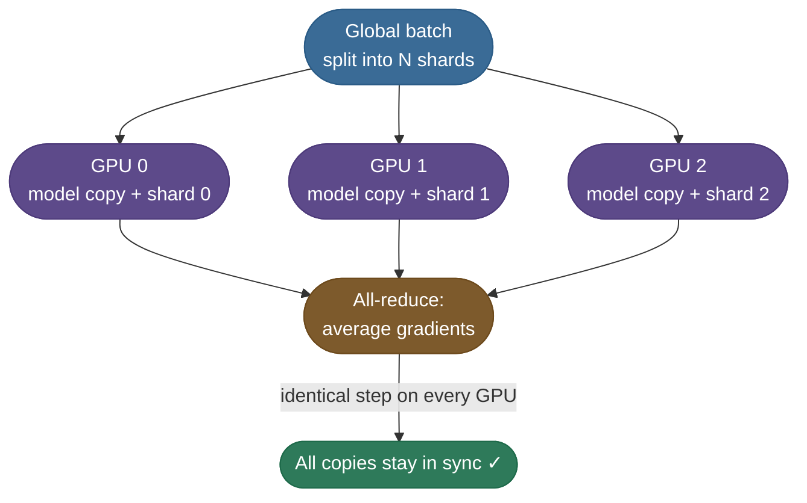
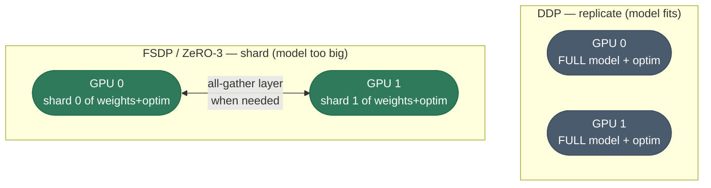
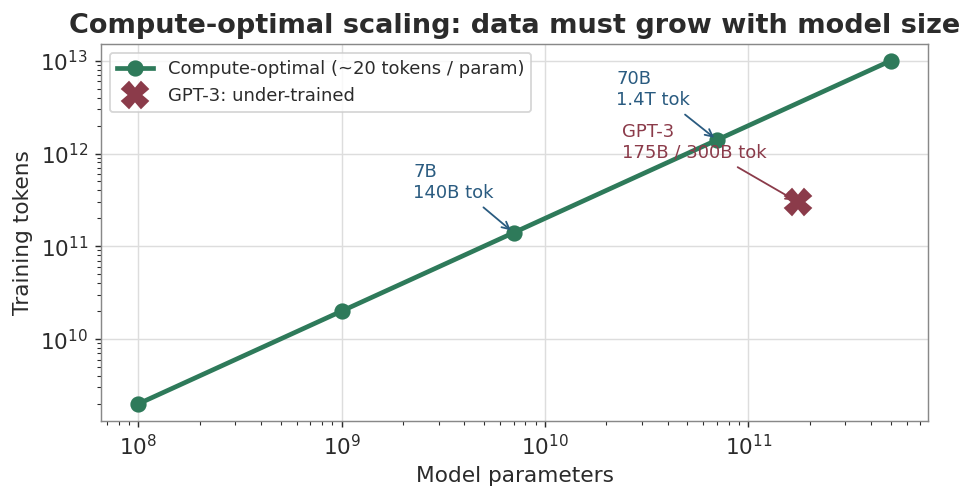

# Scaling out: DDP, FSDP and the Chinchilla rule

The loop body never changes when you add GPUs; only the wrapper around the model does. The [main page](/ai-ml/ai-ml-learning-resources/model-building/pretraining/pretraining#stage-2--parallelism-one-model-a-thousand-gpus) covers the full menu — data, tensor and pipeline parallelism, ZeRO sharding, 3D parallelism. This chapter keeps to the two wrappers a practitioner reaches for first, with the code to launch them, and the one rule that decides how much data the scaled-up run should see.

## Scaling Up: Multi-GPU & Compute-Optimal

Once your single-GPU loop works, scaling is about two questions: *how do I train faster with more hardware?* and *given a fixed compute budget, how big a model and how much data should I choose?*

### Data parallelism — the intuition

The simplest way to use N GPUs is **data parallelism**: put a full copy of the model on each GPU, send each a different slice of the batch, then **average their gradients** before the step so all copies stay identical.



In PyTorch this is `DistributedDataParallel` (DDP) — near-linear speedup, and the right default whenever the model *fits* on one GPU. Its limit is that every GPU holds a *full copy* of the weights, gradients, and (the big one) optimizer state. **The moment the model is too big for one card, replication stops working.**

The loop body is unchanged — you wrap the model and launch with `torchrun`. This is the multi-GPU reference (it needs real GPUs, so it isn't run here):

```python
# Multi-GPU data parallelism with DDP. Launch with: torchrun --nproc_per_node=4 train.py
import os, torch, torch.distributed as dist
from torch.nn.parallel import DistributedDataParallel as DDP

dist.init_process_group("nccl")                      # one process per GPU
local_rank = int(os.environ["LOCAL_RANK"])
torch.cuda.set_device(local_rank)

model = MLP().cuda(local_rank)
model = DDP(model, device_ids=[local_rank])          # gradients are all-reduced automatically
# ...the SAME five-line loop as TinyReg below; DDP averages grads across GPUs on .backward()
```

For a higher-level launcher that also handles mixed precision and FSDP from one config, most practitioners use Hugging Face `accelerate` (`accelerate launch train.py`) — same loop, the wrapper does the distributed plumbing.

### When the model itself won't fit: sharding (FSDP / ZeRO)

The fix is to stop replicating and start **sharding**. Instead of every GPU holding the whole model, each GPU owns only a *slice* of the parameters, gradients, and optimizer state. When a layer is needed for the forward or backward pass, the GPUs briefly *gather* its full weights over the network, use them, then drop the pieces they don't own. This is **FSDP** (Fully Sharded Data Parallel) in PyTorch, equivalent to DeepSpeed **ZeRO** stage 3. It attacks the tallest memory bar — the optimizer state — first.



The trade-off is the usual one: sharding adds communication (you gather weights on the fly) in exchange for fitting models many times larger than a single GPU. In practice you reach for `accelerate` or `torchrun` to launch these — the loop body stays the same five lines; only the wrapper around the model changes.

### The Chinchilla insight: data matters as much as size

For years the race was "more parameters." Then DeepMind's **Chinchilla** paper showed most large models were badly *under-trained*: given a fixed compute budget, you should scale **model size and training tokens *together*** — the deeper story is in [Neural Scaling Laws / Chinchilla (7.01)](/ai-ml/ai-ml-intuitions/scaling-adaptation-and-efficiency/scaling-behavior/neural-scaling-laws-and-chinchilla-intuition). The rule of thumb that came out of it:

> **Train on roughly 20 tokens per parameter.** A compute-optimal 70B model wants ~1.4 **trillion** tokens — not a few hundred billion.

*Source: Hoffmann et al., 2022 — Training Compute-Optimal Large Language Models (Chinchilla) ([arXiv](https://arxiv.org/abs/2203.15556))*

| Model | Parameters | Compute-optimal tokens (~20×) |
|---|---|---|
| 1B | 1 × 10⁹ | ~20 billion |
| 7B | 7 × 10⁹ | ~140 billion |
| 70B | 7 × 10¹⁰ | ~1.4 trillion |

Plotted, the compute-optimal frontier is a clean line on log-log axes — and famously under-trained models sit *below* it. GPT-3 (175B parameters, ~300B tokens) is the textbook example: by the Chinchilla rule it should have seen ~3.5 trillion tokens, so it was trained on roughly a tenth of its compute-optimal data. DeepMind's 70B Chinchilla, trained *on* the line, then beat it.



> **Note:** Chinchilla reframed training economics: a smaller model trained on more data often **beats** a bigger model trained on less, at the same compute cost — and it's cheaper to serve afterward. "Compute-optimal" means balancing parameters and tokens, not maxing out either one.


Next: [TinyReg end to end](/ai-ml/ai-ml-learning-resources/model-building/pretraining/pretraining-tinyreg-end-to-end).

---

## References and further reading

Shared with the topic's companion file — see [Pretraining at Scale — references and further reading](/ai-ml/ai-ml-learning-resources/model-building/pretraining/pretraining#references-further-reading) (the training-loop, optimizer, mixed-precision, scheduling and sharding entries harvested with these chapters).
