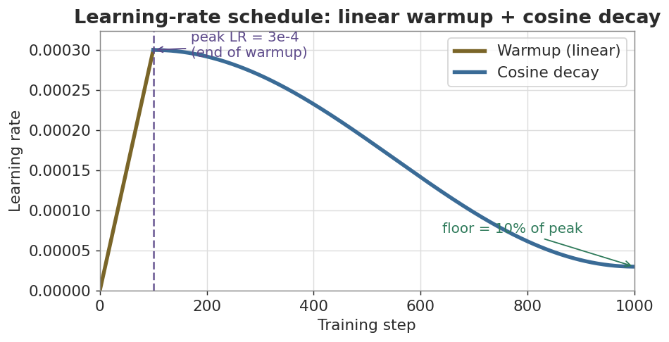
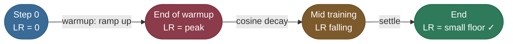
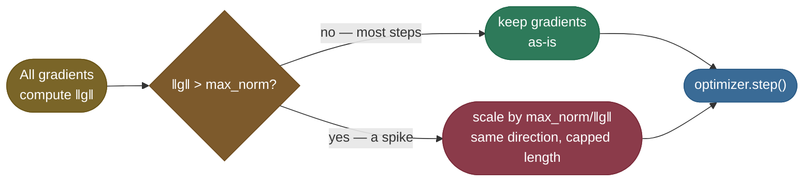
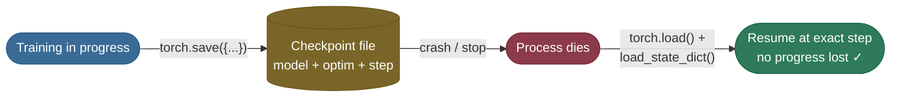
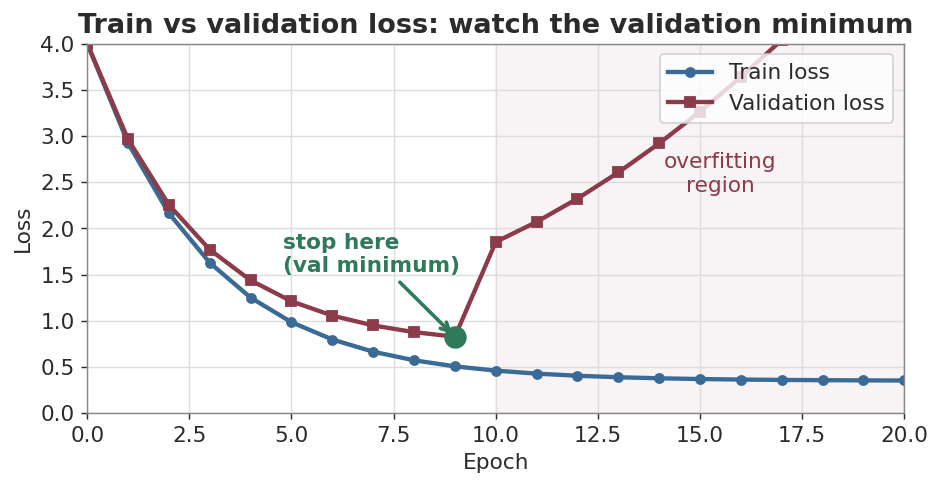

# Schedule, clipping and checkpoints: keeping a run alive

Three bookkeeping habits separate a loop that trains once from a run that survives days: a learning-rate schedule that warms up and decays, a gradient clip that stops one bad batch from wrecking the weights, and a checkpoint that holds everything needed to resume. The fourth habit is watching the right plot. The [main page](/ai-ml/ai-ml-learning-resources/model-building/pretraining/pretraining) derives the schedule and names the failure modes; this chapter shows each one on TinyReg's own numbers.

---

## Learning-Rate Schedule & Warmup

The learning rate (LR) is **the most important hyperparameter** — and the best practitioners don't keep it constant. They **warm it up**, then **decay it down**. Two problems, two fixes (the full menu of schedules is in [Learning Rate Schedules (2.09)](/ai-ml/ai-ml-intuitions/learning-and-optimization/adaptive-optimization/learning-rate-schedules-intuition)):

- **Early on, the weights are random.** A full-speed LR can send them flying into a bad region. So you **warm up**: start at ~0 and ramp linearly to the peak over the first few hundred steps. The model finds the rough direction before it sprints.
- **Late in training, you're near a good minimum.** A big LR now just bounces you around it. So you **decay** (cosine is the standard) toward a small floor, letting the model settle precisely.

Why decay matters is easiest to *see* in a narrow valley. The animation below runs steepest descent on the Rosenbrock "banana" function — a long, curved trough — and the path **zig-zags** across the valley walls, overshooting from side to side because each step is too large for the curvature. That oscillation is precisely what a decaying learning rate calms: big steps early to travel down the trough, then progressively smaller steps to stop bouncing and settle into the minimum:


*Steepest descent on the Rosenbrock function zig-zags across a narrow valley — the oscillation a decaying learning rate is designed to damp. Source: [P.A. Simionescu, Wikimedia Commons](https://commons.wikimedia.org/wiki/File:Banana-SteepDesc.gif), licensed CC BY-SA 3.0.*

*Source: cosine decay — Loshchilov & Hutter, 2016 — SGDR: Stochastic Gradient Descent with Warm Restarts ([arXiv](https://arxiv.org/abs/1608.03983)); linear warmup — Goyal et al., 2017 — Accurate, Large Minibatch SGD ([arXiv](https://arxiv.org/abs/1706.02677))*

Trace TinyReg's own schedule to see the shape in numbers (peak `1e-2`, 60 warmup steps out of 600, floor `1e-3`): step 0 starts at `0.00017`, step 30 is halfway up at `0.00517`, step 59 hits the peak `0.01000`, then cosine decay carries it down — step 300 is at `0.00628`, and the final step 599 lands on the floor `0.00100`. Those are the exact `lr` values you'll see printed in TinyReg's run later.

The curve below is the workhorse schedule used to pretrain most modern models — linear warmup into cosine decay:





| Phase | LR behavior | Why |
|---|---|---|
| **Warmup** (first ~1–5%) | 0 → peak, linear | Random weights need a gentle start; prevents early divergence |
| **Decay** (the rest) | peak → floor, cosine | Big steps to explore, then small steps to settle into the minimum |

> **Note:** AdamW (Adam + decoupled weight decay) is the default optimizer for almost all modern training. Pair it with this warmup-then-decay schedule and you have the exact recipe behind GPT-style pretraining.

---

## Gradient Clipping: Seatbelt Against Exploding Gradients

Even with good initialization and a warmed-up LR, training has bad moments. One unlucky batch, a sharp cliff in the loss surface, or a numerical fluke can produce a gradient that is *enormous* — and a single giant step can fling the weights into a region the model never recovers from (you see it as a sudden `nan` or a loss that rockets upward and never comes back). This is the **exploding-gradient** problem, and it's especially common in deep nets and RNNs/transformers.

**Gradient clipping** is the seatbelt. Before the optimizer step, you measure the total *size* (the ***L2 norm***, the square-root-of-sum-of-squares length) of all gradients stacked together. If that norm exceeds a threshold (say `1.0`), you scale every gradient down proportionally so the norm equals the threshold — **preserving the direction of the update but capping its length**. Most steps are untouched; only the dangerous spikes get reined in. The full treatment is in [Gradient Clipping (4.10)](/ai-ml/ai-ml-intuitions/training-stability/gradient-health/gradient-clipping-intuition).

*Source: norm-based gradient clipping — Pascanu et al., 2013 — On the difficulty of training Recurrent Neural Networks ([arXiv](https://arxiv.org/abs/1211.5063))*



The whole thing is one line, placed **after `backward()` and before `step()`** (the gradients must already exist, and you want to clip them before they're applied):

```python
loss.backward()
torch.nn.utils.clip_grad_norm_(model.parameters(), max_norm=1.0)  # the seatbelt
optimizer.step()
```

> **Tip:** Clip by *norm* (`clip_grad_norm_`), not by value — clipping each gradient element independently distorts the update direction, while norm clipping rescales the whole vector and keeps it pointing the right way. A threshold of `1.0` is the near-universal default for transformer training; if you see frequent clipping it's a hint your LR may be too high.

---

## Checkpointing & Resuming

Training runs for hours or days. Machines crash, jobs get preempted, you want to pick the best epoch later. A **checkpoint** is a saved snapshot that lets you resume *exactly* where you stopped — and it must contain more than the weights.

### What a complete checkpoint holds

| Save this | Why you need it to resume |
|---|---|
| **Model `state_dict`** | The weights themselves — obviously |
| **Optimizer `state_dict`** | AdamW keeps running averages (momentum, variance) per weight; lose these and you restart the optimizer cold |
| **Scheduler state / step** | So the LR resumes at the right point on the curve |
| **Epoch / global step** | To continue counting, not restart from 0 |
| **(AMP) scaler state** | So loss scaling resumes correctly |



The pattern (full working version in [TinyReg end to end](/ai-ml/ai-ml-learning-resources/model-building/pretraining/pretraining-tinyreg-end-to-end)):

```python
# Save everything needed to resume — not just the weights.
torch.save({"step": step,
            "model": model.state_dict(),
            "opt": optimizer.state_dict()}, "ckpt.pt")

# Resume: rebuild the same architecture, then load.
state = torch.load("ckpt.pt")
model.load_state_dict(state["model"])
optimizer.load_state_dict(state["opt"])
start_step = state["step"]
```

> **Note:** Saving only `model.state_dict()` and reloading is fine for **inference**, but for **resuming training** you must also restore the optimizer state — otherwise AdamW's momentum starts at zero and you get a visible loss spike on resume. TinyReg's resume below reloads the full dict and reproduces the final validation loss to four decimals, which is the proof it was complete.

---

## Monitoring: Train vs Validation Loss

You can't improve what you don't watch. The single most important plot in all of training is **train loss and validation loss on the same axes**. It tells you whether the model is learning, and — crucially — whether it has started to **overfit**.

### Reading the curves

- **Train loss** measures fit on data the model *sees*. It almost always keeps falling — that alone proves nothing.
- **Validation loss** measures fit on **held-out** data the model never trains on. **This is the one that tells the truth.** The gap between the two curves *is* the [bias-variance / generalization (3.07)](/ai-ml/ai-ml-intuitions/objectives-and-evaluation/generalization/bias-variance-tradeoff-intuition) story, made visible.

| What you see | Diagnosis | Action |
|---|---|---|
| Both falling together | Healthy learning | Keep going |
| Train ↓, val flat then **↑** | **Overfitting** — memorizing, not generalizing | Stop at the val minimum; add regularization/data |
| Both stuck high | **Underfitting** — too small / LR wrong | Bigger model, more steps, tune LR |
| Loss = `nan` | Exploding gradients / bad init / LR too high | Lower LR, clip gradients, check init |

The classic picture: both curves dive together, then the validation loss **bottoms out and turns upward** while train loss keeps dropping. That turn is overfitting — and the bottom is exactly where you should stop (this is **early stopping**):



> **Important:** Always keep a validation split the model never trains on. Train loss going down feels great but is a vanity metric — a model with enough capacity can drive train loss to zero by pure memorization. The validation curve is your only honest signal, and its minimum is your stop sign.


Next: [Scaling out](/ai-ml/ai-ml-learning-resources/model-building/pretraining/pretraining-scaling-out).

---

## References and further reading

Shared with the topic's companion file — see [Pretraining at Scale — references and further reading](/ai-ml/ai-ml-learning-resources/model-building/pretraining/pretraining#references-further-reading) (the training-loop, optimizer, mixed-precision, scheduling and sharding entries harvested with these chapters).
