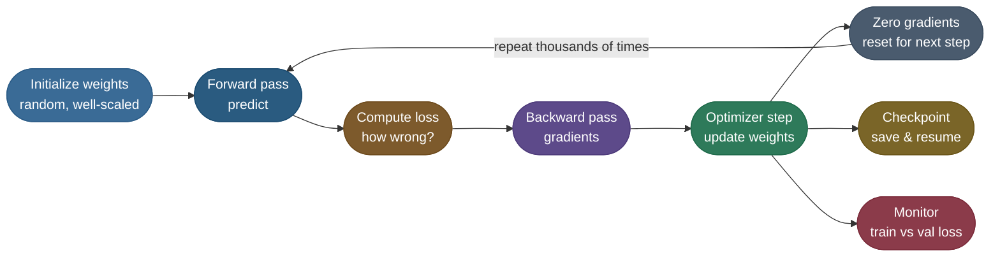
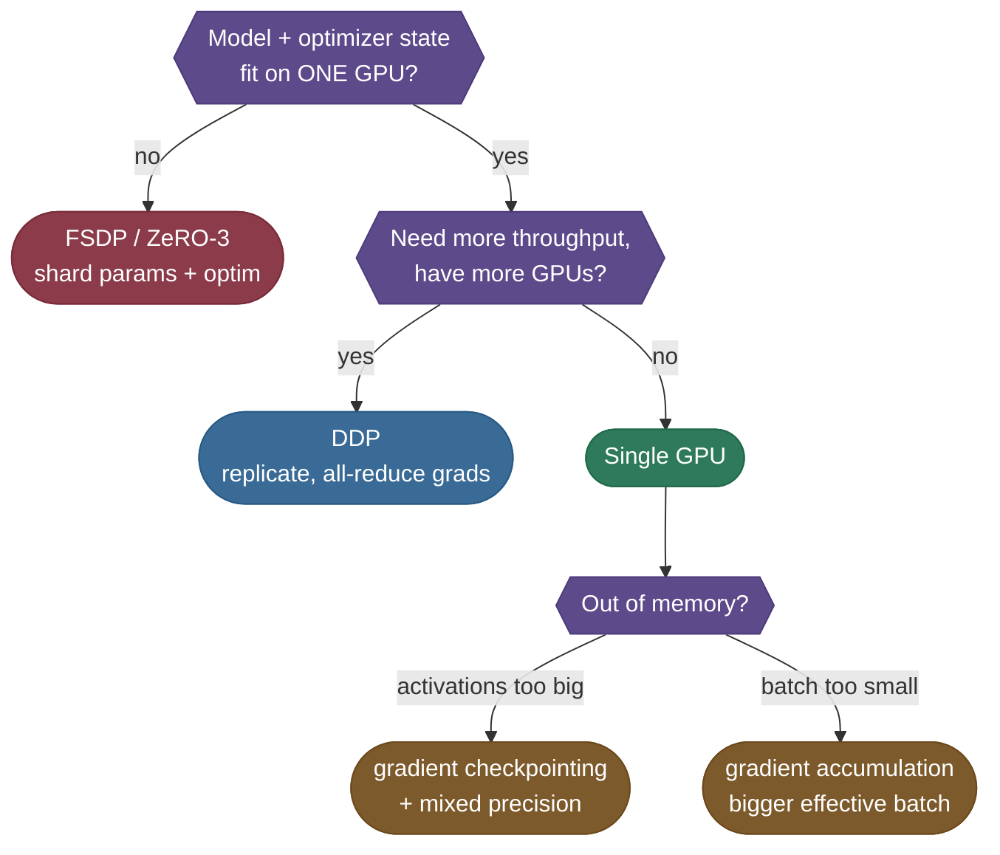
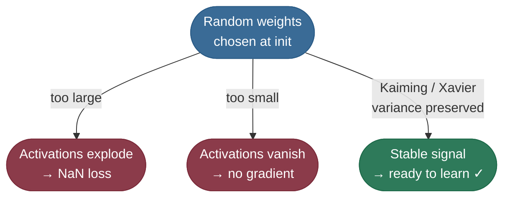
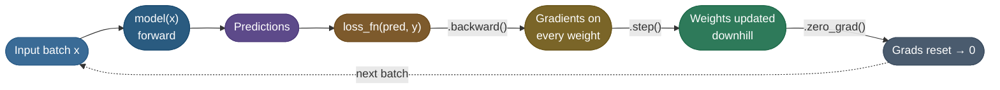
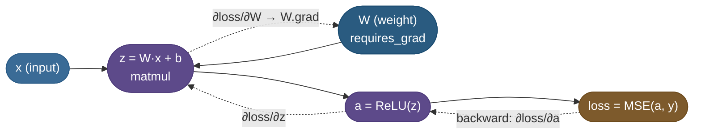
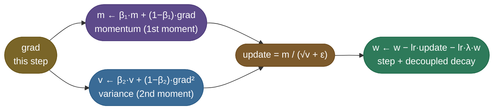

# The training loop: init, autograd and the optimizer step

The [main page](/ai-ml/ai-ml-learning-resources/model-building/pretraining/pretraining) treats pretraining as a systems problem: data pipeline, parallelism, a stable recipe, a budget. These five chapters go *underneath* that recipe and build the loop it runs, one mechanism at a time, on a model small enough to trace by hand.

Everyone draws a neural network as a stack of boxes — but the boxes don't *learn* on their own. Learning is a **loop** you run thousands of times, and every serious model on earth — a 7B LLM, a vision backbone, your tiny weekend project — is trained by the *same* five-line ritual: **forward → loss → backward → step → zero-grad**. By the end of these chapters you'll be able to write that loop from scratch, watch the loss actually fall, and understand *why* each piece exists — initialization that doesn't explode, the autograd graph that makes `.backward()` possible, what AdamW *actually* stores per weight, batching that fits your memory, mixed precision that doubles your speed, a learning-rate schedule that warms up and decays, gradient clipping that stops a single bad batch from wrecking the run, checkpoints you can resume from, and the one plot (train vs val loss) that tells you when to stop. We'll also size the **memory bill** of a real 7B model and learn the **Chinchilla** rule for how much data a model of a given size actually needs. This is **pretraining / full training from random weights** — fine-tuning a *pre-trained* model is its own recipe ([see the fine-tuning course](/ai-ml/ai-ml-learning-resources/model-adaptation/fine-tuning/decide-whether-to-fine-tune)).

Think of the loop as a feedback controller, not a recipe. The model makes a guess, the loss measures the error, the gradient says which direction reduces it, and the optimizer nudges the weights that way. Run that correction tens of thousands of times and a pile of random numbers becomes a model that predicts. Every "advanced" technique below is just a fix for one specific way that simple feedback loop breaks at scale — explosions, underflow, wasted memory, overfitting. Learn the failure each one prevents and the whole stack stops looking like magic.

To keep it concrete, we'll carry **one tiny model end-to-end** the entire way down: **TinyReg**, a small MLP that fits a noisy quadratic `y = 2x² − 3x + 1`. You'll watch it travel through every stage — initialized so it doesn't explode, trained through the five-line loop, its memory bill estimated, its learning rate warmed up and decayed, checkpointed, resumed, and finally scaled — and the runnable code near the end *is* TinyReg, with the exact numbers we quote along the way. One thread, init to resume.

The five chapters, in order:

1. **This chapter** — initialize weights, run the five-line loop, see what autograd records and what AdamW stores.
2. **[Batching, precision and memory](/ai-ml/ai-ml-learning-resources/model-building/pretraining/pretraining-batching-precision-and-memory)** — mini-batches, gradient accumulation, mixed precision and loss scaling, the VRAM bill.
3. **[Schedule, clipping and checkpoints](/ai-ml/ai-ml-learning-resources/model-building/pretraining/pretraining-schedule-clipping-and-checkpoints)** — warmup and cosine decay, gradient clipping, checkpoint and resume, train versus validation loss.
4. **[Scaling out](/ai-ml/ai-ml-learning-resources/model-building/pretraining/pretraining-scaling-out)** — DDP when the model fits, FSDP/ZeRO when it doesn't, and the Chinchilla rule for how much data to feed it.
5. **[TinyReg end to end](/ai-ml/ai-ml-learning-resources/model-building/pretraining/pretraining-tinyreg-end-to-end)** — the whole loop in eighty runnable lines, plus the troubleshooting gallery.

**The whole loop on one map** — each box below is a section, in order:



Read it as the spine of these chapters: the central cycle (forward → loss → backward → step → zero) is what *every* model trains on, and the two branches off the optimizer step — checkpointing and monitoring — are the bookkeeping that keeps a long run alive. Every section below zooms into one of these boxes.

### How big is your model? Single-GPU, DDP, or FSDP

Before you write a line of the loop, one decision shapes everything downstream: **does the model fit on one GPU, and if not, how do you split it?** The loop body is the *same* five lines in all three regimes — only the wrapper around the model changes. This table is where you're headed; the [Scaling Up section](/ai-ml/ai-ml-learning-resources/model-building/pretraining/pretraining-scaling-out) at the end builds each row out:

| | **Single GPU** | **DDP** (Distributed Data Parallel) | **FSDP / ZeRO-3** (sharded) |
|---|---|---|---|
| **When** | model + training state fit on one card | model fits, you want **N× throughput** | model is **too big** for one card |
| **What's replicated** | n/a | full model + optimizer on every GPU | nothing — each GPU owns a *shard* |
| **Communication** | none | all-reduce gradients each step | all-gather layer weights on the fly |
| **Memory per GPU** | the whole bill | the whole bill (just faster) | bill ÷ N (the big win) |
| **Launch** | `python train.py` | `torchrun` / `accelerate` | `accelerate` + FSDP config |

The three orthogonal *memory levers* you reach for in any regime — **gradient accumulation** (a bigger effective batch than fits), **mixed precision** (≈2× faster, half the activation memory), and **gradient checkpointing** (recompute activations to slash their memory) — each get their own section below. A quick map of which lever to pull when:



> **Tip:** Reach for **DDP** the moment your model fits on one GPU and you have more than one — it's near-linear speedup for a one-line wrapper. Only escalate to **FSDP/ZeRO** when the model itself won't fit, because sharding adds network communication you don't need until then.

### Setup and what a real run costs

Everything in these chapters' runnable code executes on **CPU in seconds** and downloads nothing — TinyReg needs only PyTorch. For real-scale training you'll want the standard stack:

```bash
uv pip install torch transformers datasets accelerate
# verified with: torch 2.12, transformers 5.10, datasets 5.0, accelerate 1.10
```

---

## Weight Initialization: Where the Loop Begins

Before the first forward pass, every weight is a number you have to *choose*. It feels harmless — "just random, right?" — but initialization is the difference between a model that learns and one that's dead on arrival. Pick values too big and activations blow up to infinity (or NaN); too small and the signal fades to zero by the last layer. Both kill learning before step 1.

### Why naive random fails

Imagine 50 layers, each multiplying the signal by some factor `k`:

| If each layer scales by… | After 50 layers | Result |
|---|---|---|
| `k = 1.1` | `1.1^50 ≈ 117` | **Exploding** activations / gradients |
| `k = 0.9` | `0.9^50 ≈ 0.005` | **Vanishing** signal — nothing to learn from |
| `k ≈ 1.0` | stays ~1 | Signal **preserved** — this is the goal |

The whole game of initialization is **keep the variance of activations roughly constant from layer to layer**, so gradients flow cleanly both ways. (***Variance*** here = how spread out a layer's outputs are; if it shrinks each layer, the signal dies, and if it grows, the signal blows up.)

*Source: Glorot & Bengio, 2010 — Understanding the difficulty of training deep feedforward neural networks ([PMLR](http://proceedings.mlr.press/v9/glorot10a.html))*

### The two schemes you actually use

Modern frameworks set sensible defaults, but you should know the two names:

| Scheme | Designed for | Rough rule | When |
|---|---|---|---|
| **Xavier / Glorot** | tanh, sigmoid | variance ∝ `1 / fan_in` | symmetric, saturating activations |
| **Kaiming / He** | **ReLU** & friends | variance ∝ `2 / fan_in` | the default for modern nets |

*Source: Xavier/Glorot — Glorot & Bengio, 2010 ([PMLR](http://proceedings.mlr.press/v9/glorot10a.html)); Kaiming/He — He et al., 2015 — Delving Deep into Rectifiers ([arXiv](https://arxiv.org/abs/1502.01852))*

Here ***fan-in*** is the number of inputs feeding a neuron. The `2` in Kaiming is there precisely because ReLU zeroes out half its inputs — you double the variance to compensate for the half you lost. For the full derivation of both schemes, see [Weight Initialization: Xavier & He (4.12)](/ai-ml/ai-ml-intuitions/training-stability/gradient-health/weight-initialization-intuition).

The diagram below shows the three fates your random weights can meet on the very first forward pass — two of them fatal, one of them the goal:



Read it as a fork in the road: only the bottom branch — variance preserved by Kaiming/Xavier — reaches "ready to learn"; the other two dead-end before step 1 even completes.

> **Note:** In PyTorch, `nn.Linear` already initializes with a Kaiming-style scheme, so you rarely call `nn.init.*` by hand. But when you build a custom layer — or see a loss of `nan` on step 1 — initialization is the first suspect. (TinyReg's code below still calls `kaiming_uniform_` explicitly, so the *why* is visible.)
>
> A sibling fix worth knowing: **normalization layers** like [Batch Normalization (4.01)](/ai-ml/ai-ml-intuitions/training-stability/normalization/batch-normalization-intuition) and [Layer Normalization (4.02)](/ai-ml/ai-ml-intuitions/training-stability/normalization/layer-normalization-intuition) re-center activations *during* the forward pass, making deep nets far less sensitive to the exact initialization. Good init gets you started; normalization keeps the variance in check as training proceeds.

---

## The Training Loop: Five Lines That Learn

This is the heart of everything. Once weights exist, learning is one loop body, run over and over. In PyTorch it's literally five operations:

```python
pred = model(x)              # 1. forward  — predict
loss = loss_fn(pred, y)      # 2. loss     — measure how wrong
loss.backward()              # 3. backward — compute gradients (autograd)
optimizer.step()             # 4. step     — nudge weights downhill
optimizer.zero_grad()        # 5. zero     — clear grads for the next step
```

### What each step actually does

| Step | Plain English | What it touches |
|---|---|---|
| **Forward** | Run inputs through the model to get predictions | activations |
| **Loss** | A single number: how far predictions are from truth | the scalar loss |
| **Backward** | Autograd walks the graph backward, filling `.grad` on every weight | gradients |
| **Step** | Optimizer moves each weight a little *against* its gradient | weights |
| **Zero-grad** | Reset `.grad` to zero — PyTorch **accumulates** grads by default | gradients |



### How `.backward()` knows what to do: the autograd graph

The line `loss.backward()` looks like one function call, but it's the payoff of something PyTorch built silently during the *forward* pass. Every time you multiply, add, or apply an activation, autograd records that operation and its inputs into a **computational graph** — a chain of "who computed whom." When you call `.backward()`, autograd walks that graph *in reverse*, applying the chain rule at each node to compute `∂loss/∂weight` for every weight. **That's all backpropagation is: the chain rule, executed automatically over a recorded graph.** For the math behind it, see [Backpropagation: The Chain Rule (2.02)](/ai-ml/ai-ml-intuitions/learning-and-optimization/gradients-and-credit-assignment/chain-rule-and-backpropagation-intuition); for how the graph is built and traversed, [Computational Graphs & Autograd (2.04)](/ai-ml/ai-ml-intuitions/learning-and-optimization/gradients-and-credit-assignment/computational-graphs-and-autograd-intuition).



Two consequences fall out of this and explain most autograd "surprises":
- **The graph is rebuilt every forward pass** (it's *dynamic*). That's why you can use plain Python `if`/`for` inside `forward()` — and why wrapping evaluation in `torch.no_grad()` saves memory: you tell autograd "don't bother recording, I won't call backward here."
- **Gradients land in each parameter's `.grad` and stay there** until you clear them. PyTorch *adds* to `.grad` rather than overwriting it — which is the root of both the #1 beginner bug below and the gradient-accumulation trick two sections down.

**What the first few turns of the loop actually look like.** Run TinyReg and the very first train losses it prints are `35.90 → 26.11 → 37.85 → 29.90 → 25.80 → 22.28 → 20.97` over steps 0–6. Two things to notice that recur in *every* real run: it starts huge (the model is random, so a target near `y ≈ 9` is wildly missed) and it is **not monotonic** — step 2 jumps *up* to 37.85 from 26.11. That bounce is not a bug; each step sees a different random mini-batch, so the loss is a *noisy* signal that only trends down. (By step 120 it's `0.06`, by step 599 it's `0.009` — the full trace is in the runnable code's `# Expected output` at the end.) Never panic at a single step that ticks upward; watch the trend over tens of steps.

### The #1 beginner bug: forgetting `zero_grad()`

PyTorch *adds* new gradients onto whatever is already in `.grad`. If you skip `zero_grad()`, step 2's gradient is `grad(1) + grad(2)`, step 3's is `grad(1) + grad(2) + grad(3)`, and your updates spiral out of control. **Always zero the grads** — once per optimizer step. (We'll deliberately exploit this accumulation behavior in the next section — but on *purpose*.)

> **Warning:** Forgetting `zero_grad()` is the single most common training bug, and it's *silent* — no error, the loss just refuses to fall or goes haywire because every step carries the stale sum of all previous gradients. If a brand-new loop won't learn, check this line first.

> **Note:** `optimizer.step()` updates weights; `optimizer.zero_grad()` clears gradients. They are two different objects' jobs — `step` reads `.grad` and writes weights, `zero_grad` wipes `.grad`. Order matters: step **then** zero.

---

## Inside the Optimizer Step: What AdamW Stores

`optimizer.step()` is the line where learning actually happens — but "nudge the weights downhill" hides real machinery. Plain ***SGD*** (Stochastic Gradient Descent) does the literal thing: `w ← w − lr · grad`. It works, but it's twitchy: a noisy mini-batch gradient sends every weight lurching, and a flat-but-tilted loss landscape (very common) makes it crawl — see [Gradient Descent & SGD (2.05)](/ai-ml/ai-ml-intuitions/learning-and-optimization/first-order-optimization/gradient-descent-and-stochastic-gradient-descent-intuition). **AdamW** — the default optimizer for essentially all modern training — fixes both by keeping a short *memory* for every single weight. It's [Adam (2.07)](/ai-ml/ai-ml-intuitions/learning-and-optimization/adaptive-optimization/adam-intuition) with one correction we'll meet below.

Whatever the optimizer, the geometry underneath is the same: the loss is a *surface* over the weights, and every step rolls a little way downhill in the direction of steepest descent. The animation below makes that literal — three runs start at different random points on the same surface and each slides into a nearby minimum, exactly what `optimizer.step()` does once per iteration:


*Gradient descent on a 2D loss surface — three initializations each descend to a nearby minimum. Source: [Jacopo Bertolotti, Wikimedia Commons](https://commons.wikimedia.org/wiki/File:Gradient_descent.gif), released CC0 (public domain).*

For each weight it tracks two running averages (***EMAs***, exponential moving averages — a rolling mean that weights recent values more), updated every step:
- **First moment `m`** — an EMA of the gradient. This is *momentum*: it smooths out the per-batch noise and keeps rolling in the consistent direction, like a ball gaining speed downhill — see [SGD with Momentum (2.06)](/ai-ml/ai-ml-intuitions/learning-and-optimization/first-order-optimization/momentum-intuition).
- **Second moment `v`** — an EMA of the gradient *squared*. This is a per-weight "how bumpy has this direction been?" meter. Dividing the step by `√v` gives each weight its **own adaptive learning rate**: weights with consistently large gradients take smaller, steadier steps; quiet weights take bigger ones.



The math for one weight, in full:

$$m_t = \beta_1 m_{t-1} + (1-\beta_1)\,g_t, \qquad v_t = \beta_2 v_{t-1} + (1-\beta_2)\,g_t^2$$

$$w_t = w_{t-1} \;-\; \text{lr}\cdot\frac{\hat m_t}{\sqrt{\hat v_t}+\epsilon}\;-\;\text{lr}\cdot\lambda\,w_{t-1}$$

*Source: moment estimates & bias correction — Kingma & Ba, 2014 — Adam: A Method for Stochastic Optimization ([arXiv](https://arxiv.org/abs/1412.6980)); decoupled `lr·λ·w` decay term — Loshchilov & Hutter, 2017 — Decoupled Weight Decay Regularization ([arXiv](https://arxiv.org/abs/1711.05101))*

For a side-by-side of how different optimizers traverse the *same* surface — SGD crawling while adaptive methods accelerate — see this [optimizer-comparison animation on a saddle surface](https://commons.wikimedia.org/wiki/File:Optimizer_Animations.gif) (VirtualVistas, Wikimedia Commons, CC BY-SA 4.0).

The defaults `β₁=0.9, β₂=0.999` are almost never worth changing. The last term — `lr·λ·w` — is the **W in AdamW**: *decoupled* weight decay. Older "Adam + L2" folded the penalty into the gradient, where the `√v` rescaling distorted it; AdamW subtracts it straight off the weight, which is why it generalizes better and became the standard — the full story is in [AdamW: Decoupled Weight Decay (2.08)](/ai-ml/ai-ml-intuitions/learning-and-optimization/adaptive-optimization/adamw-intuition).

**One step, worked on a real weight.** Take a single weight in TinyReg at `w = 0.30`, the very first step (`m₀ = v₀ = 0`), with this step's gradient `g = 0.5` and the run's `lr = 1e-2, λ = 1e-4`. Watch the machinery turn:

- **First moment:** `m = 0.9·0 + 0.1·0.5 = 0.05`, then bias-corrected `m̂ = m / (1 − 0.9¹) = 0.05 / 0.1 = 0.50`.
- **Second moment:** `v = 0.999·0 + 0.001·0.5² = 0.00025`, bias-corrected `v̂ = v / (1 − 0.999¹) = 0.00025 / 0.001 = 0.25`.
- **Adaptive update:** `m̂ / (√v̂ + ε) = 0.50 / (0.5 + 1e-8) ≈ 1.000`.
- **Weight move:** `w ← 0.30 − 0.01·1.000 − 0.01·1e-4·0.30 = 0.30 − 0.01 − 0.0000003 ≈ 0.290`.

The punchline is in that `1.000`: on the **first** step, bias correction makes `m̂/√v̂` collapse to almost exactly `±1` *no matter how big or small `g` is* (try `g = 5` or `g = 0.05` — the update is still `≈1.000`). So AdamW's opening move is a step of size `≈ lr` in the gradient's *direction*, with magnitude normalized away — that scale-invariance is precisely why Adam is so forgiving of a poorly-tuned LR where raw SGD (`w ← w − lr·g`) would have moved this weight by `lr·g = 0.005`, half as far. The decoupled-decay term is the tiny `3e-7` nudge toward zero, utterly dominated by the gradient step here but decisive over thousands of steps.

**The memory cost this implies — and it's huge.** Those two moments are stored in FP32, one of each *per parameter*. For a 7B model that's `2 × 7B × 4 bytes = 56 GB` of optimizer state alone — more than the weights and gradients combined. **The optimizer state, not the weights, is the tallest memory bar in training.** That single fact is why the memory chart two sections below is dominated by the optimizer band, why parameter-efficient methods like LoRA exist, and why distributed training shards the optimizer state first.

> **Important:** When you "resume training" from a checkpoint, restoring `model.state_dict()` is not enough — you must also restore `optimizer.state_dict()`, because that's where `m` and `v` live. Drop them and every weight's momentum and adaptive scale reset to zero, producing a visible loss spike on the first step after resume. (TinyReg's resume code below saves *both*, which is why its post-resume loss matches bit-for-bit.)


Next: [Batching, precision and memory](/ai-ml/ai-ml-learning-resources/model-building/pretraining/pretraining-batching-precision-and-memory).

---

## References and further reading

Shared with the topic's companion file — see [Pretraining at Scale — references and further reading](/ai-ml/ai-ml-learning-resources/model-building/pretraining/pretraining#references-further-reading) (the training-loop, optimizer, mixed-precision, scheduling and sharding entries harvested with these chapters).
