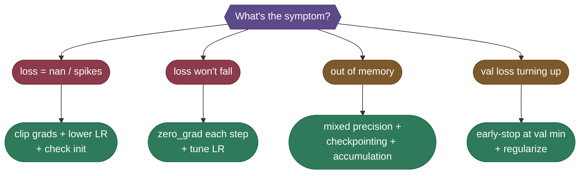

# TinyReg end to end: the whole loop in eighty lines

Every mechanism from the previous four chapters, in one runnable script, followed by the gallery of ways a run breaks and the one-line fix for each.

## The runnable loop

Here is **TinyReg** end-to-end — every concept above in ~80 lines, no downloads, runs on CPU in `Python 3.12`. This is the same model we've been tracing the whole guide: it learns the noisy quadratic `y = 2x² − 3x + 1` from Kaiming-initialized random weights, runs the five-line loop with **LR warmup + cosine decay**, **gradient accumulation** (`32 × 4 =` effective batch 128), and **gradient clipping**, then **checkpoints** and **resumes** — reproducing the exact `lr` and loss numbers quoted in the sections above. (Mixed precision is marked GPU-only and shown in its section above — it needs CUDA.)

```python
"""Runnable end-to-end training loop on CPU (no downloads, offline).
Init -> forward -> loss -> backward -> AdamW step -> zero_grad, with LR warmup +
cosine decay, gradient accumulation, gradient clipping, and checkpoint save/resume."""
import math, os, tempfile
import torch
import torch.nn as nn
torch.manual_seed(0)

# 1. DATA (toy regression y = 2x^2 - 3x + 1 + noise; held-out val split)
N = 512
x = torch.linspace(-2, 2, N).unsqueeze(1)
y = 2 * x**2 - 3 * x + 1 + 0.10 * torch.randn_like(x)
perm = torch.randperm(N); tr, va = perm[:384], perm[384:]
x_tr, y_tr, x_va, y_va = x[tr], y[tr], x[va], y[va]

# 2. MODEL + WEIGHT INIT (Kaiming for ReLU, zero bias)
class MLP(nn.Module):
    def __init__(self, h=64):
        super().__init__()
        self.net = nn.Sequential(nn.Linear(1, h), nn.ReLU(),
                                 nn.Linear(h, h), nn.ReLU(), nn.Linear(h, 1))
        for m in self.modules():
            if isinstance(m, nn.Linear):
                nn.init.kaiming_uniform_(m.weight, nonlinearity="relu")
                nn.init.zeros_(m.bias)
    def forward(self, x): return self.net(x)

model = MLP(); loss_fn = nn.MSELoss()
opt = torch.optim.AdamW(model.parameters(), lr=1e-2, weight_decay=1e-4)

# 3. LR SCHEDULE: linear warmup then cosine decay
TOTAL, WARMUP, PEAK, FLOOR = 600, 60, 1e-2, 1e-3
def lr_at(s):
    if s < WARMUP: return PEAK * (s + 1) / WARMUP          # linear ramp 0 -> PEAK; (s+1) so step 0 isn't dead-zero
    p = (s - WARMUP) / (TOTAL - WARMUP)                    # progress through decay phase, 0 -> 1
    return FLOOR + 0.5 * (PEAK - FLOOR) * (1 + math.cos(math.pi * p))   # cosine PEAK -> FLOOR

@torch.no_grad()
def val_loss():
    model.eval(); v = loss_fn(model(x_va), y_va).item(); model.train(); return v

# 4. TRAINING LOOP with gradient accumulation (micro 32 x 4 = effective batch 128)
MICRO, ACCUM = 32, 4
ckpt = os.path.join(tempfile.mkdtemp(), "ckpt.pt")
print(f"{'step':>4} | {'lr':>8} | {'train':>7} | {'val':>7}")
for step in range(TOTAL):
    for g in opt.param_groups: g["lr"] = lr_at(step)   # apply schedule
    opt.zero_grad()                                     # zero ONCE before accumulating
    running = 0.0
    for _ in range(ACCUM):
        idx = torch.randint(0, len(x_tr), (MICRO,))
        loss = loss_fn(model(x_tr[idx]), y_tr[idx]) / ACCUM   # forward + scale
        loss.backward()                                       # backward (grads accumulate)
        running += loss.item()
    nn.utils.clip_grad_norm_(model.parameters(), 1.0)         # gradient clipping
    opt.step()                                                # optimizer step
    if step % 120 == 0 or step == TOTAL - 1:
        print(f"{step:>4} | {lr_at(step):>8.5f} | {running:>7.4f} | {val_loss():>7.4f}")

# 5. CHECKPOINT: save model + optimizer + step (everything needed to resume)
torch.save({"step": TOTAL, "model": model.state_dict(), "opt": opt.state_dict()}, ckpt)
print(f"saved checkpoint -> {os.path.basename(ckpt)}")

# 6. RESUME: rebuild, load, confirm identical val loss
fresh = MLP(); state = torch.load(ckpt); fresh.load_state_dict(state["model"]); fresh.eval()
with torch.no_grad():
    print(f"resumed from step {state['step']} | "
          f"val = {loss_fn(fresh(x_va), y_va).item():.4f}  (matches above)")

# Expected output:
# step |       lr |   train |     val
#    0 |  0.00017 | 35.8971 | 28.9496
#  120 |  0.00973 |  0.0616 |  0.0453
#  240 |  0.00775 |  0.0223 |  0.0224
#  360 |  0.00472 |  0.0111 |  0.0167
#  480 |  0.00205 |  0.0110 |  0.0151
#  599 |  0.00100 |  0.0090 |  0.0149
# saved checkpoint -> ckpt.pt
# resumed from step 600 | val = 0.0149  (matches above)
```

The loss falls from **~29 to ~0.015** in 600 steps, the LR ramps up then decays exactly on the schedule curve above (`0.00017 → 0.00973 → … → 0.00100`, the same numbers we traced earlier), and the resumed model reproduces the final validation loss bit-for-bit. That's the entire ritual — and it's the *same* loop, just bigger, that trains a frontier model.

---

## When Training Breaks: A Troubleshooting Gallery

Almost every training failure announces itself with a recognizable *symptom*, and each points at a specific cause and a one-line fix. When a run misbehaves, scan this gallery first — the fix you need is usually one row:

| Symptom you see | Likely cause | One-line fix |
|---|---|---|
| **Loss is `nan` on step 1** | bad init, or LR way too high | check weight init; drop LR 10×; add gradient clipping |
| **Loss `nan`/spikes mid-run** | exploding gradients on an unlucky batch | clip grads (`clip_grad_norm_(…, 1.0)`); lower LR |
| **Loss won't fall at all** | forgot `zero_grad()`, or LR too small | zero grads once per step; raise LR; verify data isn't constant |
| **Loss falls then explodes** | LR too high after warmup; no decay | add cosine decay; shorten/raise warmup |
| **Out of memory (OOM)** | activations + optimizer state too big | mixed precision; gradient checkpointing; smaller micro-batch + accumulation |
| **Slow throughput / GPU idle** | micro-batch too small; CPU-bound dataloader | raise batch until GPU saturates; more dataloader workers; mixed precision |
| **Train ↓ but val ↑** (overfitting) | too many steps / too little data | early-stop at the val minimum; add regularization or data |
| **Both losses stuck high** (underfitting) | model too small or LR wrong | bigger model; more steps; tune LR |
| **Loss spike right after resume** | restored weights but not optimizer state | reload `optimizer.state_dict()` (and scheduler step) too |
| **FP16 loss stalls / grads vanish** | tiny gradients underflowing to zero | enable `GradScaler` loss scaling, or switch to BF16 |

> **Tip:** When in doubt, the two highest-leverage knobs are the **learning rate** (most failures above are an LR that's too high) and **gradient clipping** (the cheapest insurance against a single bad batch wrecking the run). Reach for those before anything more exotic.



---

## You Can Do This

Step back and look at what you now hold: the complete loop, end to end. **Initialize** weights so the signal neither explodes nor vanishes; let autograd build the **graph** so `.backward()` can fill every `.grad`; run **forward → loss → backward → step → zero-grad** thousands of times, with **AdamW** smoothing each weight via its own momentum and adaptive scale; use **mini-batches** (and **gradient accumulation** when memory is tight); budget your **VRAM** knowing the optimizer state is the tallest bar; turn on **mixed precision** for near-free speed (with **loss scaling** on FP16); **warm up then decay** the learning rate; bolt on **gradient clipping** as a seatbelt; **checkpoint** the model *and* optimizer so you can resume without a loss spike; and watch **train vs validation loss** to know exactly when to stop. Scaling out is the same loop — **DDP** averages gradients across machines, **FSDP/ZeRO** shards the model when it won't fit, and **Chinchilla** tells you to grow data and parameters together. None of it is magic — it's five lines in a `for` loop, and you just ran them. **You can train a model yourself, today, from scratch.**

---

## Production implementation

Runnable services in this estate that implement what this page teaches:

- **[ml-platform](/python/python-production-examples/ml-platform/readme)** — training-pipeline orchestration, model packaging and a served prediction endpoint around a real trained classifier.
- **[data-ml-pipeline](/python/cross-service-workflows/data-ml-pipeline)** — the same loop placed downstream of ingestion and feature computation.

---

## References and further reading

Shared with the topic's companion file — see [Pretraining at Scale — references and further reading](/ai-ml/ai-ml-learning-resources/model-building/pretraining/pretraining#references-further-reading) (the training-loop, optimizer, mixed-precision, scheduling and sharding entries harvested with these chapters).
