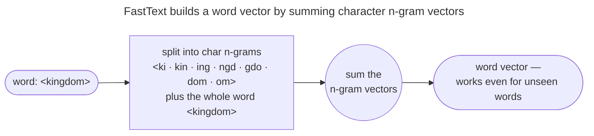

# FastText: words made of pieces

Word2vec and GloVe give each whole word one vector; this page breaks words into pieces so unseen words still get one.

## FastText: words are made of pieces

Word2vec and GloVe share one stubborn weakness: they learn **one vector per whole word**. That makes them helpless in two situations:

- **Unseen words:** a word never seen in training (**out-of-vocabulary**, OOV) has *no vector at all*.
- **Morphology:** related words (*run*, *runs*, *running*, *runner*) are treated as **unrelated atoms** that each learn meaning independently.

[FastText](https://arxiv.org/abs/1607.04606) (Bojanowski et al., 2017) fixes both with one idea: represent a word as the **sum of the vectors of its character n-grams**.




How it works:

- The word `kingdom`, padded with boundary markers `<kingdom>`, is decomposed into all character n-grams of length 3–6 (`<ki`, `kin`, `ing`, `ngd`, ..., plus the special whole-word token).
- Each n-gram has its *own* learned vector, and the word's vector is their **sum**.
- Then SGNS runs exactly as before, but on n-gram vectors.

Two payoffs fall out:

1. **OOV is solved.** An unseen word still has n-grams you *did* see, so it gets a sensible vector from its pieces.
   - We *measure* this below: a FastText model that never saw `kingdoms` still produces a vector for it (norm 0.60, not zero).
   - That vector has cosine **0.9997** with `kingdom` — it correctly infers the plural's meaning from shared n-grams.
2. **Morphology is free.** Because *running* and *runs* **share n-grams** (`run`, `unn`, ...), they automatically get similar vectors without ever needing to co-occur.
   - In our tiny demo, $\cos(\text{king}, \text{kingdom}) = 0.999$ — the shared `king` n-gram binds them.

This is the *same instinct* that **subword tokenization** (BPE, byte-pair encoding; WordPiece; Unigram) brings to modern LLMs: never let an unknown word break you — fall back to pieces. See [Tokenization & Subword Algorithms](/ai-ml/ai-ml-learning-resources/multimodal-and-generative-media/natural-language-processing/tokenization-and-subword-algorithms/tokenization-and-subword-algorithms) for that lineage.

> [!NOTE]
> **Source:** the subword model — a word vector as the sum of its character-n-gram vectors, trained with SGNS — is [Bojanowski, Grave, Joulin & Mikolov, *Enriching Word Vectors with Subword Information* (TACL 2017)](https://arxiv.org/abs/1607.04606).
>
> - §3.1 gives the n-gram scoring function.
> - §3.2 gives the boundary markers and OOV behaviour.

---

## Code 3: FastText handles a word it never saw

This trains a tiny FastText model and queries it for `kingdoms` — a word that is **not in the training vocabulary**. Word2vec/GloVe would crash with a `KeyError`; FastText returns a sensible vector built from the subword n-grams of `kingdom`.

```step
///FILE fasttext_oov_demo.py
"""FastText OOV demo: a vector for an UNSEEN word, from its n-grams. Verified Python 3.12, gensim 4.x."""
import numpy as np
from gensim.models import FastText

royalty, animals = ["king", "queen"], ["dog", "cat"]
sents = []
for r in royalty:
    sents += [["the", r, "ruled", "the", "kingdom"], ["the", r, "wore", "a", "crown"],
              ["the", r, "sat", "on", "the", "throne"]] * 8
for a in animals:
    sents += [["the", a, "chased", "the", "ball"], ["the", a, "was", "a", "furry", "pet"],
              ["the", a, "slept", "all", "day"]] * 8

m = FastText(sents, vector_size=24, window=2, min_count=1, min_n=2, max_n=4, sg=1, epochs=80, seed=0)
print("'kingdom'  in vocab:", "kingdom"  in m.wv.key_to_index)
print("'kingdoms' in vocab:", "kingdoms" in m.wv.key_to_index, "  <- OOV, never seen in training")

v = m.wv["kingdoms"]                       # still works! built from shared char n-grams
print("OOV 'kingdoms' vector norm:", round(float(np.linalg.norm(v)), 4), "(non-zero -> built from n-grams)")

cos = lambda a, b: float(m.wv[a] @ m.wv[b] / (np.linalg.norm(m.wv[a]) * np.linalg.norm(m.wv[b])))
print("cos(kingdom, kingdoms[OOV]) =", round(cos("kingdom", "kingdoms"), 4))
print("cos(king,    kingdom)       =", round(cos("king", "kingdom"), 4))
```

Output:

```text
'kingdom'  in vocab: True
'kingdoms' in vocab: False   <- OOV, never seen in training
OOV 'kingdoms' vector norm: 0.6021 (non-zero -> built from n-grams)
cos(kingdom, kingdoms[OOV]) = 0.9997
cos(king,    kingdom)       = 0.9991
```

> [!NOTE]
> The unseen plural `kingdoms` gets a vector with cosine **0.9997** to `kingdom` — FastText correctly inferred the plural's meaning purely from shared character n-grams (`king`, `ingd`, `dom`, ...), no co-occurrence required.
>
> - This is why FastText shines on **morphologically rich languages** (Finnish, Turkish, German compounds) and **noisy text** (typos, hashtags).
> - It's the same fallback-to-pieces idea that **subword tokenization** gives modern LLMs.

---

## References

Shared with the topic's companion file — see [Word Embeddings — references and further reading](/ai-ml/ai-ml-learning-resources/multimodal-and-generative-media/natural-language-processing/word-embeddings-word2vec-glove-fasttext/word-embeddings-word2vec-glove-fasttext#references-further-reading).
