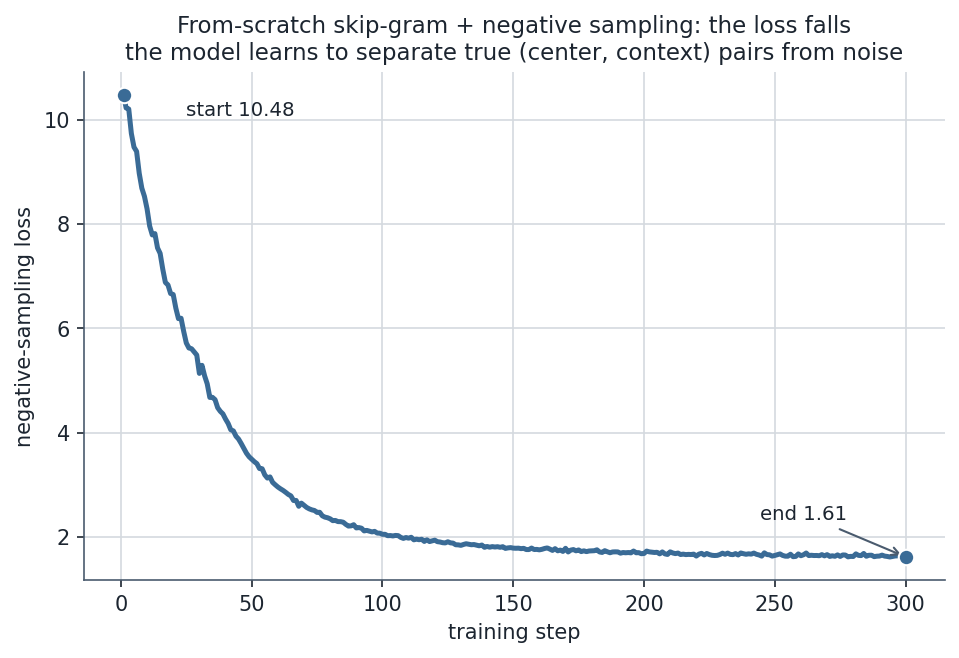

# Negative sampling: the trick that made word2vec scale

Word2vec's softmax sums over the whole vocabulary for every training pair; this page replaces it with a handful of cheap yes-or-no questions, then trains a model with it.

## The training trick: negative sampling

The fix that made word2vec famous is **negative sampling** ([Mikolov et al., 2013b](https://arxiv.org/abs/1310.4546)).

- The insight: we don't need a calibrated probability distribution over all $V$ words — just vectors whose geometry is right.
- So replace the one giant $V$-way softmax with a handful of cheap **binary** decisions.
- Teach the model to tell **real** (center, context) pairs apart from **fake** ones.

For each true pair $(c, o)$, draw $k$ "negative" words $n_1,\dots,n_k$ at random and minimize:

$$\boxed{\ \mathcal{L} = -\log \sigma(u_o^\top v_c) \;-\; \sum_{i=1}^{k} \log \sigma(-\,u_{n_i}^\top v_c)\ }$$

where $\sigma(x) = 1/(1+e^{-x})$ is the logistic sigmoid. The equivalent **maximization** form (how the paper writes it) is $\log\sigma(u_o^\top v_c) + \sum_{i=1}^k \mathbb{E}_{n_i \sim P_n}\big[\log\sigma(-\,u_{n_i}^\top v_c)\big]$.

Read it as a sentence:

- *Push the **real** neighbour's score up so $\sigma \to 1$.*
- *Push $k$ random **non**-neighbours' scores down so $\sigma(-\cdot)\to 1$.*
- Geometrically it's a tug-of-war: pull the true context toward the center, shove a few random words away.


The cost per step drops from $O(V)$ to $O(k)$ with $k = 5\text{–}20$ — the change that let word2vec train on **billions** of words on a single machine. With $V = 10^6$ and $k = 10$, that's a ~**100,000×** reduction in work per pair.

### Where the negatives come from: the $\text{freq}^{0.75}$ trick

Negatives are *not* sampled uniformly, and *not* from the raw word frequencies either. They're drawn from the unigram distribution raised to the **3/4 power** and renormalized:

$$P_n(w) = \frac{\text{count}(w)^{0.75}}{\sum_{w'} \text{count}(w')^{0.75}}.$$

The exponent **0.75** is a deliberate compromise between two failure modes:

- **Raw frequency:** you waste almost every negative on `the`, `of`, `a`.
- **Uniform sampling:** you over-pick ultra-rare words that teach little.
- The 3/4 power **damps the frequent words and lifts the rare ones** — a sweet spot Mikolov found empirically.

Concretely, take counts $[1000, 500, 100, 50, 10]$:

| word | raw $p(w)$ | smoothed $p(w)^{0.75}$ |
|---|---|---|
| the (1000) | 0.6024 | 0.5236 |
| of (500) | 0.3012 | **0.3113** |
| king (100) | 0.0602 | **0.0931** |
| queen (50) | 0.0301 | **0.0554** |
| kingdom (10) | 0.0060 | **0.0166** |

The rare word `kingdom` is sampled ~**2.75×** more often under the 0.75 power (0.0166 vs 0.0060), while `the` is damped (0.5236 vs 0.6024). These exact numbers are produced by `word_embeddings.py` — and they are the right-hand panel of the negative-sampling figure above.

> [!NOTE]
> **Source:** negative sampling, hierarchical softmax, the $\text{freq}^{0.75}$ negative distribution, and subsampling of frequent words are all from [Mikolov, Sutskever, Chen, Corrado & Dean, *Distributed Representations of Words and Phrases and their Compositionality* (2013)](https://arxiv.org/abs/1310.4546).
>
> - The boxed loss is Eq. 4; the $\text{freq}^{0.75}$ choice is §2.2.
> - The clean re-derivation of negative sampling as binary logistic regression is in [Jurafsky & Martin, *SLP3* Ch. 6](https://web.stanford.edu/~jurafsky/slp3/6.pdf).

### The other speedup: hierarchical softmax (briefly)

Before negative sampling caught on, the original paper offered **hierarchical softmax**.

- Arrange the vocabulary as the leaves of a binary tree (a Huffman tree, so frequent words sit shallow).
- Replace the single $V$-way decision with $\log_2 V$ binary decisions along the root-to-leaf path.
- That turns the $O(V)$ softmax into $O(\log V)$ — a few dozen sigmoids instead of millions of exponentials.
- It's exact (it still defines a proper distribution) but fiddly; **negative sampling won in practice** because it's simpler, faster, and gives slightly better vectors for frequent words.

Know both names; reach for negative sampling.

> [!WARNING]
> **Negative sampling is *not* the softmax.**
>
> - It's a related **binary-classification surrogate**, not an approximation that converges to the same objective.
> - In an interview, say "it approximates the softmax *cheaply* by learning to separate real pairs from noise" — never "it *is* the softmax."
> - The precise relationship is the gem in the next section.

---

## Code 4: negative-sampling loss, one triple, by hand

Finally, the smallest possible end-to-end check: one (center, true context, negative) triple, computed both as a full-softmax probability and as the negative-sampling loss + gradient — matching the by-hand algebra above so you can trace every number.

```step
///FILE negative_sampling_by_hand.py
"""One skip-gram triple BY HAND: softmax p(o|c), NS loss, gradient, and the 0.75 trick. Python 3.12."""
import numpy as np, math
vc = np.array([0.5, -0.2, 0.1])   # center vector v_c
uo = np.array([0.4,  0.1, 0.3])   # true context  u_o
un = np.array([-0.3, 0.5, -0.2])  # one negative   u_n
u3 = np.array([0.0,  0.2, -0.1])  # a third vocab word, for the softmax denominator

s_o, s_n, s3 = vc @ uo, vc @ un, vc @ u3
print(f"scores: u_o.v_c={s_o:.4f}  u_n.v_c={s_n:.4f}  u3.v_c={s3:.4f}")

# (a) full softmax over the 3-word vocab {o, n, w3}
Z = math.exp(s_o) + math.exp(s_n) + math.exp(s3)
print(f"p(o|c) full softmax = {math.exp(s_o)/Z:.4f}")

# (b) negative-sampling loss with k=1 negative: -[log sig(s_o) + log sig(-s_n)]
sig = lambda z: 1 / (1 + math.exp(-z))
loss = -(math.log(sig(s_o)) + math.log(sig(-s_n)))
print(f"sigma(u_o.v_c)={sig(s_o):.4f}  sigma(-u_n.v_c)={sig(-s_n):.4f}  NS loss={loss:.4f}")

# (c) gradient of the NS loss w.r.t. v_c: (sig(s_o)-1)*u_o + sig(s_n)*u_n
grad_vc = (sig(s_o) - 1) * uo + sig(s_n) * un
print("grad_vc =", np.round(grad_vc, 4))

# (d) the freq^0.75 sampling trick (the/of/king/queen/kingdom counts)
counts = np.array([1000, 500, 100, 50, 10], dtype=float)
p_raw = counts / counts.sum()
p_075 = counts ** 0.75; p_075 /= p_075.sum()
print("raw unigram  :", np.round(p_raw, 4))
print("unigram^0.75 :", np.round(p_075, 4))
```

Output:

```text
scores: u_o.v_c=0.2100  u_n.v_c=-0.2700  u3.v_c=-0.0500
p(o|c) full softmax = 0.4184
sigma(u_o.v_c)=0.5523  sigma(-u_n.v_c)=0.5671  NS loss=1.1609
grad_vc = [-0.3089  0.1717 -0.2209]
raw unigram  : [0.6024 0.3012 0.0602 0.0301 0.006 ]
unigram^0.75 : [0.5236 0.3113 0.0931 0.0554 0.0166]
```

> [!NOTE]
> **Trace the gradient.** `grad_vc = (σ(s_o)−1)·u_o + σ(s_n)·u_n`.
>
> - Since $\sigma(s_o)=0.55 < 1$, the first term is *negative × $u_o$* — it moves $v_c$ **toward** the true context $u_o$ (descending the loss).
> - The second term, $\sigma(s_n)\cdot u_n$ with $\sigma(s_n)=0.43$, pushes $v_c$ **away** from the negative $u_n$.
> - Pull the real neighbour in, push the fake one out — the exact tug-of-war the diagram drew, now as numbers you can check by hand.
> - The bottom two rows reproduce the $\text{freq}^{0.75}$ table: `kingdom` rises 0.006 → 0.017.

---

## Code 1: train skip-gram with negative sampling from scratch

A from-scratch skip-gram-with-negative-sampling on a tiny but **structured** corpus (royalty words share contexts; animal words share contexts).

- It won't rival pretrained vectors, but it *proves the mechanism*: words that share contexts end up with higher cosine similarity.
- The model is **device-agnostic** (CUDA / MPS / CPU); the trace below is **pinned to CPU** so the numbers are reproducible.

> [!NOTE]
> **Runnable project and a step-by-step notebook:**
>
> - The same verified code lives as a clean, seeded source-of-truth script and an executed teaching notebook next to this page — see the [step-by-step teaching notebook](code/word-embeddings-word2vec-glove-fasttext.ipynb) and the [runnable demo script](code/word_embeddings.py) (run it with `python word_embeddings.py`).
> - Every number on this page is produced by that file, and [`make_figures_05.py`](code/make_figures_05.py) regenerates every figure by importing the *same* functions, so nothing here can drift.

```step
///FILE skipgram_negative_sampling.py
"""Skip-gram with negative sampling, from scratch. Device-agnostic; trace pinned to CPU.
Verified on Python 3.12 / torch 2.12.0."""
import numpy as np, torch, torch.nn as nn, torch.nn.functional as F

SEED = 0
torch.manual_seed(SEED); np.random.seed(SEED)
# pick the best device, but pin the reproducible trace to CPU (tiny tensors -> GPU adds only noise)
DEVICE = ("cuda" if torch.cuda.is_available()
          else "mps" if torch.backends.mps.is_available() else "cpu")
device = "cpu"
print(f"device: {device} (detected {DEVICE}; pinned to CPU for reproducibility)  |  torch: {torch.__version__}")

# a small but STRUCTURED corpus: royalty words share contexts; animal words share contexts
royalty, animals = ["king", "queen"], ["dog", "cat"]
sents = []
for r in royalty:
    sents += [["the", r, "ruled", "the", "kingdom"], ["the", r, "wore", "a", "crown"],
              ["the", r, "sat", "on", "the", "throne"]] * 6
for a in animals:
    sents += [["the", a, "chased", "the", "ball"], ["the", a, "was", "a", "furry", "pet"],
              ["the", a, "slept", "all", "day"]] * 6

vocab = sorted({w for s in sents for w in s}); V = len(vocab); w2i = {w: i for i, w in enumerate(vocab)}
W, pairs = 2, []                                       # window 2 -> (center, context) pairs
for s in sents:
    idx = [w2i[w] for w in s]
    for i, c in enumerate(idx):
        for j in range(max(0, i - W), min(len(idx), i + W + 1)):
            if j != i: pairs.append((c, idx[j]))
pairs = torch.tensor(pairs, device=device)             # every tensor created on `device`

d, K = 16, 5                                           # embedding dim, # negatives
emb_in  = nn.Embedding(V, d).to(device)                # v_c  (center vectors)
emb_out = nn.Embedding(V, d).to(device)                # u_o  (context vectors)
opt = torch.optim.Adam(list(emb_in.parameters()) + list(emb_out.parameters()), lr=0.01)
losses = []
for _ in range(300):
    perm = pairs[torch.randperm(len(pairs), device=device)]; centers, contexts = perm[:, 0], perm[:, 1]
    negs = torch.randint(0, V, (len(perm), K), device=device)       # k random negatives per pair
    vc = emb_in(centers)
    pos = (vc * emb_out(contexts)).sum(-1)             # true-pair score  u_o . v_c
    neg = torch.bmm(emb_out(negs), vc.unsqueeze(-1)).squeeze(-1)    # negative scores
    loss = -(F.logsigmoid(pos) + F.logsigmoid(-neg).sum(-1)).mean()  # the boxed NS loss
    opt.zero_grad(); loss.backward(); opt.step(); losses.append(loss.item())

E = F.normalize(emb_in.weight.detach(), dim=1)         # unit vectors -> cosine = dot
cos = lambda a, b: (E[w2i[a]] @ E[w2i[b]]).item()
assert losses[-1] < losses[0]                          # loss must fall
assert cos("king", "queen") > cos("king", "dog")       # within-cluster beats cross-cluster
print(f"loss: {losses[0]:.3f} -> {losses[-1]:.3f}")
print(f"cos(king, queen) = {cos('king','queen'):+.3f}  (royalty pair  -> HIGH)")
print(f"cos(dog,  cat)   = {cos('dog','cat'):+.3f}  (animal pair   -> HIGH)")
print(f"cos(king, dog)   = {cos('king','dog'):+.3f}  (cross-cluster -> LOWER)")
```

Output:

```text
device: cpu (detected mps; pinned to CPU for reproducibility)  |  torch: 2.12.0
loss: 10.477 -> 1.614
cos(king, queen) = +0.537  (royalty pair  -> HIGH)
cos(dog,  cat)   = +0.319  (animal pair   -> HIGH)
cos(king, dog)   = +0.270  (cross-cluster -> LOWER)
```




> [!NOTE]
> With only a few dozen sentences the numbers are modest, but the **ordering is the whole point** — words that shared contexts (king/queen, dog/cat) ended up more similar than words that didn't.
>
> - Scale this to billions of words and you get the vectors that solve `king − man + woman ≈ queen`.
> - The `loss` line is *exactly* the boxed negative-sampling objective: `logsigmoid(pos)` is $\log\sigma(u_o^\top v_c)$ and `logsigmoid(-neg).sum` is $\sum_i \log\sigma(-u_{n_i}^\top v_c)$.
> - Every tensor is created with `device=device` and each module is moved with `.to(device)` — swap the pin to `device = DEVICE` and it runs unchanged on a GPU.

---

## References

Shared with the topic's companion file — see [Word Embeddings — references and further reading](/ai-ml/ai-ml-learning-resources/multimodal-and-generative-media/natural-language-processing/word-embeddings-word2vec-glove-fasttext/word-embeddings-word2vec-glove-fasttext#references-further-reading).
