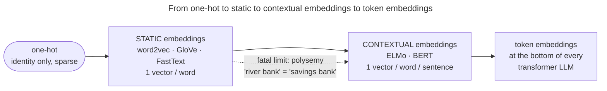

# Using word embeddings: choosing, applying and outgrowing them

This page turns the course into decisions: where static embeddings still fit, how to apply them, which method to pick, and where they stop.

## Where they're used

- **Initializing natural language processing (NLP) models.** For years, the first layer of nearly every NLP network was a matrix of pretrained word vectors (GloVe/word2vec) — a free injection of "the model already knows which words are related."
- **Retrieval and similarity.** Semantic search, recommendation, deduplication, clustering: embed everything, compare by cosine, retrieve nearest neighbours (with FAISS or a vector database at scale; [Vector Search](/ai-ml/ai-ml-learning-resources/data-and-representation/vector-search/vector-search) teaches the index, and the [Embeddings and Vector Search workflow](/ai-ml/practitioner-workflows/data-and-inputs/embeddings-and-vector-search) builds one).
  - Modern systems use *sentence/document* embeddings (see [Sentence & Document Embeddings](/ai-ml/ai-ml-learning-resources/multimodal-and-generative-media/natural-language-processing/sentence-and-document-embeddings/sentence-and-document-embeddings)).
  - The principle — meaning is geometry, similarity is cosine — is identical.
- **Beyond words.** The embedding idea generalizes far past language:
  - **users/items** (recommender systems);
  - **nodes** (graph embeddings like node2vec, which literally reuse skip-gram on random walks);
  - most importantly, the **token-embedding layer** at the bottom of *every* transformer. When GPT or Llama maps a token id to a vector, that lookup table is a learned embedding; this course is its origin story.

> [!TIP]
> You rarely *train* word2vec yourself anymore — you'd download pretrained GloVe/FastText vectors, or (far more likely) use a **contextual** model.
> But the *concept* — discrete → dense, similarity = geometry, learned from co-occurrence — is foundational, transfers everywhere, and is asked in interviews constantly.

---

## Application: a playbook for using embeddings

If you actually had to *use* static embeddings on a task, here's the end-to-end reasoning, the way I'd do it:

1. **Pretrained or train your own?** Almost always **pretrained** — GloVe (Common Crawl / Wikipedia) or FastText (157 languages) give you general-purpose vectors for free.
   - Train your own only when your domain vocabulary is far from general text (legal, biomedical, code, product SKUs, stock-keeping units) *and* you have a large in-domain corpus.
   - Rule of thumb: pretrained for general language, in-domain training when the jargon dominates.
2. **Pick the method by your constraints.** Out-of-vocabulary (OOV) words, typos, rich morphology or non-English → **FastText**. Pure speed on a known vocabulary → word2vec or GloVe. (See the side-by-side table below.)
3. **Preprocess *consistently*.** Tokenize, lowercase (usually), and handle punctuation the **same way at train time and lookup time** — a mismatch silently turns known words into OOVs.
   - For multi-word units ("New York"), decide up front whether to phrase them (word2vec's phrase detection) or keep tokens separate.
4. **Build the document/sentence vector.** The cheap, shockingly-strong baseline is **mean-pooling** the word vectors.
   - Optionally weight by TF-IDF (term frequency–inverse document frequency), or by SIF — Arora et al.'s "smooth inverse frequency," which down-weights frequent words and removes the top principal component.
   - For anything serious today, jump to a real [sentence embedding model](/ai-ml/ai-ml-learning-resources/multimodal-and-generative-media/natural-language-processing/sentence-and-document-embeddings/sentence-and-document-embeddings).
5. **Compare by cosine, retrieve by ANN.** L2-normalize, then cosine similarity; at scale use an approximate-nearest-neighbour (ANN) index (FAISS, or hierarchical navigable small world (HNSW) graphs) instead of brute force.
6. **Audit before you ship.** Probe for bias on your sensitive axes (the Bolukbasi-style "gender direction" projection is a quick check), and sanity-check nearest neighbours on a few domain words — embeddings fail *quietly*, so look before you trust.

> [!NOTE]
> **Subsampling frequent words.** One more word2vec trick worth knowing:
>
> - Very frequent words (`the`, `a`, `of`) are *discarded* during training with probability rising with their frequency ($P(\text{drop}) = 1 - \sqrt{t/f(w)}$ in the paper).
> - This both **speeds training** (fewer near-useless `the`-centered windows) and **improves quality** (rare, informative pairs aren't drowned out).
> - It's the *input* counterpart to the $\text{freq}^{0.75}$ trick on the *negatives* — both fight the tyranny of frequent words from opposite ends.

---

## The three methods, side by side

When someone asks "word2vec vs GloVe vs FastText — when do you use which?", this is the table to have in your head:

| | **word2vec** (SGNS) | **GloVe** | **FastText** |
|---|---|---|---|
| **paradigm** | predictive, local windows | count-based, global matrix | predictive + subword |
| **trains on** | streamed (center, context) pairs | the co-occurrence matrix $X$ | (center, context) pairs of n-grams |
| **unit represented** | whole word | whole word | sum of char n-grams |
| **OOV words** | ✗ KeyError (no vector) | ✗ KeyError | ✓ vector from n-grams |
| **morphology** | ✗ atoms unrelated | ✗ atoms unrelated | ✓ shared n-grams |
| **rare words** | ok | ok | **best** (n-gram sharing) |
| **training speed** | fast, online | fast once matrix built | slower (more units) |
| **what it factorizes** | shifted-PMI (implicitly) | log co-occurrence (explicitly) | shifted-PMI of n-grams |
| **reach for it when** | general baseline, large corpus | want global stats, batch training | OOV/typos/rich morphology, default modern choice |

The honest practitioner summary:

- **word2vec and GloVe give near-identical quality** — pick by infrastructure (streaming vs matrix).
- **FastText is the safe default**, because the subword fallback costs little and buys OOV robustness.
- That is why FastText pretrained vectors (157 languages) were the workhorse before contextual models took over.

> [!WARNING]
> **Common mistakes to avoid.**
>
> 1. **Not lowercasing / inconsistent preprocessing** between training and lookup → silent OOVs.
> 2. **Forgetting to L2-normalize** before cosine, or mixing normalized and raw vectors.
> 3. **Trusting analogies as reasoning** — they're a geometric *property*, brittle on rare relations.
> 4. **Treating distributional similarity as semantic equivalence** — antonyms (`good`/`bad`) and co-hyponyms (`monday`/`tuesday`) score high because they share contexts.
> 5. **Shipping embeddings without auditing bias** — they encode stereotypes by default.

---

## Where static embeddings stop: one vector per word

Every embedding in this course is **static**: one fixed vector per word, whatever the sentence.

- That breaks on **polysemy**: "river **bank**" and "savings **bank**" get the identical vector, a blurry average of both senses.
- **Contextual embeddings** compute a vector per word *per sentence*; the measured fix, ELMo and BERT, is on [Contextual Embeddings (ELMo · BERT)](/ai-ml/ai-ml-learning-resources/multimodal-and-generative-media/natural-language-processing/contextual-embeddings-elmo-bert/contextual-embeddings-elmo-bert).
- Static vectors still win when you need **cheap, fixed, precomputed** vectors: classic retrieval, cold-start features, on-device language processing, billions of items embedded once.

---

## Recap and rapid-fire

**If you remember nothing else:**

- Embeddings turn each word into a dense vector learned so that **words in similar contexts land nearby** (the distributional hypothesis), making similarity a **cosine** and analogies a **direction**.
- **Word2vec** learns them *predictively* (skip-gram / CBOW) and scales by replacing the $O(V)$ softmax with **negative sampling** ($O(k)$ binary classifications, negatives drawn $\propto \text{freq}^{0.75}$).
- **GloVe** learns them by *factorizing the global log-co-occurrence matrix* — and **Levy & Goldberg** showed both are secretly factorizing the same (shifted-PMI) statistics.
- **FastText** adds **character n-grams** for OOV + morphology.
- All three are **static** — one vector per word — exactly the limitation (polysemy) that **contextual** embeddings (ELMo/BERT) came next to fix.

**Quick-fire — say these out loud:**

- *Why not one-hot?* Orthogonal (no similarity — every pair equidistant) and vocabulary-sized (huge, sparse, no sharing).
- *Distributional hypothesis?* "You shall know a word by the company it keeps" (Firth) — learn vectors so context-sharing words are close.
- *Skip-gram vs CBOW?* Skip-gram predicts context from center (better for rare words/small data); CBOW predicts center from averaged context (faster, better on frequent words).
- *Write the skip-gram objective.* $p(o\mid c) = \exp(u_o^\top v_c)/\sum_{w} \exp(u_w^\top v_c)$, maximized over all center–context pairs.
- *What is negative sampling and why?* Replace the $O(V)$ softmax with "is this a real neighbour?" binary logistic classification against $k$ random negatives — $O(k)$ per step, the thing that made word2vec scale.
- *Why sample negatives $\propto \text{freq}^{0.75}$?* Damps ultra-frequent words and lifts rare ones — a sweet spot between raw-frequency and uniform sampling.
- *Word2vec vs GloVe?* Predictive/local/online vs count-based/global/batch — but by Levy & Goldberg both factorize a (shifted-PMI) co-occurrence matrix, so vectors behave alike.
- *What does FastText add?* Subword (char n-gram) vectors summed into the word vector → handles **OOV** and **morphology** for free.
- *How do analogies work?* Consistent relations are consistent directions; solve $b-a+c$ by nearest cosine, excluding the inputs — $\text{king}-\text{man}+\text{woman}\approx\text{queen}$.
- *Static vs contextual?* Static = one vector per word (`bank` is ambiguous, gets one blurred vector); contextual (ELMo/BERT) = a vector per word **per sentence**.
- *A risk to name?* Embeddings **inherit and amplify bias** from their training text (Bolukbasi et al.) — and antonyms can look *similar* (distributional ≈ relatedness, not sentiment).

---

## References

Shared with the topic's companion file — see [Word Embeddings — references and further reading](/ai-ml/ai-ml-learning-resources/multimodal-and-generative-media/natural-language-processing/word-embeddings-word2vec-glove-fasttext/word-embeddings-word2vec-glove-fasttext#references-further-reading).
