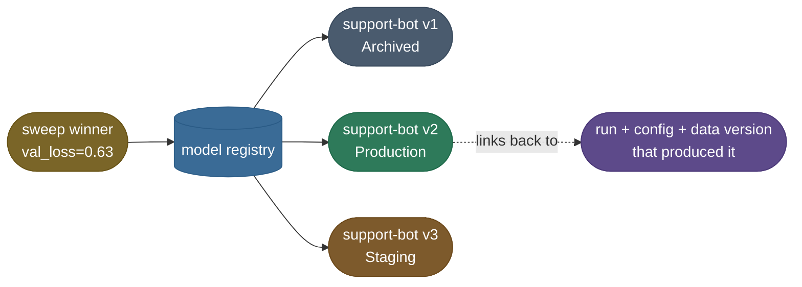

# Model Registry and Governance: a model is a name, a version and a stage
> A central, versioned store for trained models with stage transitions (staging → production → archived),
> lineage, approvals, and metadata. Governance adds the controls around it: who can promote a model, what
> documentation it carries (model cards), audit trails, and compliance. The control plane between "trained"
> and "deployed."

**Why it matters:** "how do you manage which model version is in production, and roll back?" Interviewers
want the registry's role (single source of truth, stage transitions, lineage back to the run + data),
how it gates deployment (approvals, quality checks), and governance/responsible-AI concerns (model cards,
auditability, access control). Since 2025 the compliance half is no longer optional in Europe: the
**EU AI Act** phases in obligations for general-purpose and high-risk AI systems through 2026–27
(technical documentation, logging, human oversight), and the **NIST AI Risk Management Framework (AI RMF)**
is the voluntary US counterpart most enterprises map to. Sits between experiment tracking and serving.

A [hyperparameter sweep](/ai-ml/ai-ml-learning-resources/operations-and-lifecycle/lifecycle-and-reproducibility/experiment-tracking/experiment-tracking#hyperparameter-sweeps-why-random-beats-grid) produces a winner. Now you have to **find it again next month** — and that's what a **model registry** is for. The registry is a versioned catalog of trained models: each entry has a name, a version number, the run that produced it, and a lifecycle **stage** (`Staging`, `Production`, `Archived`).

The diagram's two ideas: the same name (`support-bot`) holds many immutable versions each tagged with a stage, and the dashed arrow is the thing a folder of files can't give you — every version traces back to the exact run, config, and data that produced it.

### Why a registry, not a folder of `.pt` files

The registry solves three problems that `model_final_v2_REALLY_final.pt` cannot:

- **Traceability.** Every registered version links back to the **run** that created it — its config, metrics, seed, and data version. You can answer "what produced production v2?" in one click.
- **Lifecycle.** Promoting a model from `Staging` to `Production` is an explicit, auditable transition — not a copy-paste of a file with a new name. Rollback is "promote the previous version", not "find the right backup".
- **A clean serving contract.** Your inference service loads `support-bot@Production` by name, not by hardcoded path. Swap the underlying version and serving picks it up — no redeploy of the path.

This is exactly where the registry hands off to **[Packaging and Serving](/ai-ml/ai-ml-learning-resources/inference-and-serving/packaging-and-serving/readme)**: serving pulls `@Production` from the registry. So our sweep winner stops being `support-bot.pt` on a laptop and becomes `support-bot v3 @Staging` — and the day it's promoted to `@Production`, serving picks it up by name with no redeploy. MLflow Model Registry and W&B Model Registry both implement this; the concept is the same — **a model is identified by name + version + stage, and each version is immutable and traceable.**

> **Tip:** Never let a model reach production without a registry entry that links back to its run. If you can't answer "what config, seed, and data version produced `@Production`?" in one click, you can't safely roll it back or debug a regression — you're back to spelunking through `.pt` files.

> **Note:** The registry is the bridge between "research" and "production". The moment a model has a name and a version, it stops being a file on someone's laptop and becomes an asset the whole team can reason about, roll back, and audit.

---

## References and further reading

The curated link library for this topic — videos, courses, articles, papers, and internal cross-links — lives in a companion file so it can be reused as a standalone reference list:

**→ [Model Registry and Governance — references and further reading](/ai-ml/ai-ml-learning-resources/operations-and-lifecycle/governance-and-economics/model-registry-and-governance/model-registry-and-governance#references-further-reading)**
