# Continuous Training: the retraining flywheel

> The loop that keeps a deployed model from rotting: serving generates fresh data, a trigger
> decides when to retrain, the pipeline trains a candidate, and a gate decides whether it is
> allowed to replace the model in production. Automation removes the toil, never the judgement.

**Why it matters:** every model degrades, because the world it was fitted to keeps moving. The
question a production team actually answers is not "is the model good" but "how will we know it
stopped being good, and what happens automatically when it does."

- **What is probed:** which trigger fires a retrain (schedule, drift, performance) and why you
  usually want more than one; how drift is measured; full versus incremental retraining; and what
  stops an automated loop from quietly poisoning itself.
- **The trade-off:** retrain often and you pay compute and risk churn; retrain rarely and you serve
  a staler model every day. The cadence is a cost decision with a quality bill attached.
- **The failure mode:** a loop that trains on its own output, forgets what it used to know, and
  promotes the result because nothing was gating it.

This page teaches the loop itself. The CI/CD plumbing that runs it — pipelines, environments and
the release mechanics — belongs to
[CI/CD for ML and Continuous Training](/ai-ml/ai-ml-learning-resources/operations-and-lifecycle/release-and-deployment/cicd-for-ml-and-continuous-training/cicd-for-ml-and-continuous-training),
and the dashboards and alerting that watch a live model belong to
[Monitoring and Reliability](/ai-ml/ai-ml-learning-resources/operations-and-lifecycle/monitoring-and-reliability/readme).


Here is the uncomfortable truth nobody tells you on launch day: **the moment your model goes live, it starts dying.** Not because the code rots, but because the *world* moves — new slang, new products, new fraud tricks, a holiday season that looks nothing like training data. Your model is a photograph of a world that no longer exists. By the end of this guide you'll be able to build the cure yourself: a ***retraining flywheel*** (*a self-reinforcing loop where serving the model generates the very data that keeps it sharp*). You'll know *why* models decay, *how* to detect it before users do, *when* to pull the retrain trigger, and how to redeploy *without* shipping a regression. And we'll prove it twice on your own laptop: a drift monitor that scores a distribution shift with one number, and a static model that rots from 92% to 24% accuracy sitting next to a flywheel that holds ~90% through the same storm.

I'm going to walk this the way I'd actually run it on a real project: stand up a model in production, instrument it so serving *collects* its own future training data, watch a monitor for the first sign of rot, retrain a fresh candidate only when something has actually moved, prove the candidate is better before a single user sees it, and roll it out on a leash that yanks back automatically if it misbehaves. Each stage produces the exact artifact the next one eats — logged traffic becomes labels, labels become a fresh training set, that set becomes a candidate, the candidate becomes a canary — so the whole thing reads as one turning loop rather than a list of disconnected tools.

Here's the journey as a checklist before we zoom in — you'll be doing these in order, and then forever:

1. **Serve + instrument** — put the model in production and log every `(input, prediction, context)` so serving quietly stockpiles tomorrow's training data.
2. **Collect labels** — turn raw traffic into ground truth via implicit signals, explicit feedback, delayed outcomes, or human annotation.
3. **Monitor for drift** — watch the *input* distribution (a leading indicator) and *live quality* (the lagging backstop) for the first sign of decay.
4. **Decide the trigger** — fire a retrain on a schedule, on a drift threshold, or on a performance floor — and pick **full vs incremental**.
5. **Retrain (gated)** — run an automated, reproducible pipeline that ingests fresh data, validates it, trains a candidate, and gates it against the incumbent.
6. **Roll out safely** — canary a sliver of traffic, watch live metrics, and auto-roll-back the instant something looks wrong; then the loop turns again.

**The whole loop on one map** — every box below is a stage, in order, and the arrow back to the start is the entire point:

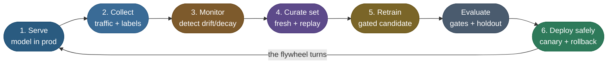

This is ***continuous training*** (**CT**) — the third "C" that turns CI/CD into the MLOps trinity **CI/CD/CT**. It's not a one-off script; it's a standing system that treats your model as a perishable good and your production traffic as a renewable resource.

> **Note:** To keep this concrete, we'll carry **one model end-to-end**: **ShopSense**, a checkout-fraud classifier for an online store. It scores each transaction "fraud / not fraud." Watch ShopSense travel through every stage — serving and logging transactions, a PSI monitor catching a shift in spending patterns, a gated retrain on fresh labels, and a canary rollout — so the loop is a story about one system, not six disconnected diagrams.

### What one turn of the flywheel actually looks like

Before any theory, here is the whole loop as a literal 12-week trace of ShopSense — the exact numbers you'll reproduce at the bottom of this guide. Each week we read **two** signals: **PSI** (how far this week's monitored feature has drifted from the frozen training reference — the *leading* signal) and **live accuracy** (how good predictions actually are — the *lagging* signal). Whichever crosses its line first pulls the retrain lever:

| Week | PSI (leading) | Accuracy (lagging) | What the monitor decides |
|---|---|---|---|
| 0–3 | 0.00 → 0.05 | 0.92 → 0.87 | quietly decaying, both signals under threshold — **hold** |
| **4** | 0.10 | **0.83** | accuracy fell through the **0.85 floor** first → **PERF trigger fires**, retrain on fresh labels → back to **0.90** |
| 5–7 | 0.03 → 0.17 | 0.92 → 0.88 | fresh model is healthy; PSI climbs back into the **watch** band as the world keeps rotating |
| **8** | **0.27** (then resets to 0) | 0.85 | **PSI crosses 0.20 while accuracy is still fine** → **DRIFT trigger fires pre-emptively**, retrain *before* users feel it |
| 9–11 | 0.00 → 0.02 | 0.89 | freshly re-anchored — stable again, **hold** |

Read top to bottom and you've watched the flywheel turn twice for two *different* reasons. At week 4 the **lagging** signal won the race — a boundary rotation hurt accuracy before it visibly moved the single feature's marginal — so the *performance* trigger caught it. At week 8 the **leading** signal won — PSI flagged a shifted input distribution while accuracy was still a healthy 0.85 — so the *drift* trigger retrained pre-emptively, *before* the damage. That is the entire argument for running both triggers: **whichever is faster for a given kind of shift saves you.** Every concept below — PSI, the trigger table, the gated pipeline, the recovery — is just one column of this trace explained slowly.

### Which trigger do I pick? Scheduled vs drift vs performance

Before you build anything, decide *when the loop turns*, because that single choice shapes the whole system. Retraining isn't free — it costs compute, eval effort, and deployment risk — so firing it on every data point is as wrong as never firing it. There are three trigger philosophies, and the table is here so you know where you're headed; the rest of the guide teaches all three:

| | **Scheduled** | **Drift-triggered** | **Performance-triggered** |
|---|---|---|---|
| **Fires when** | a fixed clock ticks ("every Sunday 02:00") | the *input* distribution diverges from training | a *live quality metric* crosses a floor |
| **Signal type** | none — blind to reality | **leading** (warns before quality drops) | **lagging** (reacts after users feel it) |
| **Needs labels?** | no | no — watches inputs only | yes — to compute the metric |
| **Main risk** | wastes compute *or* reacts a cycle too late | false alarms on benign shifts | damage already done by the time it fires |
| **Best for** | steady, predictable drift | catching shifts early, pre-emptively | the ultimate backstop on what matters |

> **Tip:** Don't choose one — run all three as an **OR**. A scheduled floor so you never go stale silently, drift detection for early warning, and a performance gate as the ultimate backstop. **Drift says "the inputs look weird"; performance says "and it's hurting us."** Together they catch both the slow rot and the sudden break.

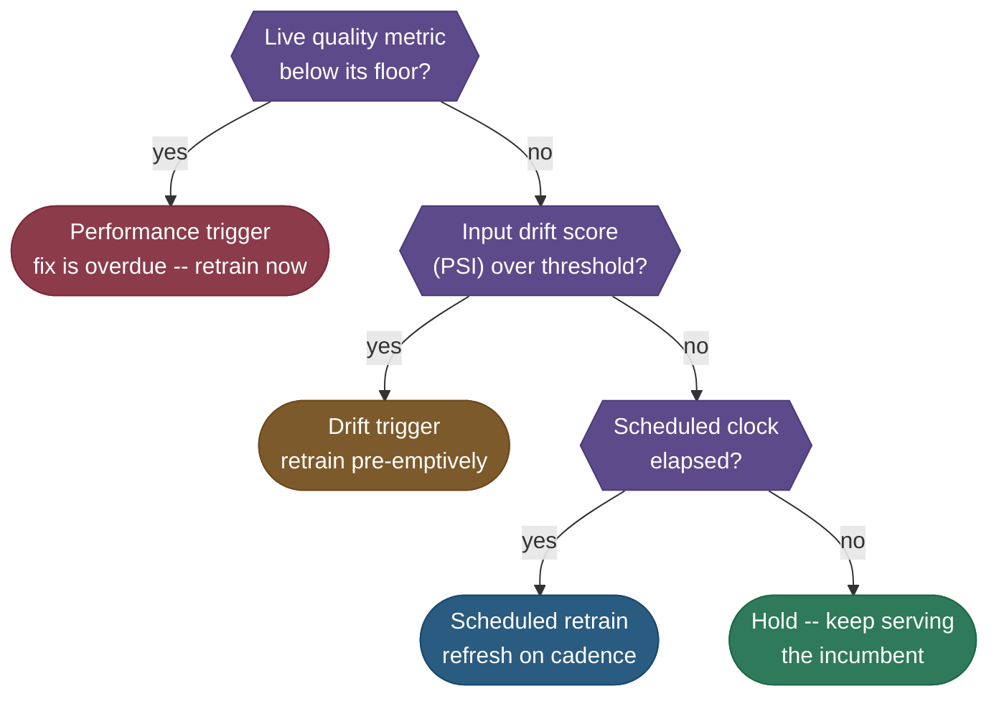

**Walking the decision tree with real numbers.** Take two weeks from the trace above and run them through the diagram top-down, exactly as the monitor would. **Week 4:** is live accuracy below its `0.85` floor? Accuracy is `0.83` — **yes**, so we stop at the first branch and fire the **performance** trigger; we never even look at PSI. **Week 8:** is accuracy below the floor? It's `0.85` — **no**, fall through. Is the input PSI over `0.20`? It's `0.27` — **yes**, so we fire the **drift** trigger and retrain pre-emptively, with a full cycle of headroom before accuracy would have cratered. **Week 2:** accuracy `0.89` (above floor, no), PSI `0.02` (under `0.20`, no), scheduled clock not elapsed → **hold and keep serving the incumbent.** The branches are checked in *severity order* — the cheapest-to-act-on, most-urgent signal first — so a single week resolves to exactly one action.

There's a second decision riding alongside the trigger: when you *do* retrain, do you rebuild from scratch or just nudge the existing model? That's **full vs incremental retrain**, and the answer depends on *how far the world moved*:


- ***Incremental update*** — keep the current weights and continue training on the fresh window (a few epochs, often a warm-started fine-tune). **Cheap and fast**, ideal for small, steady drift. The risk: it inherits the old model's blind spots and can drift off course over many rounds.
- ***Full retrain*** — rebuild from scratch on a wide window of data. **Costlier but robust** — the right move after **concept drift** or a regime change, because the model relearns the mapping instead of patching it.

> **Tip:** A pragmatic default is *incremental on the regular cadence, full retrain on a drift alarm or on a slower clock* (say, monthly). The incremental updates keep you fresh cheaply; the periodic full retrain stops small errors from compounding.

### Setup and what continuous training actually costs

The two demos below run on CPU in seconds and download nothing. For a real CT system you'll lean on a drift/monitoring library, an orchestrator, and your normal training stack:

```bash
uv pip install scikit-learn numpy matplotlib        # the runnable demos in this guide
uv pip install evidently                            # drift detection (PSI, KL, data tests)
# orchestration (pick one): apache-airflow | kfp (kubeflow) | metaflow
# verified with: scikit-learn 1.7, numpy 2.3, matplotlib 3.10, evidently 0.7
```

The cost of CT is not one training run — it's *retraining forever*, so the lever that matters is **cadence**. Retrain too often and you burn compute refreshing a model that hadn't moved; too rarely and you serve stale predictions for a full cycle after the world shifts:

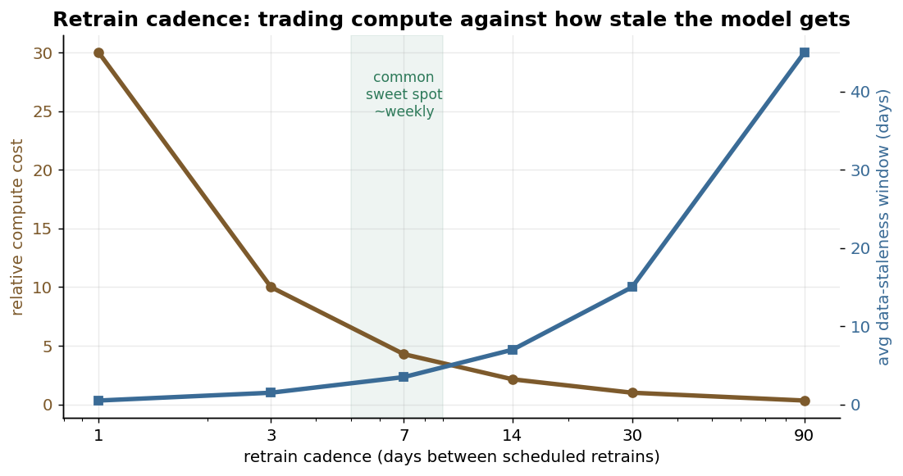

> **Note:** The headline cost trade-off is **compute vs staleness**. Frequent retrains cost more compute but keep the staleness window small; rare retrains are cheap but let the model rot between runs. Most teams land near **weekly** for a moderately drifting model and let **drift triggers** insert extra retrains exactly when they're needed — so you pay for compute only when the world actually moves. **Drift-triggered retraining is the cheapest way to stay fresh** because it spends compute on demand, not on a clock.

**The analogy:** covariate drift is being asked questions about a *new* neighborhood you've never visited; concept drift is being asked questions about your *own* neighborhood where, overnight, the street signs were all swapped. The first you can sometimes survive by generalization — an incremental update often suffices. The second you cannot: the mapping is wrong, so you must relearn it with a full retrain on fresh labels.

> **Warning:** Don't reach for a fancier model when accuracy drops — first ask *which drift* you have. Throwing model capacity at **concept drift** is wasted effort; the labels are stale, not the architecture. Diagnose the drift before you touch the model. The deeper "why a frozen model can't generalize past its training distribution" lives in [Bias-Variance & Generalization (3.07)](/ai-ml/ai-ml-intuitions/objectives-and-evaluation/bias-variance-tradeoff-intuition).

> **Note:** Most "the model degraded" incidents are a blend, but concept drift dominates the scary ones. A retraining flywheel is the only general defense, because it doesn't try to *predict* how the world will change — it just keeps re-reading the world.

## The Data Flywheel: Serving Generates Its Own Fuel

Here's the beautiful part. The thing that *exposes* ShopSense to drift — serving real transactions — is also the thing that *generates the data to fix it*. That feedback loop, spun fast enough, is a ***flywheel*** (*heavy to start, but once turning, each rotation makes the next one easier*): more users → more data → better model → more users.

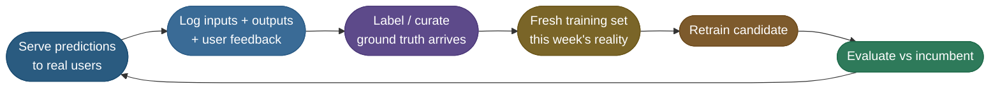

Trace the arrows and notice the loop closes on itself: the *output* of serving (logged predictions) becomes the *input* to the next retrain. But one box does all the real work — `Label / curate`, where raw traffic becomes trusted ground truth. That single step paces the entire flywheel, so it earns its own section.

### Where do the labels come from?

A model is cheap to retrain; the *labels* are the expensive, rate-limiting reagent. The whole design of your flywheel hinges on **how feedback becomes ground truth**, and there are four common sources, in rough order of cheapness:

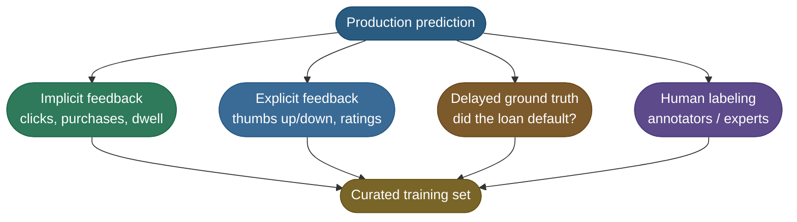

- ***Implicit*** (free, instant, biased): the user clicked the recommended item → weak positive label. Cheapest, but it only tells you about things you *showed* — a feedback-loop trap we'll defuse later.
- ***Explicit*** (cheap, sparse): a thumbs-down on a chatbot answer; a customer disputing a ShopSense charge. High signal, low volume.
- ***Delayed ground truth*** (gold, but late): a flagged transaction is confirmed fraud — or refunded as a false positive — when the chargeback lands 60 days later. Perfectly accurate, uselessly slow for fast drift.
- ***Human labeling*** (expensive, authoritative): send hard/uncertain cases to annotators. This is where ***active learning*** earns its keep (*don't label random traffic — label the examples the model is least sure about*, where a label moves the model most).

> **Important:** The flywheel's speed is set by your slowest-but-trustworthy label source. If ShopSense's true fraud label only lands with the 60-day chargeback, you cannot retrain weekly *on that label* — you retrain on proxies (disputes, manual reviews) and **reconcile** when truth lands. **Designing the label pipeline is designing the flywheel**; everything else is downstream of how fast trustworthy labels arrive. The upstream curation, dedup, and validation mechanics live in [Data-Preparation](/ai-ml/ai-ml-learning-resources/data-and-representation/synthetic-data-and-curation/synthetic-data-and-curation).

## Detecting Drift: One Number That Says "Different"

Before you can *trigger* on drift, you have to *measure* it. The workhorse statistic is the ***Population Stability Index*** (**PSI**) — *one number summarizing how far a feature's live distribution has moved from its training reference* (its close cousin is KL divergence). You freeze the feature's bins on the training data, then compare the live traffic's bin proportions to the reference:

$$\text{PSI} = \sum_{i} (p_i^{\text{live}} - p_i^{\text{ref}}) \cdot \ln\!\left(\frac{p_i^{\text{live}}}{p_i^{\text{ref}}}\right)$$

*Source: Matthew Burke, 2018 — Population Stability Index ([link](https://mwburke.github.io/data%20science/2018/04/29/population-stability-index.html))*

Read the formula as a per-bin disagreement score: each bin contributes *how much its share changed* times *the log-ratio of the change*, and PSI is the sum. The standard rule of thumb: **PSI < 0.1** = stable, **0.1–0.2** = moderate shift (watch), **> 0.2** = significant shift (investigate / retrain).

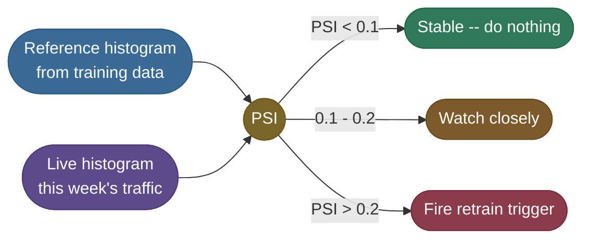

### A worked PSI micro-example

Let's trace real numbers. Suppose ShopSense bins a standardized feature (say transaction amount) into 5 equal-frequency buckets at training time, so the **reference** is flat: each bin holds 20% of traffic. This week the spending pattern shifts right — small purchases dry up, big ones surge — so the **live** proportions become `[0.05, 0.10, 0.20, 0.30, 0.35]`:

| Bin | `p_ref` | `p_live` | `p_live − p_ref` | `ln(p_live/p_ref)` | contribution |
|---|---|---|---|---|---|
| b0 | 0.20 | 0.05 | −0.15 | −1.386 | **+0.208** |
| b1 | 0.20 | 0.10 | −0.10 | −0.693 | **+0.069** |
| b2 | 0.20 | 0.20 |  0.00 |  0.000 | **+0.000** |
| b3 | 0.20 | 0.30 | +0.10 | +0.405 | **+0.041** |
| b4 | 0.20 | 0.35 | +0.15 | +0.560 | **+0.084** |

To see exactly where one row comes from, plug bin **b0** into the formula by hand: its share fell from `p_ref = 0.20` to `p_live = 0.05`, so the term is `(0.05 − 0.20) × ln(0.05 / 0.20) = (−0.15) × ln(0.25) = (−0.15) × (−1.386) = +0.208`. Two negatives multiply to a positive — a bin that *emptied* (live below reference) contributes just as much as one that *filled*. b0 alone is over half the whole score, which is the signal "the smallest-value bucket nearly emptied out." Do that for all five bins and sum: `0.208 + 0.069 + 0.000 + 0.041 + 0.084 ≈ 0.40`.

Sum the last column: **PSI ≈ 0.40**, well past the `0.2` line — so the monitor fires. Notice *each term is positive* (a moved-away bin always adds, whether it grew or shrank), and the biggest contributors are the bins that emptied or filled the most. Here it is as a picture:

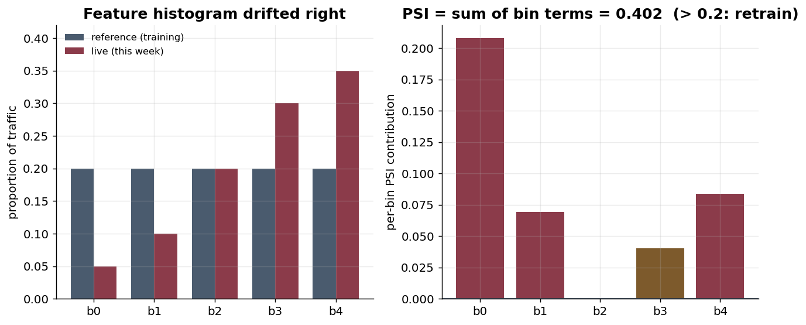

Now the same logic as runnable code: bin the reference once, then score three live weeks for ShopSense and turn each PSI into a decision. **The bin edges are frozen at training time and reused forever** — re-binning on live data would hide the very drift you're hunting:

```python
"""Runnable drift-detection demo (CPU, offline, deterministic). Compute the Population
Stability Index (PSI) of a feature's live histogram against its training reference, then
turn the score into a retrain decision -- exactly what a drift-triggered monitor does."""
import numpy as np
np.random.seed(0)

# 1. REFERENCE: the feature distribution the model was TRAINED on (e.g. transaction amount,
#    standardized). We freeze its bin edges at training time and reuse them forever.
ref = np.random.normal(0.0, 1.0, size=20_000)
edges = np.quantile(ref, np.linspace(0, 1, 6))      # 5 equal-frequency bins
edges[0], edges[-1] = -np.inf, np.inf               # catch out-of-range live values

def proportions(x):
    counts, _ = np.histogram(x, bins=edges)
    p = counts / counts.sum()
    return np.clip(p, 1e-6, None)                    # avoid log(0) on empty bins

p_ref = proportions(ref)

# 2. PSI between a live week and the reference: sum over bins of (p_live - p_ref)*ln(p_live/p_ref).
def psi(live):
    p_live = proportions(live)
    terms = (p_live - p_ref) * np.log(p_live / p_ref)
    return float(terms.sum()), p_live

def verdict(score):
    if score < 0.1:  return "stable      -> do nothing"
    if score < 0.2:  return "moderate    -> watch closely"
    return "significant -> FIRE retrain trigger"

# 3. THREE WEEKS of live traffic for our ShopSense model: week 1 looks like training,
#    week 5 has shifted (mean creeps up), week 9 has shifted hard (a new spending regime).
weeks = {
    "week 1 (no shift)":   np.random.normal(0.0, 1.0, 8_000),
    "week 5 (mean +0.35)": np.random.normal(0.35, 1.0, 8_000),
    "week 9 (mean +1.1)":  np.random.normal(1.1, 1.2, 8_000),
}
print(f"{'live window':<20} | {'PSI':>6} | decision")
print("-" * 56)
for name, live in weeks.items():
    score, _ = psi(live)
    print(f"{name:<20} | {score:>6.3f} | {verdict(score)}")

# Expected output:
# live window          |    PSI | decision
# --------------------------------------------------------
# week 1 (no shift)    |  0.000 | stable      -> do nothing
# week 5 (mean +0.35)  |  0.110 | moderate    -> watch closely
# week 9 (mean +1.1)   |  0.827 | significant -> FIRE retrain trigger
```

> **Warning:** PSI watches the *inputs*, so it catches **covariate drift** but is blind to pure **concept drift** — where `P(x)` is unchanged but `P(y|x)` flipped. That's why drift monitoring alone is never enough: you also need a *performance* trigger on real labels. The inputs can look identical while the right answer quietly changed underneath them.

## Retraining Triggers in Practice

You can now measure drift and you've seen the three trigger philosophies. Let's see them side by side over the same 12 production weeks — the value of each becomes obvious only when you watch *when* each one fires:

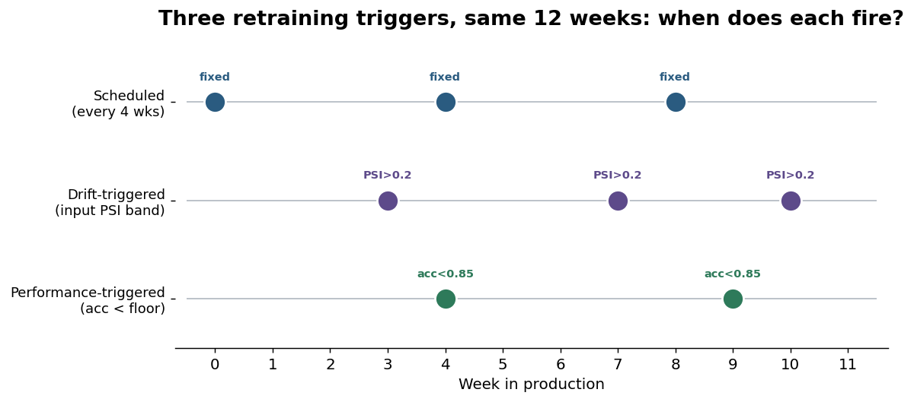

Here is the OR-combination running on ShopSense — the exact trace from the top of the guide, now as code you can run. Each week we read **both** signals and let whichever crosses first pull the lever:

```python
"""ShopSense flywheel with BOTH triggers (CPU, offline, deterministic).

We watch one monitored feature's PSI (leading: did the inputs move?) and live
accuracy (lagging: did quality drop?) together, week by week, as the world
rotates (drift). Whichever crosses its line first fires a retrain; after a
retrain we re-anchor the PSI reference to the new normal. This is the loop
turning, in numbers -- the source of the 12-week table at the top of the guide.
"""
import numpy as np
from sklearn.linear_model import LogisticRegression

RNG = np.random.default_rng(0)          # deterministic: identical numbers every run
N_WEEK = 1500
DRIFT_PER_WEEK = 0.18                    # radians the world rotates each week
PSI_WATCH, PSI_FIRE = 0.10, 0.20         # drift bands (leading indicator)
ACC_FLOOR = 0.85                         # accuracy floor (lagging indicator)

def make_week(week, n=N_WEEK):
    """Two labelled blobs whose separating axis ROTATES with the week => drift."""
    theta = DRIFT_PER_WEEK * week
    rot = np.array([[np.cos(theta), -np.sin(theta)],
                    [np.sin(theta),  np.cos(theta)]])
    y = RNG.integers(0, 2, size=n)                       # 0 = legit, 1 = fraud
    centers = np.array([[-1.4, 0.0], [1.4, 0.0]])        # one blob center per class
    X = (RNG.normal(0.0, 1.0, size=(n, 2)) + centers[y]) @ rot.T
    return X, y

# PSI bin edges are frozen ONCE on the week-0 feature and reused forever -- re-binning
# on live data would hide the very drift we are hunting.
X0, y0 = make_week(0)
edges = np.quantile(X0[:, 0], np.linspace(0, 1, 6))      # 5 equal-frequency bins
edges[0], edges[-1] = -np.inf, np.inf                    # catch out-of-range live values

def histp(values):                                       # bin proportions, log-safe
    p = np.histogram(values, bins=edges)[0] / len(values)
    return np.clip(p, 1e-6, None)

def psi(values, p_ref):
    p = histp(values)
    return float(((p - p_ref) * np.log(p / p_ref)).sum())

model = LogisticRegression().fit(X0, y0)                 # ShopSense, trained on week 0
p_ref = histp(X0[:, 0])                                  # PSI reference = current normal
print(f"{'wk':>2} | {'PSI':>5} | {'acc':>5} | what the monitor decides")
print("-" * 60)
for wk in range(12):
    Xw, yw = make_week(wk)                               # this week's live traffic
    s   = psi(Xw[:, 0], p_ref)                           # leading: did the inputs move?
    acc = float((model.predict(Xw) == yw).mean())        # lagging: is quality still ok?
    if wk > 0 and acc < ACC_FLOOR:                       # performance trigger (backstop)
        model = LogisticRegression().fit(Xw, yw)         # retrain on fresh labels...
        p_ref = histp(Xw[:, 0])                          # ...and re-anchor PSI reference
        new = float((model.predict(Xw) == yw).mean())
        note = f"PERF fires -> retrain (acc {acc:.2f}->{new:.2f})"
    elif wk > 0 and s > PSI_FIRE:                        # drift trigger (leading)
        model = LogisticRegression().fit(Xw, yw)         # retrain pre-emptively...
        p_ref = histp(Xw[:, 0])                          # ...and re-anchor PSI reference
        note = f"DRIFT past 0.20 -> retrain (PSI {s:.2f}, acc still {acc:.2f})"
        s = 0.0                                           # post-retrain, drift resets
    elif s > PSI_WATCH:
        note = "watch band -> hold"
    else:
        note = "stable -> hold"
    print(f"{wk:>2} | {s:>5.2f} | {acc:>5.2f} | {note}")

# Expected output:
# wk |   PSI |   acc | what the monitor decides
# ------------------------------------------------------------
#  0 |  0.00 |  0.92 | stable -> hold
#  1 |  0.00 |  0.92 | stable -> hold
#  2 |  0.02 |  0.89 | stable -> hold
#  3 |  0.05 |  0.87 | stable -> hold
#  4 |  0.10 |  0.83 | PERF fires -> retrain (acc 0.83->0.90)
#  5 |  0.03 |  0.92 | stable -> hold
#  6 |  0.10 |  0.91 | watch band -> hold
#  7 |  0.17 |  0.88 | watch band -> hold
#  8 |  0.00 |  0.85 | DRIFT past 0.20 -> retrain (PSI 0.27, acc still 0.85)
#  9 |  0.00 |  0.89 | stable -> hold
# 10 |  0.01 |  0.89 | stable -> hold
# 11 |  0.02 |  0.89 | stable -> hold
```

Trace the firings: at **week 4** the *lagging* signal wins the race — a boundary rotation hurt accuracy (`0.83`) before it visibly moved the single feature's marginal (PSI still `0.10`), so the **performance** trigger catches it. At **week 8** the *leading* signal wins — PSI hits `0.27`, past the `0.20` line, while accuracy is still a healthy `0.85`, so the **drift** trigger retrains *pre-emptively, before users feel it*. Different shifts surface in different signals, which is exactly why you wire them as an **OR**: the faster of the two always saves you. (After each retrain we re-anchor the PSI reference to the new normal — otherwise PSI would keep growing against an obsolete week-0 baseline and scream forever.)

## The Automated Retraining Pipeline


```mermaid
graph LR
    T(["Trigger fires<br/>scheduled / drift / perf"]):::trigger
    T --> ING(["Ingest fresh data<br/>last N weeks of traffic"]):::ingest
    ING --> VAL(["Validate data<br/>schema + quality checks"]):::validate
    VAL --> TR(["Train candidate<br/>same recipe, new data"]):::train
    TR --> EVAL(["Evaluate<br/>holdout + gates"]):::eval
    EVAL --> GATE{{"Beats incumbent<br/>AND passes gates?"}}:::gate
    GATE -->|"yes"| REG(["Register model<br/>versioned artifact"]):::register
    GATE -->|"no"| STOP(["Reject + alert<br/>keep incumbent"]):::stop
    REG --> DEP(["Deploy: canary"]):::deploy

    classDef trigger fill:#7D5A2C,stroke:#6D4A1C,color:#fff
    classDef ingest fill:#3A6B96,stroke:#2A5B86,color:#fff
    classDef validate fill:#2A5B80,stroke:#1A4B70,color:#fff
    classDef train fill:#7A6528,stroke:#6A5518,color:#fff
    classDef eval fill:#5D4A8A,stroke:#4D3A7A,color:#fff
    classDef gate fill:#4A5B6E,stroke:#3A4B5E,color:#fff
    classDef register fill:#2E7A5A,stroke:#1E6A4A,color:#fff
    classDef stop fill:#8B3B4A,stroke:#7B2B3A,color:#fff
    classDef deploy fill:#2E7A5A,stroke:#1E6A4A,color:#fff
```

Three properties make this a *pipeline* rather than a *script*:

2. **Data validation as a first-class gate** — before a single gradient step, the pipeline asserts the fresh data's *schema, ranges, null rates, and class balance* match expectations. **The number-one cause of a bad retrain is not a bad model — it's a silently broken upstream data source** the pipeline trained on without noticing. (See [Data-Preparation](/ai-ml/ai-ml-learning-resources/data-and-representation/synthetic-data-and-curation/synthetic-data-and-curation).)
3. **The model is never trusted by default** — a fresh candidate is *guilty until proven innocent*. It only ships if it beats the current production model **and** clears absolute quality gates. Otherwise the pipeline keeps the incumbent and alerts a human. A flywheel that auto-ships every candidate is a machine for amplifying data bugs.

> **Important:** "Continuous training" does not mean "continuously deploying whatever comes out." It means the path from new-data to evaluated-candidate is automated; whether that candidate reaches users is a separate, gated decision. **The automation removes toil, not judgement.** The actual training recipe each run re-executes is the one from [The Training Loop](/ai-ml/ai-ml-learning-resources/model-building/pretraining/pretraining-the-training-loop) — CT just re-runs it on a schedule with guardrails.

## Guarding Against Degradation

The flywheel has a dark side: **a loop that retrains on its own outputs can spiral.** Three failure modes can make automated retraining actively *worse* than doing nothing. A serious CT system spends as much engineering on guardrails as on the loop itself.

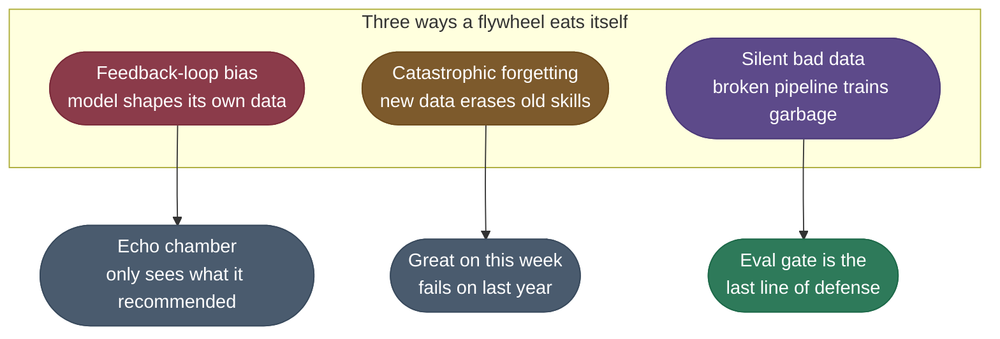

### 1. Feedback-loop bias (the echo chamber)

A recommender shows item A, the user clicks A, you log "A is good," you retrain to recommend A *more*. Item B — which the user might have loved — was never shown, so it gets no positive labels, so it's recommended less, so it gets fewer labels. The model spirals into a **self-confirming echo chamber**, mistaking *what it showed* for *what users want*. ShopSense has its own version: if it blocks a class of transactions, those transactions never complete, so it never learns they were actually legitimate — the model's own decisions censor its future training data.

- **The fix:** inject ***exploration*** (*show a small fraction of randomized or epsilon-greedy decisions to gather unbiased signal*) and use ***inverse-propensity weighting*** (*re-weight each logged example by 1/(probability the old policy showed it), correcting for the fact that your logs are biased by past behavior*). You must deliberately spend a little reward to keep learning.

### 2. Catastrophic forgetting

If you retrain *only* on the freshest window, the model can become brilliant at this month and amnesiac about everything before. A fraud model trained only on this week's attacks may forget last year's attacks — which promptly return.

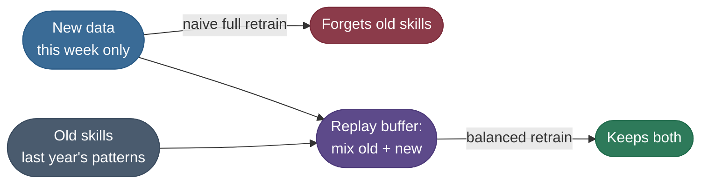

- **The fix:** ***rehearsal / replay*** (*always blend a representative sample of historical data into each retrain*) and evaluate against a **frozen "regression" test set** of old-but-still-important cases. The fresh window teaches the new world; the replay buffer protects the old. The effect is stark — a fresh-only retrain can ace this week while collapsing on last year's cases:

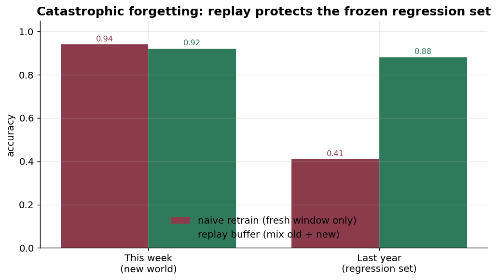

> **Note:** The bars show the trade you're making: replay gives up a *hair* of this-week accuracy (0.94 → 0.92) to avoid a *cliff* on last year's cases (0.41 → 0.88). That's almost always the right trade — a model that forgot last year's fraud is a model that re-opens last year's holes.

### 3. The eval gate is your last line of defense

Both hazards above, plus silently-broken data pipelines, are ultimately caught by one mechanism: **a candidate must beat the incumbent on a trustworthy holdout before it can ship.** This is the single most important safety device in continuous training — and the reason the pipeline rejects candidates rather than blindly promoting them. Pair it with [LLM-as-judge / evaluation](/ai-ml/ai-ml-learning-resources/evaluation/model-evaluation-and-benchmarks/model-evaluation-and-benchmarks) discipline for generative systems, and gate generative retrains with [LLM Evaluation & LLM-as-Judge (8.04)](/ai-ml/ai-ml-intuitions/objectives-and-evaluation/llm-as-judge-intuition).

> **Warning:** Automation without guardrails doesn't just risk a bad day — it risks a confident, self-reinforcing slide that's hard to even notice. The flywheel must be able to say "no."

## Code Example

Two views of the same idea. **First, the runnable simulation** — a full flywheel on your laptop, no GPU, no downloads, deterministic. We train ShopSense on "week 0," let the world rotate a little each week (drift), and watch two policies diverge: a **static** model that's never updated, and a **flywheel** that retrains whenever its live accuracy drops below a floor (a *performance* trigger, the lagging backstop from above).

```python
"""Simulated data flywheel (CPU, offline, deterministic).

A baseline classifier is trained on week 0. Each week the world rotates a
little (covariate + concept drift). We compare a STATIC model (never updated)
against a FLYWHEEL (retrains on fresh, freshly-labeled traffic when live
accuracy drops below a floor). The static model rots; the flywheel recovers.
"""
import numpy as np
from sklearn.linear_model import LogisticRegression

RNG = np.random.default_rng(0)          # deterministic
N_PER_WEEK = 1500
WEEKS = 12
DRIFT_PER_WEEK = 0.18                    # radians the world rotates each week
RETRAIN_THRESHOLD = 0.85                 # accuracy floor that triggers retrain


def make_week(week, n=N_PER_WEEK):
    """Two blobs whose separating axis ROTATES as weeks pass => drift."""
    theta = DRIFT_PER_WEEK * week
    rot = np.array([[np.cos(theta), -np.sin(theta)],
                    [np.sin(theta),  np.cos(theta)]])
    y = RNG.integers(0, 2, size=n)
    centers = np.array([[-1.4, 0.0], [1.4, 0.0]])
    X = (RNG.normal(0.0, 1.0, size=(n, 2)) + centers[y]) @ rot.T
    return X, y


def accuracy(model, X, y):
    return float((model.predict(X) == y).mean())


X0, y0 = make_week(0)                       # the "launch" world
baseline = LogisticRegression().fit(X0, y0)   # static: trained once, never again
flywheel = LogisticRegression().fit(X0, y0)   # flywheel: will retrain on drift

print(f"{'week':>4} | {'static acc':>10} | {'flywheel acc':>12} | event")
print("-" * 56)
for week in range(WEEKS):
    Xw, yw = make_week(week)                 # this week's live traffic
    acc_static = accuracy(baseline, Xw, yw)
    acc_fly = accuracy(flywheel, Xw, yw)
    event = ""
    if week > 0 and acc_fly < RETRAIN_THRESHOLD:        # performance trigger
        flywheel = LogisticRegression().fit(Xw, yw)     # retrain on fresh labels
        after = accuracy(flywheel, Xw, yw)
        event = f"RETRAIN (acc {acc_fly:.3f} -> {after:.3f})"
        acc_fly = after
    print(f"{week:>4} | {acc_static:>10.3f} | {acc_fly:>12.3f} | {event}")

# Expected output:
# week | static acc | flywheel acc | event
# --------------------------------------------------------
#    0 |      0.919 |        0.919 |
#    1 |      0.919 |        0.919 |
#    2 |      0.889 |        0.889 |
#    3 |      0.875 |        0.875 |
#    4 |      0.833 |        0.904 | RETRAIN (acc 0.833 -> 0.904)
#    5 |      0.777 |        0.917 |
#    6 |      0.679 |        0.912 |
#    7 |      0.643 |        0.883 |
#    8 |      0.509 |        0.853 |
#    9 |      0.429 |        0.893 | RETRAIN (acc 0.803 -> 0.893)
#   10 |      0.345 |        0.905 |
#   11 |      0.243 |        0.911 |
```

Read the columns side by side and the entire thesis of this guide is in the numbers: the **static** model rots from **0.919 → 0.243** as the world rotates away from it, while the **flywheel** holds **~0.90** the whole way by retraining at weeks 4 and 9. Same drift, two policies — the only difference is whether the loop turns. (One honest detail to notice: at week 9 the flywheel had already drifted to ~0.80 *before* the floor caught it — that lag is exactly why you also want the *leading* drift trigger from the PSI section, which would have fired earlier.)

Here is that table as a picture (generated by the same simulation):

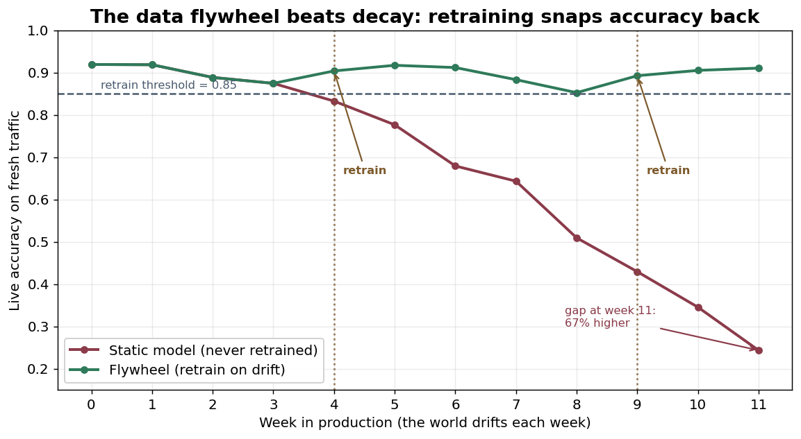

**Second, the production shape** — in a real system the loop is the same, but each step is an orchestrated, gated stage. This is the skeleton you'd wire into Airflow / Kubeflow / Vertex Pipelines (illustrative, not run here):

```python
# PRODUCTION continuous-training pipeline (orchestrator pseudocode / illustrative).
def continuous_training_run(trigger_reason: str):
    # 1. INGEST a fresh, versioned window of production data
    data = ingest_recent_traffic(window="28d")              # + user feedback/labels

    # 2. VALIDATE before training (schema, ranges, null rates, class balance)
    assert_data_contract(data)                              # fail loud, never train garbage

    # 3. CURATE: blend fresh window with a replay buffer (anti-forgetting)
    train_set = mix(fresh=data, replay=sample_history(frac=0.3))

    # 4. TRAIN a candidate with the SAME pinned recipe as production
    candidate = train(train_set, config=PINNED_HPARAMS, seed=0)

    # 5. EVALUATE against incumbent on a trustworthy holdout + frozen regression set
    if not (beats_incumbent(candidate) and passes_quality_gates(candidate)):
        alert("retrain rejected: candidate did not clear gates"); return  # keep incumbent

    # 6. REGISTER the versioned artifact, then DEPLOY behind a canary
    version = registry.register(candidate, lineage=trigger_reason)
    deploy_canary(version, traffic=0.05, auto_rollback_on=("quality", "latency", "errors"))
```

The runnable toy and the production skeleton are the *same seven boxes* from the map at the top — ingest, validate, train, evaluate, gate, register, roll out. Scale changes the tooling, not the shape.

## Troubleshooting: When the Flywheel Misbehaves

Continuous-training failures have recognizable *signatures*, and each points at a specific fix. When a retrain goes wrong, run down this list before touching the model architecture:

| Symptom you see | Likely cause | One-line fix |
|---|---|---|
| **Accuracy drops but PSI is flat** | concept drift — `P(y\|x)` moved, inputs didn't | add a *performance* trigger on real labels; full retrain on fresh labels |
| **Retrains fire constantly (thrash)** | trigger threshold too tight; noisy weekly metric | add hysteresis / a minimum interval; smooth the metric over a window |
| **Model aces this week, fails on old cases** | catastrophic forgetting — fresh-only window | blend a replay buffer; gate on a frozen regression set |
| **Recommendations narrow over time** | feedback-loop bias (echo chamber) | inject exploration; inverse-propensity-weight the logs |
| **Candidate looks great offline, bad live** | holdout doesn't match live traffic | canary first; shrink the gap by sampling the holdout from recent traffic |
| **A retrain silently shipped garbage** | broken upstream data, no validation gate | add a data contract (schema/ranges/nulls) *before* training |
| **PSI screams but quality is fine** | benign covariate shift (harmless new region) | don't auto-retrain on drift alone; require drift **and** a quality dip |
| **Every retrain is slightly worse** | incremental updates compounding error | periodic **full** retrain from a wide window to reset |


> **Tip:** Almost every row above is fixed by one of two moves — **make the trigger smarter** (combine drift + performance, add hysteresis) when the loop fires wrong, or **fix the data** (replay buffer, validation gate, exploration) when the *signal* feeding the retrain was biased or broken. Diagnose which half you're in before turning knobs.

## Final Conclusion

You now have the whole flywheel. A deployed model is a perishable good: the world drifts (covariate, label, and the deadly concept drift), and a frozen model decays — you watched ShopSense fall from 92% to 24%. The cure isn't a smarter model; it's a **system**: serving generates data, a PSI monitor flags the rot early (drift as the leading indicator, performance as the lagging backstop), an automated-but-gated pipeline retrains a candidate (incremental when the world nudged, full when it lurched), guardrails (replay against forgetting, exploration against feedback-loop bias, and above all an eval gate that can say *no*) keep the loop from eating itself, and a canary rollout with automatic rollback ships it without betting the whole user base. String those together and you get a model that stays sharp on its own — not because you predicted the future, but because you built a machine that **keeps re-reading the present**. None of it needs a research budget: **you can build a retraining flywheel yourself, today, on a laptop** — the PSI monitor and the simulation above are the seed; production is the same loop with sturdier plumbing.

## Production implementation

Runnable services in this estate that implement what this page teaches:

- **[ml-platform](/python/python-production-examples/ml-platform/readme)** — drift detection triggering a retrain, then a gated promotion state machine deciding whether the new model ships.
- **[mlops-lifecycle](/python/cross-service-workflows/mlops-lifecycle)** — the full retrain-evaluate-promote circuit across services.

## References

The curated link library for this topic — videos, courses, articles, papers and internal
cross-links — lives in a companion file so it can be reused as a standalone reference list:

- [Continuous Training — references](/ai-ml/ai-ml-learning-resources/operations-and-lifecycle/lifecycle-and-reproducibility/continuous-training/continuous-training-references)
