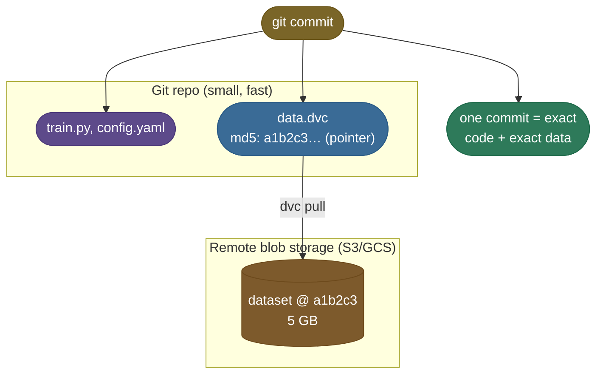
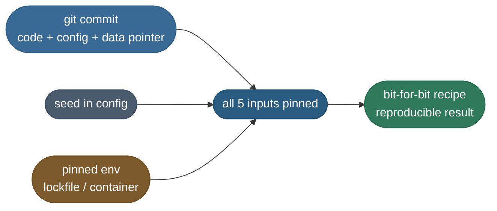

# Data and Model Versioning — DVC · lakeFS: the half of reproducibility Git cannot do
> Git for data and models: track large datasets and model artifacts by content hash, store the bytes in
> object storage, and keep only lightweight pointers in Git — so any commit reconstructs the exact
> data + model that produced a result. Reproducibility's missing half (Git versions code, not 10 GB of data).

**Why it matters:** the "Git can't hold your training set — so how do you version data?" question.
Expect the DVC model (pointer files + remote cache + content-addressable storage), why this differs
from versioning code, data lineage (which dataset version → which model), and the difference between
file-level tools (DVC) and data-lake/branching tools (lakeFS). Pairs with experiment tracking for full reproducibility.

[Reproducibility](/ai-ml/ai-ml-learning-resources/operations-and-lifecycle/lifecycle-and-reproducibility/reproducibility/reproducibility) pinned config and seeds; [Experiment Tracking](/ai-ml/ai-ml-learning-resources/operations-and-lifecycle/lifecycle-and-reproducibility/experiment-tracking/experiment-tracking) recorded params, metrics and artifacts per run and registered the winner. Two inputs remain — **data** and **code** — and they are what make a result *truly* reproducible months later. Git handles code natively. Data needs a companion: **DVC (Data Version Control)**.

## Data and code versioning: DVC + Git

### The problem: git can't hold your data

Git is built for text. A 5 GB dataset (or a 2 GB model checkpoint) in git will bloat the repo, slow every clone to a crawl, and eventually hit hosting limits. But you still need to answer "which exact data produced this model?"

**DVC's trick:** keep the *data* in cheap blob storage (S3, GCS, a shared drive) and keep a tiny **pointer file** in git. The pointer is a hash of the data's content. Git versions the pointer; DVC uses the pointer to fetch the right data from storage.



The split is the whole trick: git holds only small, fast things (code, config, a tiny hash pointer), the heavy bytes live in blob storage, and one `git commit` ties the two together — so the commit *is* the exact code-plus-data recipe, and `dvc pull` rehydrates the data the pointer names.

### The payoff: one git commit pins everything

With DVC + git, a single commit captures **code + config + data version** together. To reproduce the run that scored 0.94:

```bash
git checkout <commit-that-scored-0.94>   # restores code + config + the .dvc pointer
dvc pull                                  # fetches the exact dataset that pointer references
python train.py --config config.yaml      # same code, same data, same config
```

That's the whole `support-bot` story closing the loop: the commit restores the code and the `.dvc` pointer, `dvc pull` fetches the exact `support_tickets_v3` snapshot, and the seed in `config.yaml` fixes the randomness — so the run that scored `0.94` runs again and scores `0.94`. Combine that with a pinned environment (`requirements.txt` / a lockfile / a container image), and you have all five inputs nailed down — the run is reproducible by construction.

> **Warning:** A `.dvc` pointer in git is worthless if the blob it references was deleted from remote storage. Treat your DVC remote like a backup: the data behind every commit you might want to reproduce must actually still exist. "We versioned the pointer but garbage-collected the data" is a real, painful way to lose a result.

Here is how all five inputs fold into a single recoverable recipe — three sources converging on one guarantee:



> **Note:** DVC also versions models and intermediate artifacts the same way — and `dvc repro` can re-run a defined pipeline (prep → train → eval) only where inputs changed. Pair it with the [Data Preparation](/ai-ml/practitioner-workflows/data-and-inputs/data-preparation) workflow so the data snapshot you train on is itself versioned and reproducible.

---

## References and further reading

The curated link library for this topic — videos, courses, articles, papers, and internal cross-links — lives in a companion file so it can be reused as a standalone reference list:

**→ [Data and Model Versioning — references and further reading](/ai-ml/ai-ml-learning-resources/operations-and-lifecycle/lifecycle-and-reproducibility/data-and-model-versioning/data-and-model-versioning#references-further-reading)**
