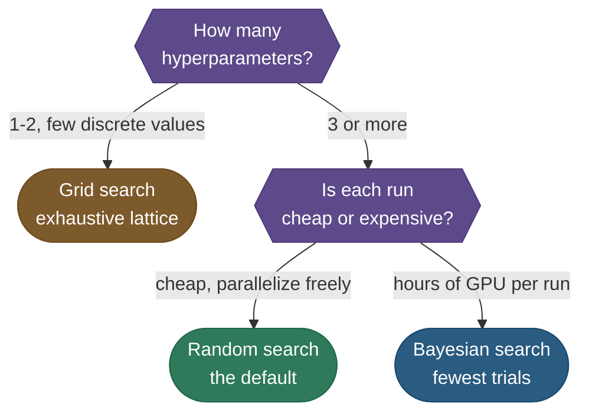
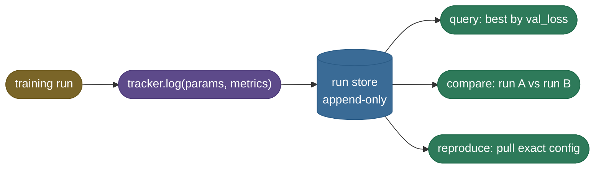
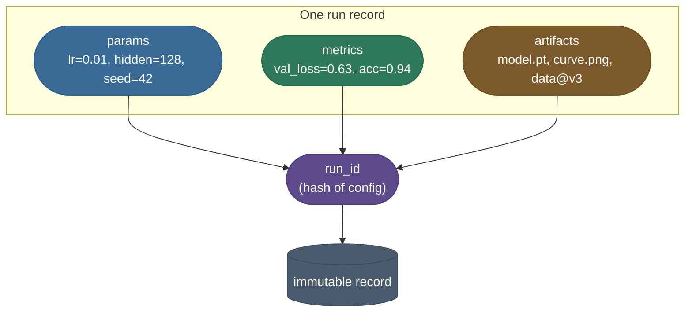
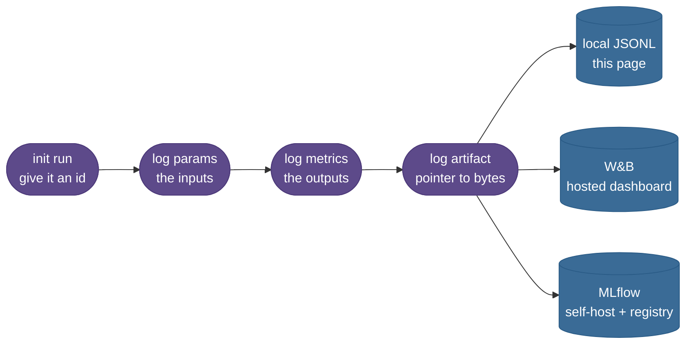
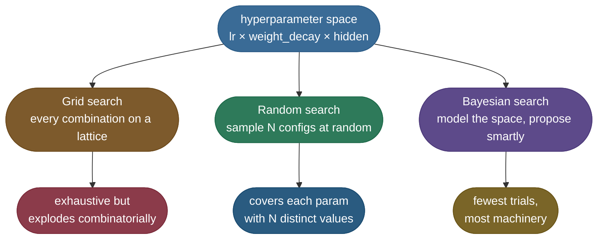
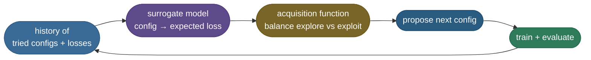
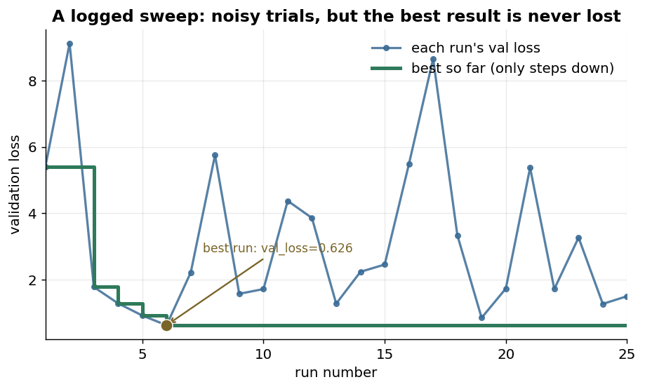

# Experiment Tracking — MLflow · Weights & Biases: which config got that score?
> Logging every run's params, metrics, code version, and artifacts to a central store so experiments
> are comparable, searchable, and reproducible. The lab notebook of ML — turns "I think run 47 was
> best" into a queryable record.

**Why it matters:** a near-universal MLOps interview topic. Expect "how do you track experiments and
pick the best model," the anatomy of a run (params vs metrics vs tags vs artifacts), why this beats
spreadsheets/filenames, MLflow's four components (Tracking, Projects, Models, Registry), and how
tracking feeds the model registry and CI/CD downstream. Since MLflow 3 (2025) the same store also
holds **generative-AI traces and evaluation runs**, so "a run" now covers a prompt/agent version too.

[Reproducibility](/ai-ml/ai-ml-learning-resources/operations-and-lifecycle/lifecycle-and-reproducibility/reproducibility/reproducibility) pinned the intentional inputs (config) and the unintentional one (randomness). This page is the logbook: the tracker that writes config and score in the same record for every run, the sweep that decides what to run next, and the runnable fifteen-line tracker that proves the concept is smaller than the tools. We carry the same `support-bot` experiment — a support-ticket classifier on `support_tickets_v3`, chasing a validation accuracy of `0.94`.

### Which tracker do I pick? W&B vs MLflow vs TensorBoard

Before you log a single run, pick where the logbook lives — the three common choices solve the *same* problem (record params + metrics + artifacts per run) but trade off hosting, cost, and scope very differently. This page teaches the *concept* with a tiny local store so it's tool-agnostic; this table is so you know which real tool to reach for:

| | **Weights & Biases** | **MLflow** | **TensorBoard** |
|---|---|---|---|
| **What it is** | hosted experiment platform | open-source tracking + registry | a metrics *visualizer* |
| **Hosting** | SaaS (or self-host enterprise) | self-host or managed | local files / `tensorboard` server |
| **Cost** | free for individuals, paid teams | free (you run the server) | free |
| **Sweeps built in** | yes (W&B Sweeps) | no (pair with Optuna) | no |
| **Model registry** | yes | yes (first-class) | no |
| **Best for** | teams wanting dashboards + sweeps with zero ops | self-hosted, registry-centric MLOps | quickly *eyeballing* loss curves in one run |

> **Tip:** If you just want to *see* a loss curve for one run, TensorBoard is the path of least resistance. The moment you have **many runs to compare** or a team to share with, reach for W&B (least ops) or MLflow (self-hosted, registry-first). They're not mutually exclusive — plenty of teams log to MLflow *and* point TensorBoard at the same metrics.

The second decision you'll hit is *how to search* the hyperparameter space — grid, random, or Bayesian. We cover the why in depth later; this flow is the short answer for where you're headed:



### Setup and what tracking actually costs

The runnable demo at the end of this page needs only the Python standard library — it logs to a local JSON file with zero dependencies. To use the *real* tools, install the standard tracking stack:

```bash
uv pip install wandb mlflow optuna dvc tensorboard
# verified with: wandb 0.18, mlflow 2.17, optuna 4.0, dvc 3.55, tensorboard 2.18
```

Tracking isn't free, but it's cheap. The two costs to keep in mind:

| Cost | Reality |
|---|---|
| **Logging overhead** | Per-step `log()` calls are tiny (a metric is a few bytes). Logging *every* step of a long run adds up — log scalars every step, but throttle heavy artifacts (images, histograms) to every N steps. |
| **Artifact storage** | The bytes are in the **artifacts**, not the metrics. A 2 GB checkpoint logged on every one of 200 sweep trials is 400 GB. Store a *pointer* (hash/path) by default and only upload the few checkpoints you'll actually keep. |

> **Note:** The most expensive mistake isn't storage — it's *not* tracking. One un-logged run that scored 0.94 and can't be reproduced costs more engineer-hours than a year of W&B storage. Log first, optimize storage later.

---

## Tracking Runs: Params, Metrics, and Artifacts Together

Now the heart of it. The fix for "which config got that score?" is to **write the config and the score in the same place, automatically, for every run.** That's all an experiment tracker is: a logbook that records, per run, the **parameters** (the inputs) and the **metrics** (the outputs) — plus pointers to **artifacts** (the model file, plots, the data version).



Read it as one write feeding three reads: every run flows through a single `log` call into one append-only store, and once it's there the three questions you'll ever ask — *which is best?*, *how do two compare?*, *what config do I re-run?* — are all just queries against it.

### The anatomy of a logged run

Three things, always together:

1. **Params** — the config that defined the run (`lr`, `weight_decay`, `hidden`, `seed`, data version). The *inputs*.
2. **Metrics** — what you measured (`val_loss`, `accuracy`, `train_time`). The *outputs*. Often logged per-step so you can plot a curve.
3. **Artifacts** — the heavy outputs you can't put in a number: the saved model weights, a confusion-matrix plot, the exact data snapshot. The tracker stores a *pointer* (path or hash), not the bytes inline.

**Here's what one looks like.** Strip away the dashboard and a logged `support-bot` run is just a record — this is the JSONL line that lands in the store, pretty-printed and fleshed out with the seed, data version, and artifact pointers a real run also logs (the runnable demo below logs the same shape with a leaner field set):

```json
{
  "run_id": "d4ae3025",
  "params": {
    "lr": 0.00716,
    "weight_decay": 1.0e-05,
    "hidden": 128,
    "seed": 42,
    "dataset": "support_tickets_v3",
    "git_commit": "a1b2c3d"
  },
  "metrics": { "val_loss": 0.6258, "val_acc": 0.94, "train_time_s": 87.3 },
  "artifacts": { "model": "s3://bucket/support-bot/d4ae3025/model.pt", "data": "support_tickets_v3@a1b2c3" }
}
```

Read it top to bottom and every reproducibility question is already answered in one place: *which config?* (the `params` block), *what did it score?* (`metrics`), *where's the model and what data made it?* (`artifacts`, by pointer not by bytes). The `run_id` `d4ae3025` is a hash of the config, so the record is self-naming — no more `model_final_v2_REALLY_final.pt`. That single object **is** the cure for "which config got that score?": the `0.94` and the recipe that produced it can never again drift apart, because they were written down together, in the same line, the moment the run finished.



The takeaway the diagram fixes in place: params, metrics, and artifacts all collapse into one `run_id` (a hash of the config), and that id keys an immutable record — which is precisely why the recipe and its score can never drift apart again.

### The W&B / MLflow mental model

In production you don't write the logbook yourself — you use **Weights & Biases (W&B)** or **MLflow**. Strip away the dashboards and they're the same three calls our local store makes:

| Concept | Local JSON store (this page) | W&B | MLflow |
| :--- | :--- | :--- | :--- |
| Start a run | `RunStore(path)` | `wandb.init(project=...)` | `mlflow.start_run()` |
| Record inputs | `params` in `log()` | `wandb.config.update(params)` | `mlflow.log_params(params)` |
| Record outputs | `metrics` in `log()` | `wandb.log(metrics)` | `mlflow.log_metrics(metrics)` |
| Save an artifact | path string | `wandb.log_artifact(file)` | `mlflow.log_artifact(file)` |
| Find the best | `store.best(...)` | dashboard / API sweep | `search_runs(order_by=...)` |

Seen as a diagram, the three tools are the *same three calls* fanning into different backends — which is why the concept transfers the moment you learn it once:



The value the hosted tools add on top: a **web dashboard** (live loss curves across runs), **automatic system metrics** (GPU util, memory), **team sharing**, and **sweep orchestration**. But the *concept* — log params + metrics + artifacts to one queryable store, keyed by a run id — is exactly what you can build in fifteen lines, which we do in the code example below. So when our `support-bot` run logs `{"lr": 0.01, "hidden": 128, "seed": 42}` as params and `{"val_acc": 0.94}` as metrics, the `0.94` and the recipe that produced it now live in the *same record*, keyed by one run id — the "which config?" question is already answered.

> **Tip:** Log the **config object itself** as params, not a hand-picked subset. The knob you forget to log is always the one that turns out to matter — and a tracker that records params automatically from your config file (rather than by hand) is the only kind that survives a deadline.

> **Note:** The discipline matters more than the tool. A team that religiously logs to a shared JSON file is more reproducible than a team that has W&B installed but logs runs "when they remember to." **The best tracker is the one that runs automatically on every run.**

---

## Hyperparameter Sweeps: Why Random Beats Grid

A tracker records what you *ran*. A **sweep** decides *what to run next* — it searches the hyperparameter space for the configuration that minimizes your validation loss. There are three strategies, and the choice between them is one of the highest-leverage decisions in practical ML.



### Grid search: the obvious idea that doesn't scale

Grid search tries **every combination** on a lattice — say 3 learning rates × 3 weight decays × 3 hidden sizes = 27 runs. Two problems:

- **Combinatorial explosion.** Add a fourth hyperparameter with 3 values and you're at 81 runs; 5 dimensions and you're at 243. The curse of dimensionality is brutal.
- **Wasted budget on what doesn't matter.** Here's the key insight from Bergstra & Bengio (2012): in most ML problems, **only one or two hyperparameters actually matter** (often the learning rate). A grid spends most of its trials varying parameters that barely move the metric — and only probes the *important* one at a handful of distinct values.

### Random search: more coverage of what matters, for free

Random search samples each hyperparameter independently from a distribution (e.g. log-uniform for `lr`). With 9 trials, a 3×3 grid probes the important hyperparameter at only **3 distinct values** — but random search probes it at **9 distinct values**, because every trial draws a fresh number. **For the same budget, random covers the dimension that matters far more densely than grid.** That's why it's more likely to land near the optimum of the hyperparameter that actually moves your metric.

**Here's what the sweep result looks like.** When the `support-bot` sweep finishes its 25 random trials, the tracker doesn't make you scroll terminal logs — you query it for "best by `val_loss`" and get a ranked table. This is the literal leaderboard our runnable demo produces (top 5 of 25, plus the two worst to show the spread):

| Rank | run_id | lr | weight_decay | hidden | val_loss |
|---:|---|---:|---:|---:|---:|
| 1 ✅ | `d4ae3025` | 0.00716 | 1.0e-05 | 128 | **0.6258** |
| 2 | `68242d22` | 0.00439 | 1.8e-03 | 128 | 0.8500 |
| 3 | `ff302308` | 0.00327 | 1.3e-05 | 64 | 0.9190 |
| 4 | `48547a7a` | 0.00269 | 2.3e-06 | 128 | 1.2693 |
| 5 | `9dcde92e` | 0.00685 | 2.1e-03 | 256 | 1.2770 |
| … | … | … | … | … | … |
| 24 | `856a401b` | 0.00019 | 9.4e-03 | 512 | 8.6643 |
| 25 | `f3c0569f` | 0.00013 | 7.3e-03 | 512 | 9.1278 |

The winner selects itself: run `d4ae3025` at `lr≈0.0072, weight_decay=1e-5, hidden=128` posts `val_loss=0.6258`. Notice the story the table tells about *which knob matters* — the top three runs all sit near `lr≈0.003–0.007`, while the two worst runs (`val_loss` near 9, fourteen-times worse) both have `lr≈0.0001`, an order of magnitude too small to train in time. The `weight_decay` and `hidden` columns scatter all over the top and bottom without a clear pattern. That **is** Bergstra & Bengio in one table: learning rate dominates, the other two barely move the metric — so spending random trials to sample many distinct `lr` values is exactly the budget allocation that pays off.


The picture makes Bergstra & Bengio's argument visual: when the loss surface depends sharply on one parameter (the purple peak) and weakly on another (the flat grey line), the lattice "wastes" its rows on the flat direction. Random search, by giving every trial a unique value of the important parameter, finds the peak with the same number of runs.

### Bayesian search: spend trials intelligently

Random search is *uninformed* — each trial ignores what the previous ones learned. **Bayesian optimization** builds a probabilistic model (a surrogate, often a Gaussian process or Tree-structured Parzen Estimator) of "config → expected loss", then proposes the next config that best balances **exploit** (near the current best) and **explore** (where the model is uncertain). It finds good configs in fewer trials, at the cost of sequential dependency (harder to parallelize) and more machinery. Tools: **Optuna**, **Ray Tune**, W&B Sweeps.

The payoff is purely about *trials to reach a good config* — for the same target loss, Bayesian search typically gets there in fewer evaluations than random, which in turn beats grid:


The picture is the practitioner's whole argument for *when* the extra machinery is worth it: when every trial is a multi-hour GPU run, the gap between reaching a good config at trial 6 versus trial 11 (versus grid never getting there) is real money. When trials are cheap and parallel, random's simplicity wins — you just launch 40 at once.

Where does that head start come from? The loop below is the machinery — each finished trial feeds back into a model of the space, which then proposes the next config more cleverly than a coin flip:



The cycle is what random search lacks: the loop back from `train + evaluate` into the history means trial N+1 *knows* what trials 1..N found. That feedback is also why it's hard to parallelize — each proposal waits on the last result.

**The practitioner's rule of thumb:**

| Strategy | Use when |
| :--- | :--- |
| **Grid** | ≤2 hyperparameters, each with few discrete values, and you want exhaustive coverage |
| **Random** | The default for 3+ hyperparameters — cheap, parallelizes perfectly, hard to beat for the effort |
| **Bayesian** | Trials are expensive (large models), you want the fewest possible runs, and you can run sequentially |

> **Note:** Start with random search. It's embarrassingly parallel (launch all N at once), needs zero tuning of the tuner itself, and the Bergstra-Bengio result says it'll beat grid for the same budget. Reach for Bayesian only when each run costs hours of GPU time. (Two of the three knobs our `support-bot` sweep tunes — learning rate and weight decay — are exactly the [regularization (2.10)](/ai-ml/ai-ml-intuitions/learning-and-optimization/objective-shaping/l1-and-l2-regularization-intuition) levers that most affect generalization.)

---

## Code: the production swap and a runnable tracker

Two views of the same idea. **First, the production swap** — exactly how you'd log a run with the real `wandb` and `mlflow` APIs. It needs an account/server, so it's the canonical reference, not run here:

```python
# PRODUCTION run logging (needs a W&B account or an MLflow tracking server).

# --- Weights & Biases ---
import wandb
wandb.init(project="support-bot", config={"lr": 0.01, "hidden": 128, "seed": 42})
for step in range(epochs):
    wandb.log({"val_loss": val_loss, "accuracy": acc})   # live curves in the dashboard
wandb.log_artifact("model.pt", type="model")             # versioned artifact
wandb.finish()

# --- MLflow (same three ideas) ---
import mlflow
with mlflow.start_run():
    mlflow.log_params({"lr": 0.01, "hidden": 128, "seed": 42})
    mlflow.log_metrics({"val_loss": val_loss, "accuracy": acc})
    mlflow.log_artifact("model.pt")
    # register the winner so serving can load it by name@stage
    mlflow.register_model("runs:/<run_id>/model", "support-bot")

# A W&B sweep (random search) is declared as config, then agents pull configs:
#   wandb sweep sweep.yaml      # method: random ; metric: {name: val_loss, goal: minimize}
#   wandb agent <sweep_id>      # each agent samples a config and runs your script
```

**Second, the same workflow you can actually run** — a tiny JSON-backed tracker, a random-search sweep that selects the best config, and a seed-determinism demo. No GPU, no account, no downloads. The three calls (`log` → `all` → `best`) mirror `wandb.log` / `mlflow.log_metrics` exactly:

```python
"""Runnable experiment tracker on CPU: a tiny JSON-backed run logger + a
random-search sweep that selects the best config + a seed-determinism demo.
No GPU, no network, no W&B/MLflow account. Same mental model as the real tools;
the production swap (wandb/mlflow) is shown above."""
import json, os, random, tempfile, hashlib, math

# 1. A MINIMAL TRACKER  (what W&B / MLflow do, in ~15 lines)
#    One append-only JSONL file = one source of truth for every run.
class RunStore:
    def __init__(self, path):
        self.path = path
        open(self.path, "a").close()              # touch

    def log(self, run_id, params, metrics):
        rec = {"run_id": run_id, "params": params, "metrics": metrics}
        with open(self.path, "a") as f:            # append-only: never lose a run
            f.write(json.dumps(rec) + "\n")

    def all(self):
        with open(self.path) as f:
            return [json.loads(line) for line in f if line.strip()]

    def best(self, metric, mode="min"):
        runs = self.all()
        key = lambda r: r["metrics"][metric]
        return (min if mode == "min" else max)(runs, key=key)

# 2. THE "MODEL" — a deterministic, dependency-free objective.
#    Stand-in for "train model with these hyperparams, return val loss."
#    Minimum sits near lr=0.01, weight_decay=1e-4, hidden=128.
def train_and_eval(lr, weight_decay, hidden, seed):
    rng = random.Random(seed)                       # seed -> reproducible noise
    loss  = (math.log10(lr) + 2.0) ** 2             # bowl in log-lr, min at lr=0.01
    loss += (math.log10(weight_decay) + 4.0) ** 2 * 0.20
    loss += ((hidden - 128) / 128) ** 2 * 0.50
    loss += 0.40                                    # irreducible floor
    loss += rng.uniform(-0.02, 0.02)                # tiny run-to-run noise
    return round(loss, 4)

# 3. RANDOM-SEARCH SWEEP — sample configs, log each run, keep the best.
#    Random beats grid: it spends its budget across many distinct values of the
#    hyperparameter that actually matters instead of wasting it on a grid.
def sample_config(rng):
    return {
        "lr":           10 ** rng.uniform(-4, -1),  # log-uniform 1e-4 .. 1e-1
        "weight_decay": 10 ** rng.uniform(-6, -2),  # log-uniform 1e-6 .. 1e-2
        "hidden":       rng.choice([64, 128, 256, 512]),
    }

def run_sweep(store, n_trials, sweep_seed):
    rng = random.Random(sweep_seed)
    for _ in range(n_trials):
        cfg = sample_config(rng)
        val_loss = train_and_eval(cfg["lr"], cfg["weight_decay"], cfg["hidden"], seed=42)
        run_id = hashlib.sha1(json.dumps(cfg, sort_keys=True).encode()).hexdigest()[:8]
        store.log(run_id, cfg, {"val_loss": val_loss})

# DEMO
store = RunStore(os.path.join(tempfile.mkdtemp(), "runs.jsonl"))
run_sweep(store, n_trials=25, sweep_seed=0)         # same sweep_seed -> same sweep
runs = store.all()
print(f"logged {len(runs)} runs to {os.path.basename(store.path)} (append-only JSONL)")

best = store.best("val_loss", mode="min")
print("best run:")
print(f"  run_id   : {best['run_id']}")
print(f"  val_loss : {best['metrics']['val_loss']}")
print(f"  lr       : {best['params']['lr']:.5f}")
print(f"  weight_decay : {best['params']['weight_decay']:.2e}")
print(f"  hidden   : {best['params']['hidden']}")

top3 = sorted(runs, key=lambda r: r["metrics"]["val_loss"])[:3]
print("leaderboard (top 3 by val_loss):")
for rank, r in enumerate(top3, 1):
    print(f"  {rank}. {r['run_id']}  val_loss={r['metrics']['val_loss']}  "
          f"lr={r['params']['lr']:.4f}  hidden={r['params']['hidden']}")

# 4. SEED-DETERMINISM DEMO — same seed -> identical result; different -> differs
a = train_and_eval(0.01, 1e-4, 128, seed=123)
b = train_and_eval(0.01, 1e-4, 128, seed=123)       # same config + same seed
c = train_and_eval(0.01, 1e-4, 128, seed=999)       # same config, different seed
print("determinism check:")
print(f"  seed 123 run #1 : {a}")
print(f"  seed 123 run #2 : {b}   -> identical? {a == b}")
print(f"  seed 999 run    : {c}   -> identical to seed 123? {a == c}")

# Re-running the WHOLE sweep with the same sweep_seed reproduces the best run id.
store2 = RunStore(os.path.join(tempfile.mkdtemp(), "runs.jsonl"))
run_sweep(store2, n_trials=25, sweep_seed=0)
print(f"reproduced sweep best id == original? "
      f"{store2.best('val_loss', mode='min')['run_id'] == best['run_id']}")

# Expected output:
# logged 25 runs to runs.jsonl (append-only JSONL)
# best run:
#   run_id   : d4ae3025
#   val_loss : 0.6258
#   lr       : 0.00716
#   weight_decay : 1.00e-05
#   hidden   : 128
# leaderboard (top 3 by val_loss):
#   1. d4ae3025  val_loss=0.6258  lr=0.0072  hidden=128
#   2. 68242d22  val_loss=0.85  lr=0.0044  hidden=128
#   3. ff302308  val_loss=0.919  lr=0.0033  hidden=64
# determinism check:
#   seed 123 run #1 : 0.3821
#   seed 123 run #2 : 0.3821   -> identical? True
#   seed 999 run    : 0.4113   -> identical to seed 123? False
# reproduced sweep best id == original? True
```

The run-by-run view of that same sweep makes the payoff visual: individual trials bounce around wildly, but the tracker's **best-so-far** line only ever steps *down* — the good result, once found, is never lost:



Walking the code block top to bottom: `RunStore` is the fifteen-line tracker (`log` appends a record, `all` reads them back, `best` queries the leader) — the same three calls W&B and MLflow wrap in a dashboard. `train_and_eval` is a stand-in for "train with these hyperparameters, return val loss": a deterministic bowl whose minimum sits near `lr=0.01`, with a seeded sliver of noise so the determinism check has something to check. `run_sweep` samples 25 log-uniform configs, logs each, and the tracker surfaces `d4ae3025` (val_loss `0.6258`) as the winner — *automatically*, by query, not by scrolling. The determinism block proves the payoff: same config + same seed gives byte-identical `0.3821` twice; change the seed and it drifts to `0.4113`. And re-running the *whole* sweep with the same `sweep_seed` reproduces the same best run id — the sweep itself is reproducible, not just one run.

---

## Troubleshooting Gallery

Reproducibility problems all look the same from the outside — "the number changed" — but each has a distinct cause and a one-line fix. When a result won't come back, run down this list:

| Symptom you see | Likely cause | One-line fix |
|---|---|---|
| **Same config, different number each run** | a PRNG you didn't seed (often the data-loader workers) | call `seed_everything()` *and* set `worker_init_fn` + a generator on the `DataLoader` |
| **Reproduces on your box, not a teammate's** | library-version drift or GPU-model difference | pin the env (lockfile/container); compare `pip freeze`; expect tiny GPU float differences |
| **"Which config got 0.94?" — no record** | metrics logged, params weren't (or vice-versa) | log params + metrics **together** on every run; log the whole config object, not a subset |
| **Found the run, can't find the model file** | artifact saved by hand, name lost | register the model (name + version + stage); store the artifact path *in the run record* |
| **Sweep "isn't improving"** | searching the wrong range, or the metric is noise-dominated | check the `lr` range brackets the optimum (log-uniform!); average each trial over a few seeds |
| **Grid sweep takes forever, finds little** | combinatorial blow-up on parameters that don't matter | switch to random search; let the important dimension get many distinct values |
| **Old commit won't reproduce** — `dvc pull` fails | the data blob was garbage-collected from remote | restore the blob from backup; never GC DVC remotes you might reproduce from |
| **Beautiful loss curve, model is worse** | optimized the proxy (train/val loss) not the real metric | evaluate the headline metric on a held-out set across seeds; report mean ± std |

> **Tip:** Nine times out of ten, "I can't reproduce it" resolves to one of two root causes — **an unseeded PRNG** (the result was never deterministic) or **an unrecorded input** (the recipe was never fully written down). Diagnose which before you start changing code.

---

## Production implementation

Runnable services in this estate that implement what this page teaches:

- **[ml-platform](/python/python-production-examples/ml-platform/readme)** — run, parameter, metric and artifact tracking with provenance, feeding a registry that versions and gates every promotion.

---

## References and further reading

The curated link library for this topic — videos, courses, articles, papers, and internal cross-links — lives in a companion file so it can be reused as a standalone reference list:

**→ [Experiment Tracking — references and further reading](/ai-ml/ai-ml-learning-resources/operations-and-lifecycle/lifecycle-and-reproducibility/experiment-tracking/experiment-tracking#references-further-reading)**
