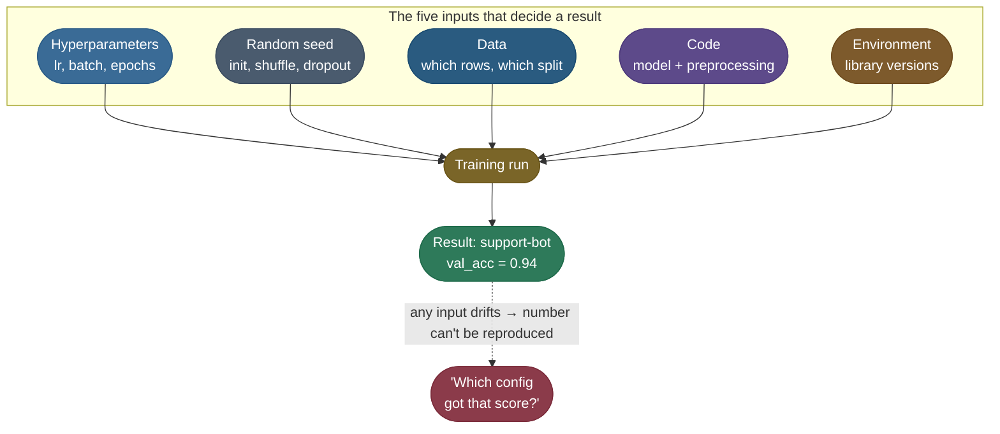
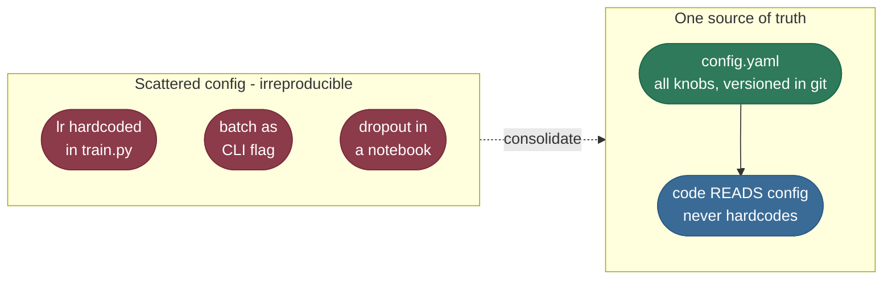
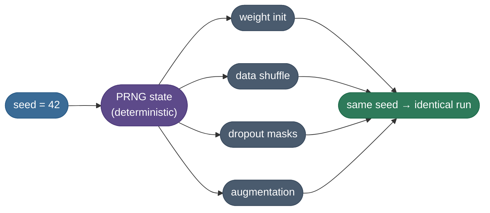
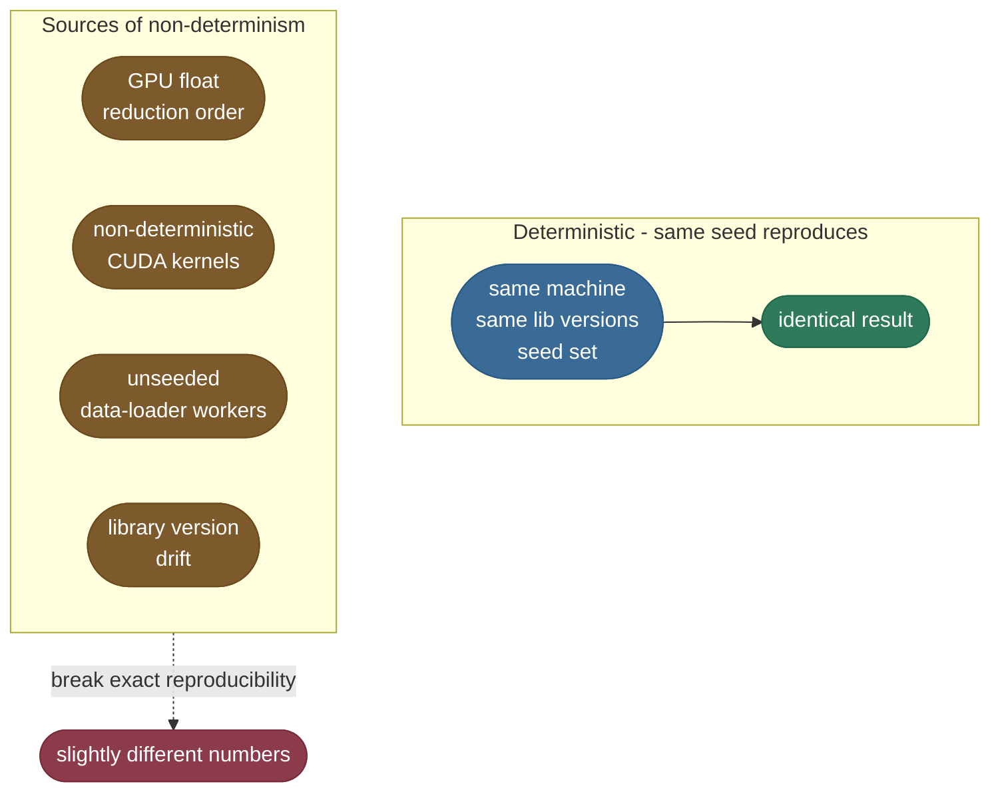

# Reproducibility: seeds, environments, lineage — never lose a result again
> Being able to re-run a result and get the same model: pin the code, data, config, environment, and
> randomness so a run is a deterministic function of versioned inputs. The bedrock that experiment
> tracking, versioning, and CI/CD all stand on.

**Why it matters:** "your model trained great last month but you can't recreate it — what went wrong?"
Interviewers probe the full surface: random seeds and non-determinism (cuDNN, data shuffling), pinned
environments (Docker, lockfiles), data + code + config versioning, and lineage (which data + commit +
hyperparameters produced this artifact). The discipline that separates a demo from a system.

Every ML practitioner has lived this nightmare: a model scored **0.94** last Tuesday, it was *great*, and now — three weeks and forty training runs later — nobody can reproduce it. Which learning rate? Which data snapshot? Which random seed? Which version of the preprocessing code? The number is real, the model is gone, and you're staring at a folder called `model_final_v2_REALLY_final.pt`. This sub-area fixes that for good. **By the end of these four pages you'll be able to run reproducible experiments yourself** — log every run's params, metrics, and artifacts to one source of truth; pin the seeds, data, and code that produced a result; run an efficient hyperparameter sweep that *automatically* surfaces the winner; and register the chosen model so anyone can pull the exact thing that scored 0.94.

I'm going to walk this the way I'd actually do it on a real project, and to keep it concrete we'll carry **one experiment end-to-end the whole way down**: training a small support-ticket classifier called **`support-bot`** on a dataset we'll version as `support_tickets_v3`, chasing a validation accuracy of `0.94`. Watch that single run travel through every stage — its config gets pinned, its seed locked, its params and metrics logged, a sweep finds its best hyperparameters, the winner lands in a registry, and finally its data and code get versioned so anyone can pull `support-bot@0.94` back, exactly. The mental model under all of it is simple: **a result is a pure function of its inputs.** Pin every input — config, seed, data version, code version — and the result is reproducible by construction. Lose track of any one of them and you're back to guessing.

Here's the journey as a checklist — the six stages, across the four pages of this sub-area:

1. **Pin the config** (this page) — put every knob (lr, batch, epochs, data version) in one YAML the code *reads*, never hardcodes.
2. **Seed everything** (this page) — set all the PRNGs so "random" becomes reproducible, and know what a seed *can't* fix.
3. **Track every run** ([Experiment Tracking](/ai-ml/ai-ml-learning-resources/operations-and-lifecycle/lifecycle-and-reproducibility/experiment-tracking/experiment-tracking)) — log params + metrics + artifacts together, automatically, to one queryable store.
4. **Sweep the hyperparameters** ([Experiment Tracking](/ai-ml/ai-ml-learning-resources/operations-and-lifecycle/lifecycle-and-reproducibility/experiment-tracking/experiment-tracking#hyperparameter-sweeps-why-random-beats-grid)) — search the space with random (not grid) and let the tracker surface the winner.
5. **Register the winner** ([Model Registry and Governance](/ai-ml/ai-ml-learning-resources/operations-and-lifecycle/governance-and-economics/model-registry-and-governance/model-registry-and-governance)) — give the chosen model a name + version + stage so serving loads it by name, not by path.
6. **Version data + code** ([Data and Model Versioning](/ai-ml/ai-ml-learning-resources/operations-and-lifecycle/lifecycle-and-reproducibility/data-and-model-versioning/data-and-model-versioning)) — one git commit (with DVC for the data) pins the exact recipe; pull `0.94` back months later.

**The whole journey on one map** — every box below is a section, in order:


Read it left to right and the arrows are the whole argument: each stage pins one more input, and only when all six are pinned does the rightmost box — a result you can pull back exactly — become possible.

---

## Why Experiments Become Irreproducible

Before tooling, understand the *failure mode*. A training run isn't one thing — it's the product of **five independent inputs**, and irreproducibility is what happens when any one of them drifts silently between "the good run" and "now."



The symptoms are always the same — and our `support-bot` run hit every one of them before we got disciplined:

- **"Which config got that score?"** — the metric lives in your terminal scrollback, the params live in your memory, and the two were never written down together.
- **"It worked on my machine."** — a teammate changed the preprocessing, or a `pip install` bumped a library, and the same command now gives a different number.
- **`model_final_v2_REALLY_final.pt`** — artifacts named by vibes, not by the run that produced them. You can't map a *file* back to the *inputs* that made it.

The cure is to make every one of those five inputs **explicit and recorded**, so a run becomes a pure function: same inputs in → same number out. **Irreproducibility is never bad luck — it's an unrecorded input.** This page walks the first two inputs — config (the hyperparameters), then seeds (determinism); [Experiment Tracking](/ai-ml/ai-ml-learning-resources/operations-and-lifecycle/lifecycle-and-reproducibility/experiment-tracking/experiment-tracking) records params + metrics together and runs the sweeps; [Data and Model Versioning](/ai-ml/ai-ml-learning-resources/operations-and-lifecycle/lifecycle-and-reproducibility/data-and-model-versioning/data-and-model-versioning) pins the data and code; the [Model Registry](/ai-ml/ai-ml-learning-resources/operations-and-lifecycle/governance-and-economics/model-registry-and-governance/model-registry-and-governance) versions the winning model.

---

## Configuration Management: One Source of Truth

The first input to pin is the **hyperparameters**. The single most common reproducibility bug is *configuration scattered across the codebase* — a learning rate hardcoded in `train.py`, a batch size passed as a CLI flag, a dropout value buried in a notebook cell. When the knobs live in five places, you can never say with confidence what produced a result.

**The rule: every knob lives in one config file, and the code reads it — never the other way around.** A YAML file is the canonical choice: human-readable, diffable in git, and trivially loaded.

```yaml
# config.yaml — the single source of truth for this run
model:
  hidden: 128
  dropout: 0.1
optim:
  lr: 0.01
  weight_decay: 1.0e-4
  epochs: 20
data:
  dataset: support_tickets_v3
  val_split: 0.2
seed: 42
```

The picture below contrasts the two worlds — knobs scattered across the codebase versus all of them consolidated into that one file:



The asymmetry the diagram captures: the left has three places to check (and forget); the right has exactly one, and an arrow making the rule explicit — code *reads* the config, never the other way around.

### Why a config file beats CLI flags and hardcoding

- **It's a record.** The config that produced a run *is* the run's recipe. Commit it (or log it as an artifact) and the recipe is preserved forever.
- **It's overridable.** Tools like **Hydra** let you keep one base config and override single keys from the command line — `python train.py optim.lr=0.001` — without editing the file. Hydra also *composes* configs (a base + a "small-model" group + an experiment override), so you describe variations declaratively instead of copy-pasting whole files.
- **It's diffable.** "What changed between the `support-bot` run that scored 0.94 and the one that scored 0.89?" becomes a one-line `git diff config.yaml`.

**The mental model:** think of the config as the **DNA of a run**. Two runs with identical DNA (and identical seed, data, code, env) are identical organisms. The moment you let a knob live outside the config, that gene is invisible — and invisible genes are exactly what make results impossible to reproduce. (The two knobs in our `config.yaml` you'll tune most live in the optimizer block — see [AdamW & weight decay (2.08)](/ai-ml/ai-ml-intuitions/learning-and-optimization/adaptive-optimization/adamw-intuition) and [Learning Rate Schedules (2.09)](/ai-ml/ai-ml-intuitions/learning-and-optimization/adaptive-optimization/learning-rate-schedules-intuition).)

> **Important:** The config is only a faithful record if the code reads **every** knob from it. The instant one value — a learning rate, a dropout — is hardcoded *alongside* the config, you have two sources of truth and no way to know which one actually ran. One file, every knob, no exceptions.

> **Note:** Resist the urge to "just hardcode it for now." The `lr` you hardcode today is the `lr` nobody can find in six weeks.

---

## Seeds & Determinism: What's Reproducible and What Isn't

Config pins the *intentional* inputs. The next input is the *unintentional* one: **randomness**. Weight initialization, data shuffling, dropout masks, augmentation — all draw from a pseudo-random number generator (PRNG). A PRNG is **deterministic given its seed**: set the seed and the entire "random" sequence is fixed. That's the lever that turns a noisy run into a reproducible one.



The diagram's point: one seed feeds one PRNG state, and that single state drives every "random" decision downstream — so fixing the seed at the source freezes the whole chain into an identical run.

### Seed everything — there's more than one PRNG

**Here's what determinism looks like when you actually check it.** Take the `support-bot` objective and run it three times — twice with the *same* seed, once with a different one:

```text
train_and_eval(lr=0.01, wd=1e-4, hidden=128, seed=123)  ->  0.3821
train_and_eval(lr=0.01, wd=1e-4, hidden=128, seed=123)  ->  0.3821   # same config + same seed -> byte-identical
train_and_eval(lr=0.01, wd=1e-4, hidden=128, seed=999)  ->  0.4113   # only the seed changed -> different number
```

That is the whole contract on one screen: **identical inputs (config + seed) give a bit-identical `0.3821` every time; change nothing but the seed and the result moves to `0.4113`.** The gap between `0.3821` and `0.4113` isn't a bug — it's the run-to-run noise that was *always* there, now made visible and controllable. Pin the seed and that noise is frozen; that is what turns "random" into "reproducible." (This exact check is the determinism block in the runnable demo below, where you can re-run it yourself.)

The catch is that a typical training stack has **several independent PRNGs**, and seeding one doesn't seed the others. The canonical "seed everything" routine sets all of them:

```python
import random, os
import numpy as np
import torch

def seed_everything(seed: int = 42):
    random.seed(seed)                       # Python's random module (stdlib shuffles, sampling)
    np.random.seed(seed)                    # NumPy (np.random.* draws)
    torch.manual_seed(seed)                 # PyTorch CPU RNG (weight init, dropout on CPU)
    torch.cuda.manual_seed_all(seed)        # every GPU's RNG (no-op if no CUDA present)
    os.environ["PYTHONHASHSEED"] = str(seed)  # set BEFORE interpreter start to fully take effect
    # NOTE: this fixes the PRNGs but NOT GPU kernel non-determinism. For bit-exact
    # GPU runs you also need torch.use_deterministic_algorithms(True) (costs speed).
```

### What is and isn't reproducible

Seeding makes a run reproducible **on the same machine and software stack**. It does *not* make it reproducible across different hardware unless you go further. This is the part everyone trips on:

| Reproducible with just a seed | Needs more than a seed |
| :--- | :--- |
| Weight initialization | **GPU vs CPU** — different float reduction order |
| Data shuffling & split | **Different GPU model** — different kernels |
| Dropout masks | **Multi-threaded data loading** (set `num_workers` + `worker_init_fn`) |
| Augmentation choices | **Non-deterministic CUDA ops** (need `torch.use_deterministic_algorithms(True)`) |
| NumPy / Python `random` draws | **Different library versions** — pin the environment |



**The pragmatic stance:** aim for **statistical reproducibility** (same seed → same result on your stack; report mean ± std over a few seeds for headline numbers) rather than chasing **bit-exact reproducibility** across hardware, which costs throughput (`torch.use_deterministic_algorithms(True)` disables fast non-deterministic kernels) and is rarely worth it outside compliance settings.

**A worked seed check.** Suppose `support-bot` posts `0.94` on seed 42. Before you celebrate, you re-run on four more seeds and get `0.91, 0.93, 0.90, 0.92`. The five values average to `0.92` with a standard deviation of `0.015`, so the honest headline is **`0.92 ± 0.015`**, not `0.94` — that `0.94` was the *lucky* seed sitting one standard deviation above the mean. If a rival config posts `0.93 ± 0.014`, the two overlap heavily and you can't claim it's better on five seeds alone. This is exactly the *generalization gap* question — see [Bias-Variance & Generalization (3.07)](/ai-ml/ai-ml-intuitions/objectives-and-evaluation/generalization/bias-variance-tradeoff-intuition).

> **Warning:** A single un-seeded run is not a result — it's one sample from a distribution you haven't measured. Reporting the best of several seeds as *the* number is the most common way teams accidentally lie to themselves about a model's quality.

> **Note:** A seed isn't just for reproducibility — it's for honesty. Always sanity-check your headline result across a few seeds and report mean ± std, not the single best draw.

---

## Recap: The Five Inputs, Pinned

You now have the full discipline. Reproducibility isn't a tool you install — it's a habit of **pinning every input to a run** so the result becomes a pure function of recorded things:


Put the config in one file, seed every PRNG, log params + metrics + artifacts together on every run, sweep with random search, register the winner by name and stage, and version your data and code in one git commit with DVC. Do that and the question "which config got that score?" stops being a panic and becomes a query. **You never lose a result again — because the inputs that produced it were written down the moment it happened.**

---

## References and further reading

The curated link library for this topic — videos, courses, articles, papers, and internal cross-links — lives in a companion file so it can be reused as a standalone reference list:

**→ [Reproducibility — references and further reading](/ai-ml/ai-ml-learning-resources/operations-and-lifecycle/lifecycle-and-reproducibility/reproducibility/reproducibility#references-further-reading)**
