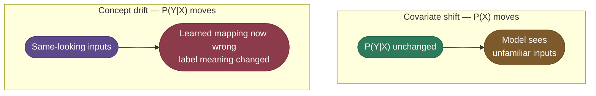
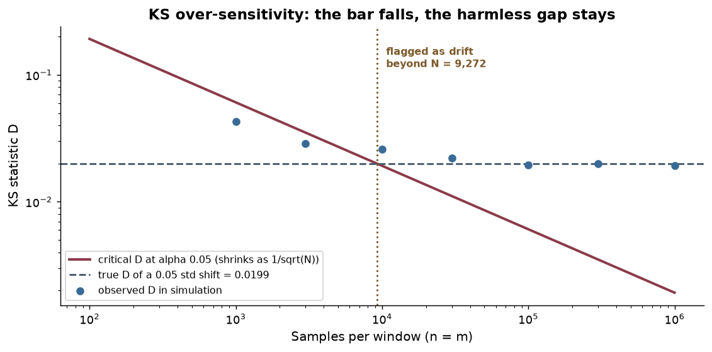
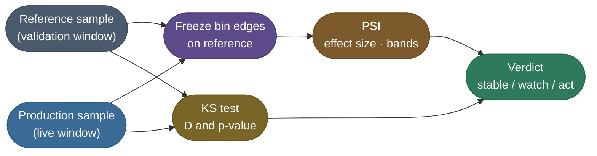
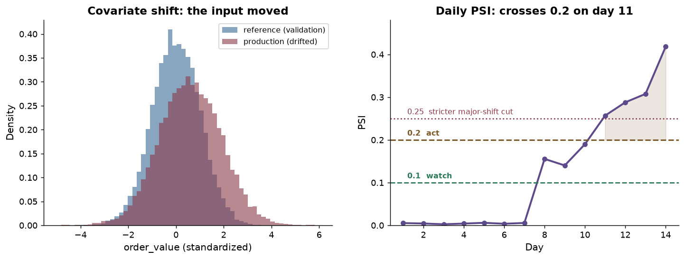

# Data and Concept Drift Detection: testing whether production still looks like training

> Detecting when production traffic has moved away from the distribution a model was validated on,
> early enough to act — usually weeks before the labels that would prove it.

**Why it matters:** this is the deep dive that follows every monitoring question. What interviewers probe:

- **The distinction:** data drift, where `P(X)` moves, versus concept drift, where `P(Y|X)` moves.
- **The tests:** Kolmogorov–Smirnov (KS), population stability index (PSI), chi-square, distances — and which question each answers.
- **The trap:** why a significance test flags everything once windows reach production size.
- **The no-label case:** input and score drift as proxies, and what they cannot see.

For large-language-model (LLM) inputs the same question is asked over **embeddings** — a KS test on
free text is meaningless, so drift is tracked in the vector space instead.

What this page assumes, and where it lives:

- **Base definitions and PSI** — the formula, a worked table, runnable code and the bands — are taught in
  [Continuous Training → Detecting drift](/ai-ml/ai-ml-learning-resources/operations-and-lifecycle/lifecycle-and-reproducibility/continuous-training/continuous-training#detecting-drift-one-number-that-says-different).
- **The layers around drift** — operational health, label lag, quality proxies — are in
  [Model Monitoring and Observability](/ai-ml/ai-ml-learning-resources/operations-and-lifecycle/monitoring-and-reliability/model-monitoring-and-observability/model-monitoring-and-observability).

> **Note:** The running example is **ShopSense**, the checkout-fraud classifier from Continuous Training.
> A marketing campaign pulls in larger first-time orders, and we test whether its `order_value`
> feature and fraud scores still match the validation window.

---

## The problem: labels are late, so test what you can see

ShopSense's true labels are chargebacks that arrive up to 60 days late. Waiting for them means a
month or two of silently wrong decisions.

So we test the things visible **the same day**, and each one catches a different kind of drift:



| What you test | Catches covariate shift? | Catches pure concept drift? | Why |
|---|---|---|---|
| **Each input feature** | yes, one feature at a time | no | inputs look identical when only `P(Y\|X)` moves |
| **Embeddings** (text, images) | yes, in vector space | no | same reason: only inputs are measured |
| **Model score distribution** | yes, weighted by what the model uses | no | a fixed model on unchanged inputs emits unchanged scores |
| **Proxy outcomes** (disputes, reviews) | indirectly | partly | they carry real outcome information, early and noisy |
| **True labels** (chargebacks) | yes | yes | the only direct measure of `P(Y\|X)` — and the latest |

> **Note:** The key consequence is uncomfortable but exact.
> - **No distribution test on inputs or scores can detect pure concept drift.** A frozen model given the same inputs produces the same outputs.
> - Detecting it needs outcome information: proxies now, labels later — the performance trigger in Continuous Training.

---

## Two questions, two tools

"Did production drift?" hides two different questions, and one tool cannot answer both.

- **How big is the shift?** An **effect size**. PSI is the standard one.
  - Bands used across this estate: below **0.1** stable, **0.1–0.2** watch, above **0.2** act.
  - Many credit-risk teams use **0.25** as a stricter "major shift" cut; treat it as the same idea set more conservatively.
- **Could this difference be chance?** A **significance test**. The two-sample KS test is the standard one.
  - It needs no assumption about the distribution's shape, and returns a p-value.

An analogy that survives follow-up questions: a thermometer and a lie detector.

- **PSI is the thermometer.** It tells you how many degrees the fever is, not whether the reading could be a fluke.
- **KS is the lie detector.** It tells you whether the "no change" story is believable, not how much changed.
- **A reading of "certainly changed, by 0.01 degrees" is real and irrelevant** — which is exactly the failure KS produces at scale.

---

## The two-sample Kolmogorov–Smirnov test

### What the statistic measures

Sort each sample and draw its **empirical cumulative distribution function (CDF)**: a staircase
rising from 0 to 1, stepping up at each observed value.

- If two samples come from the same distribution, their staircases track each other closely.
- The **KS statistic D** is the single largest vertical gap between the two staircases.


*Two-sample KS test: the statistic D is the maximum vertical gap between the two empirical CDFs (black arrow). Source: [Bscan, Wikimedia Commons](https://commons.wikimedia.org/wiki/File:KS2_Example.png), CC0 1.0 (public domain).*

### The math

Symbols first. A reference sample `x₁ … xₙ` (validation) and a production sample `y₁ … yₘ` (live window).

- **Empirical CDFs:** `Fₙ(t) = (1/n)·#{i : xᵢ ≤ t}` and `Gₘ(t) = (1/m)·#{j : yⱼ ≤ t}` — the fraction of each sample at or below `t`.
- **The statistic:**

$$D_{n,m} = \sup_t \left| F_n(t) - G_m(t) \right|$$

- **Why checking the data points is enough:** both staircases are flat between observed values, so the gap can only change where one of them steps.
  - Evaluating the gap at every pooled observation therefore finds the supremum exactly.

The p-value comes from knowing how large D gets **when nothing changed**.

- **Intuitively:** under "same distribution", both staircases are noisy copies of one curve, so their gap shrinks as samples grow.
- **Formally:** for continuous data, the null distribution of D does not depend on the underlying distribution at all — mapping values through that distribution's own CDF turns both samples into uniforms without changing D. That is what "distribution-free" means.
- **The large-sample rejection rule** (asymptotic; SciPy uses exact computation for small samples):

$$\text{reject "same distribution" at level } \alpha \text{ when } D_{n,m} > c(\alpha)\sqrt{\frac{n+m}{n\,m}}, \qquad c(\alpha) = \sqrt{-\tfrac{1}{2}\ln\tfrac{\alpha}{2}}$$

- At `α = 0.05`, `c(α) = 1.358`. Hold onto the `√((n+m)/(nm))` factor: it is the source of the trap two sections down.

### A worked example by hand

Four ShopSense fraud scores from validation, `R = [0.1, 0.2, 0.3, 0.4]`, and four from production,
`P = [0.3, 0.4, 0.5, 0.6]` — shifted right. Step along every pooled value:

| t | F(R) = share of R ≤ t | G(P) = share of P ≤ t | gap |
|---|---|---|---|
| 0.1 | 0.25 | 0.00 | 0.25 |
| 0.2 | 0.50 | 0.00 | **0.50** |
| 0.3 | 0.75 | 0.25 | **0.50** |
| 0.4 | 1.00 | 0.50 | **0.50** |
| 0.5 | 1.00 | 0.75 | 0.25 |
| 0.6 | 1.00 | 1.00 | 0.00 |

- **D = 0.50**, reached at three points.
- **Is that evidence?** The critical value is `1.358 × √(8/16) ≈ 0.96`, and the exact p-value is **0.771**.
- **So no.** With four points each, a gap of half the probability mass is easily produced by chance.

### The same test on a real window

Now a realistic window: 10,000 validation values of standardized `order_value` against 5,000 production values.

- **Critical D** at `α = 0.05`: `1.358 × √(15,000 / 50,000,000) = 0.0235`.
- **Matched window:** D = 0.008, p = 0.98 — no evidence of change.
- **After the campaign** (mean +0.6, spread ×1.3): D = 0.221, p ≈ 2.5 × 10⁻¹⁴³ — drift, beyond doubt.

---

## Why KS over-reacts at production scale

The critical value shrinks as the sample grows, but the gap caused by a **fixed** shift does not.

Take equal windows, `n = m = N`. Then:

- **The bar falls:** `D_crit = 1.358 × √(2/N)`, which halves every time N quadruples.
- **The gap stays:** two unit normals `δ` apart have population gap `D = erf(δ / (2√2)) ≈ 0.399·δ` for small `δ`.
- **So they must cross.** Setting them equal gives the window size beyond which the shift is always flagged:

$$N^{*} = 2\left(\frac{1.358}{D}\right)^{2}$$

For a shift of **0.05 standard deviations** — far too small to change a fraud decision:

- `D = erf(0.05 / 2.828) = 0.0199`
- `N* = 2 × (1.358 / 0.0199)² ≈ 9,272` transactions per window

ShopSense scores far more than 9,272 transactions a day. So a KS alert on its own would fire every day, on noise-level shifts.



*A seeded simulation against the analytic critical value. Past about 9,272 samples per window, a harmless 0.05-standard-deviation shift is always "significant".*

The simulation in the code below confirms it window by window:

| Samples per window | Observed D | Critical D | p-value | Verdict |
|---|---|---|---|---|
| 1,000 | 0.0420 | 0.0607 | 0.34 | ok |
| 10,000 | 0.0275 | 0.0192 | 1.0 × 10⁻³ | drift |
| 100,000 | 0.0243 | 0.0061 | 5.1 × 10⁻²⁶ | drift |
| 1,000,000 | 0.0201 | 0.0019 | 4.1 × 10⁻¹⁷⁶ | drift |

> **Tip:** The fix is not to abandon KS but to stop reading its p-value alone.
> - **D is itself an effect size** — a share of probability mass, from 0 to 1. Gate on it directly (for example D above 0.1).
> - Or require PSI to agree before acting, and use KS as the confirmation.

---

## Combining PSI and KS into one verdict

A production drift check freezes the reference once, scores each live window with both tools, and
only then decides.



- **Only PSI needs the frozen bins.** KS works on the raw sorted values, so it is immune to a bad binning choice.
- **A practical verdict rule:**
  - PSI below 0.1 → stable, whatever KS says.
  - PSI 0.1–0.2 → watch; log it and check the next window.
  - PSI above 0.2 **and** KS significant → act: investigate, confirm, then retrain or roll back.

Drift is read over time, not as one check. Here is `order_value` across a campaign:



*A seeded simulation. Left: covariate shift you can see. Right: daily PSI sits near zero for a week, enters the watch band on day 8, and crosses 0.2 on day 11.*

Beyond one numeric feature, the same two questions need different tools:

- **Categorical features:** a chi-square test for significance; PSI still works over the categories as bins.
- **Embeddings and many features at once:** distance measures or a **domain classifier** trained to tell reference from production — if it beats a coin flip, the windows differ. A full treatment is beyond this page; see the Evidently embedding-drift article in the references.

---

## The code: a from-scratch KS drift check

The complete program: the by-hand example, the realistic windows, and the large-sample trap. It
builds D from scratch with sorted samples, then checks it against SciPy.

```python
"""Two-sample Kolmogorov-Smirnov (KS) drift check, from scratch and with SciPy.

Three parts, all deterministic and CPU-only:
  1. The by-hand example from the page: two four-value score samples, the
     empirical CDF table, the statistic D, and why D = 0.5 is not evidence at N = 4.
  2. The drift detector on a realistic window: a matched production sample and a
     shifted one, scored against a 10,000-value reference.
  3. The large-sample trap: a business-irrelevant 0.05-standard-deviation shift
     becomes "statistically significant" once the window is big enough.

Run: uv run --python 3.12 --with numpy --with scipy python ks_drift_check.py
"""
import numpy as np
from scipy import stats

ALPHA = 0.05
C_ALPHA = np.sqrt(-np.log(ALPHA / 2) / 2)  # 1.358 for alpha = 0.05
SEED = 0


def empirical_cdf(sample: np.ndarray, points: np.ndarray) -> np.ndarray:
    """Fraction of `sample` that is <= each value in `points`."""
    return np.searchsorted(np.sort(sample), points, side="right") / sample.size


def ks_statistic(reference: np.ndarray, production: np.ndarray) -> float:
    """Largest vertical gap between the two empirical CDFs.

    The gap can only change where one of the step functions steps, so checking
    every pooled observation is enough to find the maximum.
    """
    pooled = np.concatenate([reference, production])
    gaps = np.abs(empirical_cdf(reference, pooled) - empirical_cdf(production, pooled))
    return float(gaps.max())


def critical_d(n: int, m: int) -> float:
    """Large-sample rejection threshold: reject 'same distribution' when D exceeds it."""
    return float(C_ALPHA * np.sqrt((n + m) / (n * m)))


def show_by_hand_example() -> None:
    reference = np.array([0.1, 0.2, 0.3, 0.4])
    production = np.array([0.3, 0.4, 0.5, 0.6])
    grid = np.unique(np.concatenate([reference, production]))
    print("== 1. BY HAND: four scores each ==")
    print("   x    CDF_ref  CDF_prod  gap")
    for x, cdf_r, cdf_p in zip(grid, empirical_cdf(reference, grid), empirical_cdf(production, grid)):
        print(f"  {x:.1f}   {cdf_r:5.2f}    {cdf_p:5.2f}   {abs(cdf_r - cdf_p):.2f}")
    scratch_d = ks_statistic(reference, production)
    library = stats.ks_2samp(reference, production)
    print(f"  D from scratch = {scratch_d:.2f}   D from scipy = {library.statistic:.2f}")
    print(f"  p-value = {library.pvalue:.3f}  (n = m = 4, so even a 0.5 gap could be chance)")


def show_drift_windows(rng: np.random.Generator) -> None:
    reference = rng.normal(0.0, 1.0, 10_000)   # what the model was validated on
    prod_ok = rng.normal(0.0, 1.0, 5_000)      # production that still matches
    prod_drift = rng.normal(0.6, 1.3, 5_000)   # production after a campaign shifted it
    print("\n== 2. DRIFT WINDOWS: reference n = 10,000, production n = 5,000 ==")
    print(f"  critical D at alpha {ALPHA}: {critical_d(10_000, 5_000):.4f}")
    for name, sample in [("prod_ok", prod_ok), ("prod_drift", prod_drift)]:
        result = stats.ks_2samp(reference, sample)
        scratch_d = ks_statistic(reference, sample)
        verdict = "DRIFT" if result.pvalue < ALPHA else "ok"
        print(f"  {name:10s} D={result.statistic:.3f} (scratch {scratch_d:.3f})  "
              f"p={result.pvalue:.2e} -> {verdict}")


def show_large_sample_trap(rng: np.random.Generator) -> None:
    shift = 0.05  # standard deviations: far too small to hurt a fraud model
    print(f"\n== 3. THE LARGE-SAMPLE TRAP: a fixed {shift} standard-deviation shift ==")
    print("        N     D     critical D    p-value   verdict")
    for n in [1_000, 10_000, 100_000, 1_000_000]:
        reference = rng.normal(0.0, 1.0, n)
        production = rng.normal(shift, 1.0, n)
        result = stats.ks_2samp(reference, production)
        verdict = "DRIFT" if result.pvalue < ALPHA else "ok"
        print(f"  {n:>9,}  {result.statistic:.4f}   {critical_d(n, n):.4f}     "
              f"{result.pvalue:.2e}   {verdict}")


def main() -> None:
    rng = np.random.default_rng(SEED)
    show_by_hand_example()
    show_drift_windows(rng)
    show_large_sample_trap(rng)


if __name__ == "__main__":
    main()
```

Output, from running the file above:

```text
== 1. BY HAND: four scores each ==
   x    CDF_ref  CDF_prod  gap
  0.1    0.25     0.00   0.25
  0.2    0.50     0.00   0.50
  0.3    0.75     0.25   0.50
  0.4    1.00     0.50   0.50
  0.5    1.00     0.75   0.25
  0.6    1.00     1.00   0.00
  D from scratch = 0.50   D from scipy = 0.50
  p-value = 0.771  (n = m = 4, so even a 0.5 gap could be chance)

== 2. DRIFT WINDOWS: reference n = 10,000, production n = 5,000 ==
  critical D at alpha 0.05: 0.0235
  prod_ok    D=0.008 (scratch 0.008)  p=9.83e-01 -> ok
  prod_drift D=0.221 (scratch 0.221)  p=2.52e-143 -> DRIFT

== 3. THE LARGE-SAMPLE TRAP: a fixed 0.05 standard-deviation shift ==
        N     D     critical D    p-value   verdict
      1,000  0.0420   0.0607     3.41e-01   ok
     10,000  0.0275   0.0192     1.04e-03   DRIFT
    100,000  0.0243   0.0061     5.12e-26   DRIFT
  1,000,000  0.0201   0.0019     4.08e-176   DRIFT
```

What each part proves:

- **Part 1:** the scratch D equals SciPy's, and a large gap on tiny samples is still not evidence.
- **Part 2:** drift is caught with zero labels, and the matched window stays quiet.
- **Part 3:** the observed D settles near the predicted 0.0199 while the critical value keeps falling — the trap, measured.

---

## Pitfalls

- **KS flags drift on every feature, every day.**
  - Cause: production windows are large, so the critical D is tiny and trivial shifts become significant.
  - Fix: gate on an effect size — D itself, or PSI above 0.2 — and use the p-value only as confirmation.
- **Hundreds of features, a handful of alerts every run.**
  - Cause: multiple testing. At `α = 0.05`, 200 unchanged features still produce about 10 false alarms per window.
  - Fix: correct the level (Bonferroni: `α / number of features`), rank by effect size, and alert only on features the model actually relies on.
- **Accuracy fine for weeks, then a cliff.**
  - Cause: the only alarm was lagging labels, which confirmed the drift long after it started.
  - Fix: watch input and score drift as the leading signal, and act when it agrees with a proxy outcome.
- **Every input test is quiet, yet the scores moved.**
  - Cause: univariate tests look at one feature at a time; several small shifts or a changed correlation can combine into a large change the model reacts to.
  - Fix: add a drift check on the model's score distribution, and a multivariate check such as a domain classifier.

---

## Key takeaways

- Drift detection answers two questions — how big, and could it be chance — so it needs an effect size and a significance test.
- The KS statistic is the largest gap between two empirical CDFs, and its null distribution does not depend on the data's shape.
- The KS critical value shrinks as `1/√N`, so at production scale a significance test flags shifts too small to matter.
- Input and score tests cannot see pure concept drift; that needs outcomes, from proxies first and labels later.

---

## Production implementation

Runnable services in this estate that implement what this page teaches:

- **[ml-platform](/python/python-production-examples/ml-platform/readme)** — computes the KS statistic from sorted samples in NumPy exactly as this page does, uses SciPy only for the optional p-value, and flags a feature when PSI exceeds 0.2 or D exceeds 0.1 — gating on effect sizes rather than p-values.

---

## References

The curated link library for this topic — videos, courses, articles, papers, and internal cross-links — lives in a companion file so it can be reused as a standalone reference list:

**→ [Data and Concept Drift Detection — references](/ai-ml/ai-ml-learning-resources/operations-and-lifecycle/monitoring-and-reliability/data-and-concept-drift-detection/data-and-concept-drift-detection#references-further-reading)**
