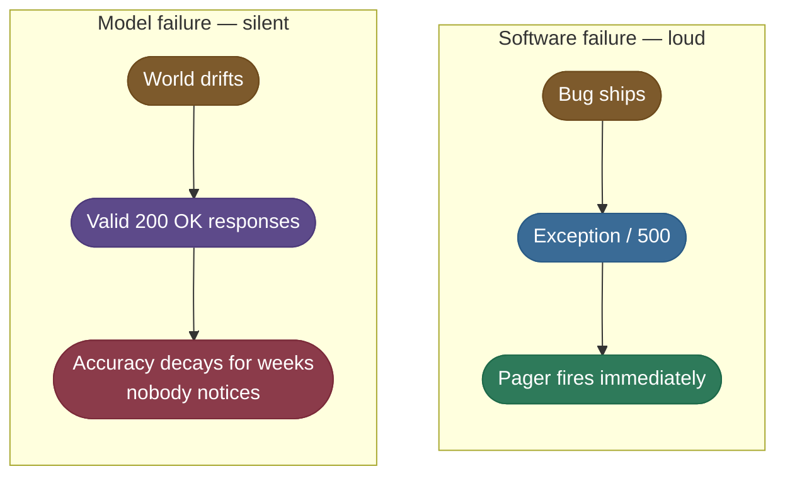
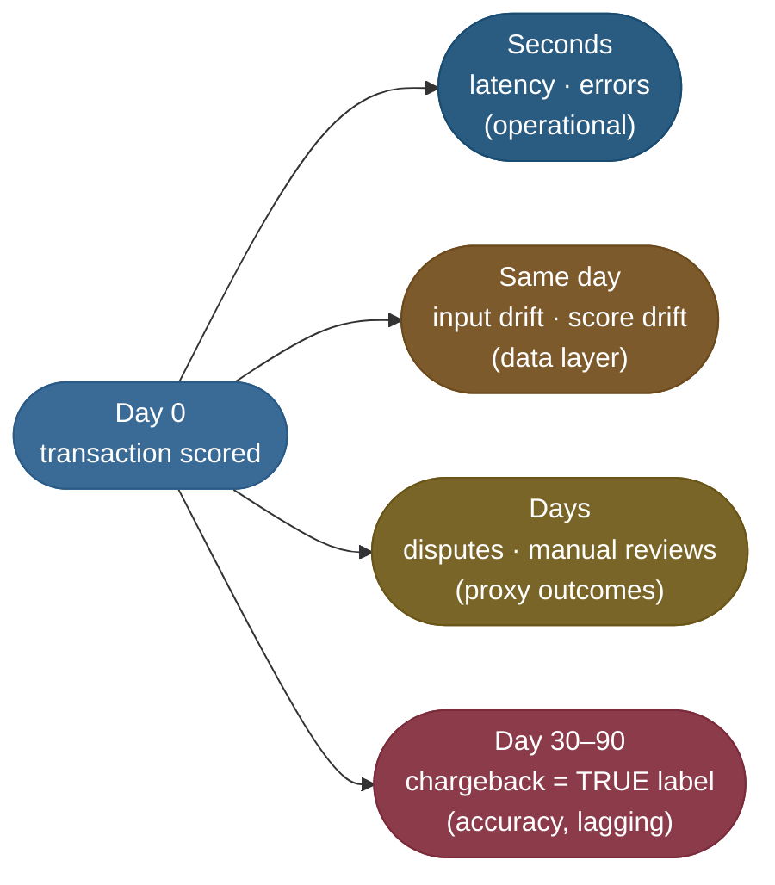
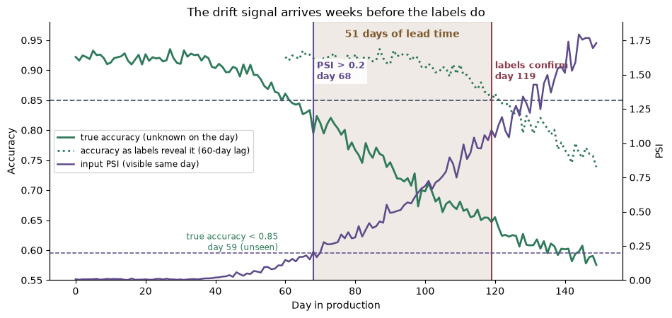
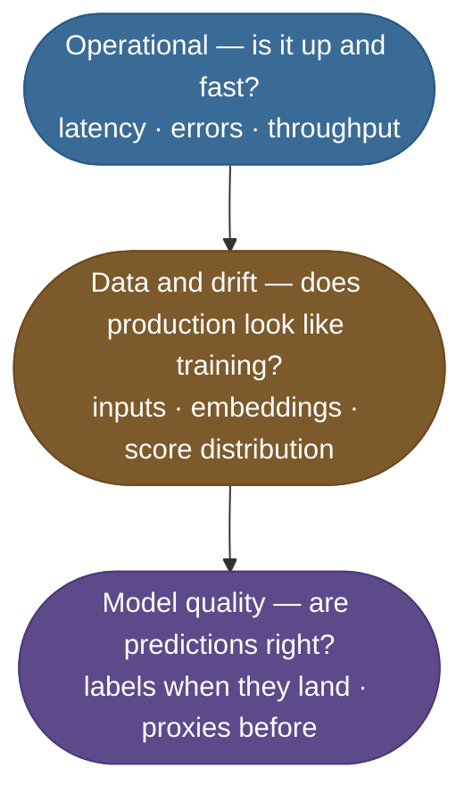
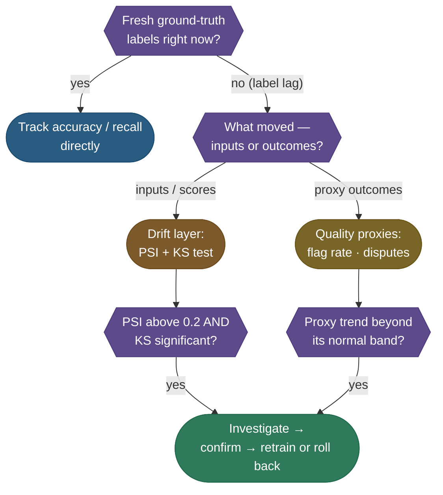
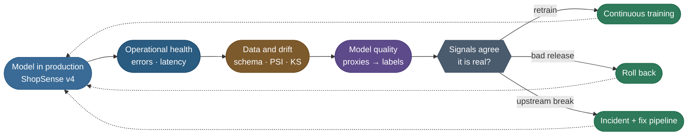

# Model Monitoring and Observability: watching a model that fails without an error

> Watching a deployed model so its silent failures get noticed. Monitoring tells you **that**
> something moved; observability lets you ask **why** — which feature, which slice, which version.

**Why it matters:** "your model is live — how do you know it still works?" is asked in almost every
machine-learning (ML) systems interview. What a strong answer carries:

- **The failure shape:** models degrade statistically, with no exception to catch.
- **The delayed-label problem:** true accuracy arrives weeks late, so you need proxies now.
- **The layers:** operational health, data and drift, model quality — and which one pages a human.
- **The loop:** an alert is only useful if it feeds a retrain, a rollback, or an incident.

This page is the **model layer** of monitoring. Two neighbours own the rest:

- **Statistical detection** (the Kolmogorov–Smirnov test, combining it with the population
  stability index) is taught in
  [Data and Concept Drift Detection](/ai-ml/ai-ml-learning-resources/operations-and-lifecycle/monitoring-and-reliability/data-and-concept-drift-detection/data-and-concept-drift-detection).
- **Application monitoring** — tracing large-language-model (LLM) calls, token dashboards,
  service-level objectives for an app — lives in the
  [Monitoring and Observability workflow](/ai-ml/practitioner-workflows/operations-and-lifecycle/monitoring-and-observability).

> **Note:** One model carries the whole page: **ShopSense**, the checkout-fraud classifier that
> [Continuous Training](/ai-ml/ai-ml-learning-resources/operations-and-lifecycle/lifecycle-and-reproducibility/continuous-training/continuous-training)
> retrains. It scores every transaction "fraud / not fraud", and its true label is a chargeback that
> lands up to 60 days later.

---

## The problem: a model breaks without saying so

Ordinary software fails **deterministically**. A bad deploy throws, a query errors, the pager fires.

A model fails **statistically**, and that changes everything about how you watch it:

- **Nothing throws.** ShopSense keeps returning well-formed scores with `200 OK` and normal latency.
- **The evidence is a distribution.** Scores get subtly worse on average; no single request is "the bug".
- **So nothing pages itself.** You only see the failure if you instrument the distributions.

The top row alerts on its own; the bottom row never will. Why the world drifts in the first place —
covariate versus concept drift — is covered in
[Continuous Training](/ai-ml/ai-ml-learning-resources/operations-and-lifecycle/lifecycle-and-reproducibility/continuous-training/continuous-training).

---

## Ground-truth lag: the metric you want arrives last

To know ShopSense's accuracy **today**, you need to know which of today's transactions were fraud.

That label is a **chargeback**, and it arrives 30–90 days later. So the one metric you most want —
online accuracy — is the one you cannot see in time. Every signal has an arrival time:

- **Leading indicators** are cheap and early but only *suggest* a problem.
- **Lagging indicators** are the truth but arrive after the damage.
- **Monitoring is layered for exactly this reason:** the early boxes buy time before the red one confirms.

### What the lag costs, in days

The chart below simulates ShopSense for 150 days. From day 30 the world drifts a little each day,
moving both the inputs and the true fraud boundary. Three things happen, in this order:

- **Day 59:** true accuracy slips under the 0.85 floor. Nobody can see it — no labels yet.
- **Day 68:** input population stability index (PSI) crosses 0.2. This is the first visible alarm.
- **Day 119:** the day-59 chargebacks land, and labelled accuracy finally confirms the breach.

*A seeded simulation, run on CPU. The drift signal fired 51 days before the labels could, though 9
days after the true breach.*

> **Note:** Read the chart honestly: drift detection did **not** beat the true failure.
> - It beat the **labels** by 51 days, which is the comparison that matters in production.
> - It lagged the unseen breach by 9 days, because part of this drift moved the fraud boundary, not only the inputs.
> - A drift signal is an early warning, never a guarantee of catching every failure first.

---

## The three-layer pyramid of signals

Monitoring a model means watching three layers at once. Each catches failures the others miss.

Cost and delay grow as you climb; truth grows with them.

- **Operational (base):** is the model serving at all — latency, error rate, throughput, saturation.
  - It is instant and cheap, but says nothing about whether predictions are right.
  - Its depth — percentiles, service-level objectives, error budgets — belongs to
    [Model Serving](/ai-ml/ai-ml-learning-resources/inference-and-serving/packaging-and-serving/model-serving/model-serving)
    and the [Monitoring and Observability workflow](/ai-ml/practitioner-workflows/operations-and-lifecycle/monitoring-and-observability).
- **Data and drift (middle):** does today's traffic resemble what the model was validated on.
  - Schema checks first: missing columns, nulls, out-of-range values, a unit change from cents to dollars.
  - Then distribution tests on inputs, embeddings and the model's own score distribution.
- **Model quality (top):** are the predictions actually right.
  - Accuracy, precision and recall once labels arrive.
  - Before that, proxies: fraud-flag rate, dispute rate, and whether scores stay
    [calibrated](/ai-ml/ai-ml-learning-resources/classical-machine-learning/model-selection-and-evaluation/calibration-and-reliability-diagrams/calibration-and-reliability-diagrams).

### Which signal, which tool, when to page

The model-layer rows of the decision space, on one table:

| Layer | Watch this | Tool or metric | Speed | Page when |
|---|---|---|---|---|
| **Operational** | is it serving | error rate, p95 latency | seconds | error rate over budget |
| **Data** | schema breaks | null rate, range and type checks | minutes | a required field goes missing |
| **Drift** | input shape change | **PSI** (effect size) | minutes | PSI above 0.2 on a feature that matters |
| **Drift** | distribution change | **KS test** (significance) | minutes | only to confirm a PSI breach, never alone |
| **Drift** | what the model sees overall | score-distribution PSI | minutes | score shape moves with no traffic change |
| **Quality** | proxy outcomes | flag rate, dispute rate | days | sustained trend, not one day |
| **Quality** | true performance | accuracy, recall on labels | weeks | below the agreed floor |

> **Tip:** Use the two drift tools for different questions.
> - **PSI** answers "how big is the shift?" with bands teams already agree on.
> - The **Kolmogorov–Smirnov (KS) test** answers "could this be chance?" — but flags trivial shifts at large sample sizes.
> - Require both to agree before acting. The reasoning is derived in [Data and Concept Drift Detection](/ai-ml/ai-ml-learning-resources/operations-and-lifecycle/monitoring-and-reliability/data-and-concept-drift-detection/data-and-concept-drift-detection).

---

## Which signal to trust: the labels fork

Every monitoring decision starts from one question: do you have fresh labels right now?

- **The left branch is rare.** Fresh labels exist for click models, almost never for fraud, credit or churn.
- **So almost every real path runs right:** signals you can see today, standing in for truth.
- **Page only when two independent signals agree.** One noisy drift score is a dashboard entry, not a wake-up call.

---

## Monitoring is a control loop, not a dashboard

A dashboard nobody acts on is decoration. The value of monitoring is what an alert **causes**.

Each exit leads to a page that owns the response:

- **The world moved:** retrain through [Continuous Training](/ai-ml/ai-ml-learning-resources/operations-and-lifecycle/lifecycle-and-reproducibility/continuous-training/continuous-training).
- **A release broke it:** revert via [Rollback and Recovery for ML Systems](/ai-ml/ai-ml-learning-resources/operations-and-lifecycle/release-and-deployment/rollback-and-recovery-for-ml-systems/rollback-and-recovery-for-ml-systems).
- **An upstream pipeline broke it:** declare an incident per [AI Incident Response and Postmortems](/ai-ml/ai-ml-learning-resources/operations-and-lifecycle/monitoring-and-reliability/ai-incident-response-and-postmortems/ai-incident-response-and-postmortems).

> **Note:** Retraining does not fix a broken upstream feed. If the drift is a unit change or a null
> flood, a retrain just teaches the model the bug — so the loop checks the data layer before it
> chooses "retrain".

---

## Monitoring versus observability

The two words are often used as synonyms, but they answer different questions.

- **Monitoring answers "that":** a predefined metric crossed a predefined line.
- **Observability answers "why":** you can slice what you logged after the fact to find the cause.

What makes a model observable, in practice:

- **Log the inputs, the score and the model version** with every prediction, joined by a request id.
- **Keep per-feature drift, not only a total.** PSI splits into per-bin terms, so you can point at the part of the distribution that moved.
- **Slice by segment.** A stable global PSI can hide a new country or merchant category that shifted hard.
- **Keep lineage.** Knowing which training data and which pipeline run produced the live model turns "it got worse" into "it got worse after the 3 March feature change".

---

## What monitoring costs

Monitoring is a real line item. A practical budget is **roughly 5–15% of serving cost**.

- **Logging dominates.** Storing every input and score for a useful retention window is the largest cost; sample high-volume traffic.
- **Drift jobs are cheap.** Binning and a KS test over a daily window cost seconds of CPU.
- **Labels are the expensive part.** Manual review queues and annotation cost far more than the compute.

---

## Pitfalls

- **Operational dashboards green, model wrong.**
  - Cause: only the base layer is instrumented; latency and errors cannot see bad predictions.
  - Fix: add drift on inputs and scores plus at least one quality proxy.
- **Waiting for labels to declare a problem.**
  - Cause: treating accuracy as the only real metric.
  - Fix: act on agreeing leading signals, then reconcile when labels land.
- **A stale or wrong reference window.**
  - Cause: comparing production against last year's data, or against a different model version's validation set.
  - Fix: pin the reference to the live model's validation data, and re-anchor it after every promotion.
- **Paging on a single drift spike.**
  - Cause: one noisy window, or a benign seasonal shift.
  - Fix: require persistence across windows and agreement with a second signal before paging.

---

## Key takeaways

- A model fails with valid responses, so failure only shows up in distributions you choose to watch.
- True accuracy is the slowest signal; leading signals exist to buy time before it arrives.
- Watch three layers — operational, data and drift, model quality — because each misses what the others catch.
- An alert is worth something only when it routes to a retrain, a rollback or an incident.

---

## Production implementation

Runnable services in this estate that implement what this page teaches:

- **[ml-platform](/python/python-production-examples/ml-platform/readme)** — a monitoring service that stores a baseline feature window per model, scores each live window with per-feature PSI and KS, persists the report, and publishes a `drift.detected` event that a retrain or rollback can subscribe to.

---

## References

The curated link library for this topic — videos, courses, articles, papers, and internal cross-links — lives in a companion file so it can be reused as a standalone reference list:

**→ [Model Monitoring and Observability — references](/ai-ml/ai-ml-learning-resources/operations-and-lifecycle/monitoring-and-reliability/model-monitoring-and-observability/model-monitoring-and-observability#references-further-reading)**
