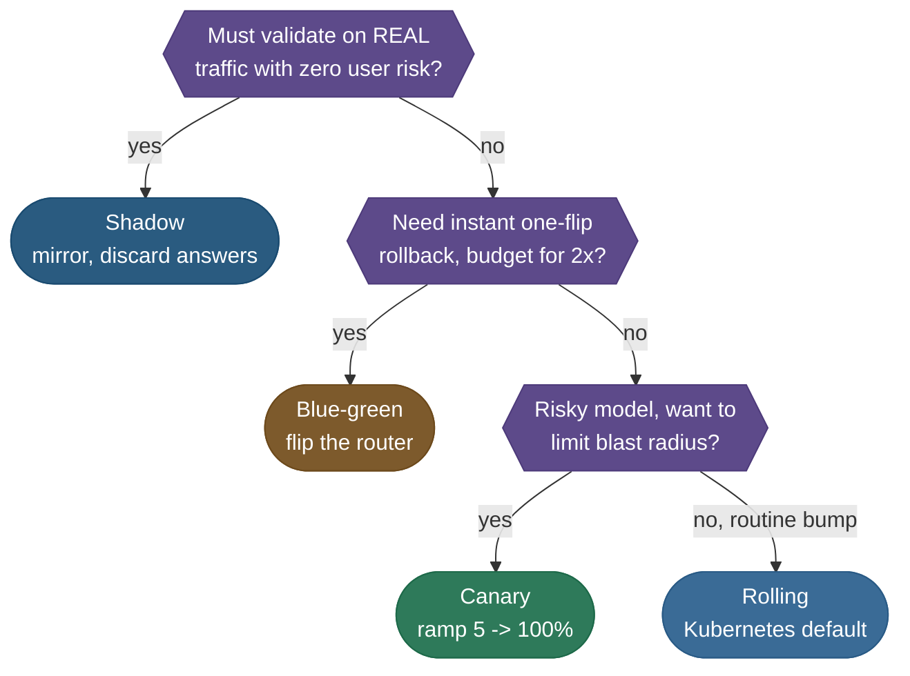
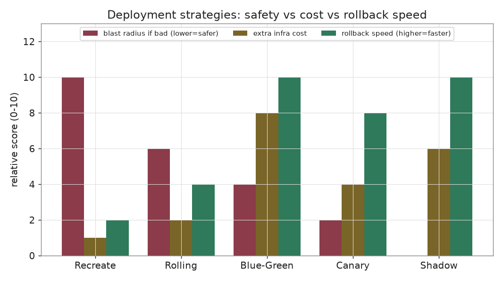
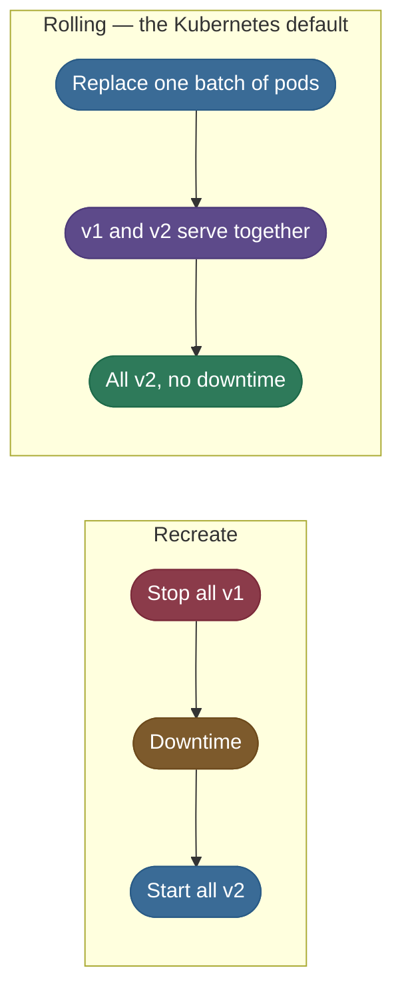
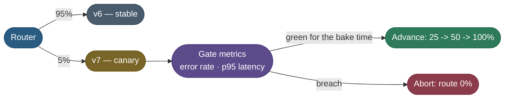
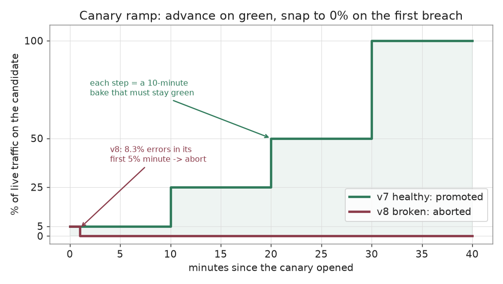
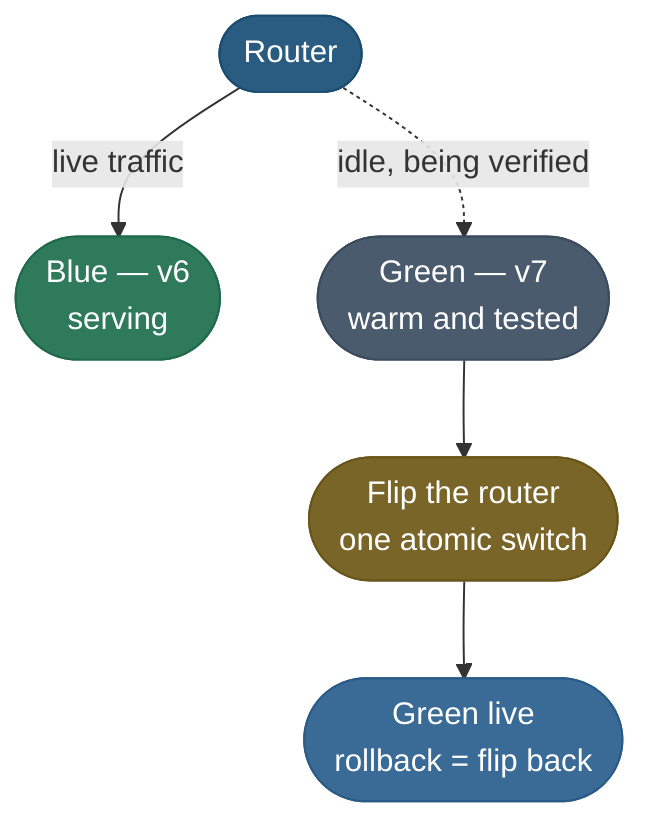
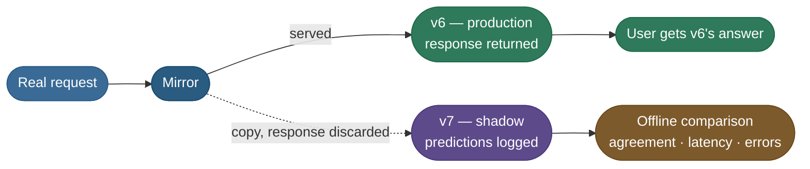

# A/B Testing, Shadow and Canary Deployment: releasing a model without betting every user

> Strategies for putting a new model in front of real traffic safely, because offline
> metrics do not guarantee online behaviour. Each one limits how far a bad version can reach.

**Why it matters:** "your offline metric went up — how do you ship it without risk, and how do you know it is actually better?"

- **What gets probed:** the shadow, canary, full-rollout ladder; when blue-green is worth its cost; and how an A/B test differs from a canary.
- **The trap:** treating a passed evaluation gate as permission to send 100% of traffic.
- **The strong answer:** names the blast radius, the gate metrics at each ramp step, the bake time, and the automatic abort.

We keep the model from [CI/CD for ML](/ai-ml/ai-ml-learning-resources/operations-and-lifecycle/release-and-deployment/cicd-for-ml-and-continuous-training/cicd-for-ml-and-continuous-training): **`iris-classifier` v7 just passed the gate** and must replace v6, which serves 10,000 requests a minute.

## Why a passed gate is not a safe release

The gate said v7 is good enough on a holdout. Production can still break it in ways no holdout contains.

- **Real inputs are stranger** than the evaluation set: malformed fields, new categories, adversarial users.
- **Real infrastructure fails differently:** memory leaks, cold caches, latency cliffs that appear only under load.
- **The business metric is not the offline metric:** higher accuracy can still lower conversions.

So the release question becomes one number, the **blast radius**: if v7 is bad, how many users are hurt before the system notices and undoes it?

## Which rollout to pick

All four common strategies replace v1 with v2 without an outage. They differ in blast radius, cost and rollback speed.

| | **Canary** | **Blue-green** | **Shadow** | **Rolling** |
|---|---|---|---|---|
| **How it works** | route a small % to v2, ramp up | two full environments, flip the router | mirror traffic to v2, discard its answers | replace pods a batch at a time |
| **User blast radius** | small (only the % exposed) | zero until the flip, then full | **zero** (users never see v2) | medium (both versions live) |
| **Extra infrastructure cost** | low | high (**2×** during cutover) | medium (a **parallel copy** doing real inference) | none |
| **Rollback speed** | fast (route to 0%) | instant (flip back) | nothing to roll back | slow (roll back through batches) |
| **Best for** | the general default for a risky model | instant, atomic rollback with budget to spare | proving a risky model on real traffic first | low-risk routine version bumps |



> **Tip:**
> - When in doubt, **canary**: the smallest blast radius for the least extra cost.
> - **Blue-green** when rollback must be one atomic switch; **shadow** to prove a model on genuine traffic with zero user risk; **rolling** for low-stakes bumps.

The same trade-offs side by side, as relative scores:



*Illustrative scores, not measurements: they rank the strategies, they do not size them.*

- **Recreate** is cheap and reckless: full blast radius and the slowest recovery.
- **Blue-green** buys the fastest rollback by paying for a second full environment.
- **Canary** and **shadow** keep the blast radius small; shadow pays for a copy that serves nobody.

> **Note:**
> - A fork sits above the rollout choice: **where the model runs**.
> - Steady, GPU-heavy load usually lives on Kubernetes, where you control batching and autoscaling.
> - Spiky, CPU-light inference is often cheaper serverless, if a cold start is tolerable.

## Recreate and rolling: the baseline

Two strategies need no extra machinery, which is exactly why they are rarely enough for a risky model.



- **Recreate** stops every old instance, then starts the new ones: simple, with downtime and no graceful way back.
- **Rolling** replaces instances batch by batch, so there is no outage.
  - The catch: **both versions serve traffic** during the rollout, with no control over who gets which.
  - Rollback means rolling back through the same slow batches.

## Canary: expose a sliver first

A canary sends a small share of traffic to v7 while everyone else stays on v6, and widens that share only while v7's error rate and 95th-percentile latency (p95) stay healthy.



The name comes from the canaries miners carried: a small, early warning that protects everyone behind it.

### The ramp schedule a controller executes

"Ramp 5 to 100%" is a concrete table that a rollout controller such as Argo Rollouts or Flagger walks step by step.

| Stage | Traffic to v7 | Bake time | Gate (advance only if it holds every minute) | Action |
|---|---|---|---|---|
| 1 | **5%** | 10 min | error rate < 2.0% **and** p95 < 150 ms | hold, watch, advance |
| 2 | **25%** | 10 min | error rate < 2.0% **and** p95 < 150 ms | hold, watch, advance |
| 3 | **50%** | 10 min | error rate < 2.0% **and** p95 < 150 ms | hold, watch, advance |
| 4 | **100%** | — | promote v7; v6 stays warm for rollback | done |

- **Healthy rollout:** 30 minutes of baking across three stages before v7 owns all traffic.
- **Any breach:** the stage does not advance; traffic **aborts straight to 0%**.

### How a request is assigned to the canary

The router must give the same answer for the same request on every replica, so it hashes the request key instead of rolling dice.

$$b(k) = \frac{\operatorname{top}_{53}\big(\mathrm{BLAKE2b}(\text{salt}:k)\big)}{2^{53}} \in [0, 1), \qquad \text{route } k \text{ to v7} \iff b(k) < \frac{p}{100}$$

- $k$: the request key (a user ID for sticky assignment, a request ID for per-request splitting).
- $\text{salt}$: a per-rollout string, so two concurrent rollouts bucket users independently.
- $p$: the current canary percentage.

Because $b(k)$ never changes, **raising $p$ only adds keys**: every user on v7 at 5% is still on v7 at 25%. The ramp never reshuffles who sees the new model.

### Blast radius, counted

Suppose v8, a broken candidate, errors on 8% of requests at 10,000 requests a minute.

- **At the 5% stage:** $10{,}000 \times 0.05 = 500$ requests a minute reach v8, and $500 \times 0.08 = 40$ of them fail.
- **Straight to 100%:** $10{,}000 \times 0.08 = 800$ failed requests in the same minute.
- **The ratio is $100 / 5 = 20\times$.** The canary does not make v8 better; it shrinks the damage and buys time to abort.

> **Note:**
> - The canary must be big enough for the gate to see anything. At 5%, a healthy 0.4% error rate means about 2 failures a minute, far below the 10 that 2% would take.
> - Shrink it to 1% (100 requests) and 2 unlucky failures already read as 2%. Under a Poisson approximation that happens in about 6% of minutes, so a 10-minute bake falsely aborts a healthy model about **47%** of the time.

## A canary controller you can run

The controller below routes 10,000 requests a minute by stable hash, walks the ramp, and aborts on the first breaching minute. It runs a healthy v7 and a broken v8 through the same schedule.

```python
"""Canary rollout controller for iris-classifier (CPU, offline, standard library only).

Routes 10,000 requests a minute between the production model (v6) and a candidate by a
stable hash of the request key, ramps the candidate through 5% -> 25% -> 50% -> 100% with
a ten-minute bake at each stage, and aborts to 0% the first minute the candidate's error
rate breaches the 2% service-level objective. A healthy and a broken candidate run through
the same schedule so the blast radius of each outcome can be counted, not estimated.

Run:  uv run --python 3.12 python canary_rollout.py
"""
from __future__ import annotations

import hashlib
import random
from dataclasses import dataclass

REQUESTS_PER_MINUTE = 10_000
ERROR_RATE_SLO = 0.02
FULL_TRAFFIC_PCT = 100
HASH_BITS = 53


@dataclass(frozen=True)
class Stage:
    """One rung of the ramp: the candidate's traffic share and how long it must stay green."""

    traffic_pct: int
    bake_minutes: int


STAGES = (Stage(5, 10), Stage(25, 10), Stage(50, 10), Stage(FULL_TRAFFIC_PCT, 0))


@dataclass(frozen=True)
class Candidate:
    name: str
    error_probability: float


@dataclass(frozen=True)
class MinuteReport:
    minute: int
    traffic_pct: int
    candidate_requests: int
    candidate_errors: int

    @property
    def error_rate(self) -> float:
        return self.candidate_errors / max(self.candidate_requests, 1)


@dataclass(frozen=True)
class RolloutResult:
    candidate: Candidate
    is_promoted: bool
    minutes: tuple[MinuteReport, ...]

    @property
    def errored_requests(self) -> int:
        return sum(report.candidate_errors for report in self.minutes)


def stable_fraction(key: str, salt: str = "iris-v7-rollout") -> float:
    """Map a request key to a uniform number in [0, 1) that every replica agrees on."""
    digest = hashlib.blake2b(f"{salt}:{key}".encode(), digest_size=8).digest()
    return (int.from_bytes(digest, "big") >> (64 - HASH_BITS)) / float(1 << HASH_BITS)


def routes_to_candidate(key: str, traffic_pct: int) -> bool:
    return stable_fraction(key) < traffic_pct / 100


def serve_one_minute(minute: int, stage: Stage, candidate: Candidate,
                     rng: random.Random) -> MinuteReport:
    candidate_requests = 0
    candidate_errors = 0
    for request_index in range(REQUESTS_PER_MINUTE):
        if not routes_to_candidate(f"req-{minute}-{request_index}", stage.traffic_pct):
            continue
        candidate_requests += 1
        if rng.random() < candidate.error_probability:
            candidate_errors += 1
    return MinuteReport(minute, stage.traffic_pct, candidate_requests, candidate_errors)


def simulate_rollout(candidate: Candidate, seed: int = 0) -> RolloutResult:
    """Walk the ramp minute by minute; abort the moment one minute breaches the SLO."""
    rng = random.Random(seed)
    reports: list[MinuteReport] = []
    minute = 0
    for stage in STAGES:
        if stage.traffic_pct == FULL_TRAFFIC_PCT:
            return RolloutResult(candidate, True, tuple(reports))
        for _ in range(stage.bake_minutes):
            report = serve_one_minute(minute, stage, candidate, rng)
            reports.append(report)
            minute += 1
            if report.error_rate >= ERROR_RATE_SLO:
                return RolloutResult(candidate, False, tuple(reports))
    return RolloutResult(candidate, True, tuple(reports))


def print_rollout(result: RolloutResult) -> None:
    print(f"\n== {result.candidate.name} (true error rate "
          f"{result.candidate.error_probability:.1%}) ==")
    print(f"{'stage':>6} | {'minutes':>7} | {'req/min on candidate':>20} | "
          f"{'worst minute':>12} | decision")
    print("-" * 72)
    for stage in STAGES[:-1]:
        stage_reports = [r for r in result.minutes if r.traffic_pct == stage.traffic_pct]
        if not stage_reports:
            break
        mean_requests = sum(r.candidate_requests for r in stage_reports) / len(stage_reports)
        worst = max(stage_reports, key=lambda r: r.error_rate)
        breached = worst.error_rate >= ERROR_RATE_SLO
        decision = "ABORT -> route 0%" if breached else "green -> advance"
        print(f"{stage.traffic_pct:>5}% | {len(stage_reports):>7} | {mean_requests:>20.0f} | "
              f"{worst.error_rate:>11.2%} | {decision}")
    outcome = "PROMOTED to 100%" if result.is_promoted else "ABORTED"
    print(f"outcome: {outcome} after {len(result.minutes)} min; "
          f"errored requests served by the candidate: {result.errored_requests}")


def main() -> None:
    healthy = simulate_rollout(Candidate("iris-classifier:v7", error_probability=0.004))
    broken = simulate_rollout(Candidate("iris-classifier:v8", error_probability=0.08))
    print(f"traffic: {REQUESTS_PER_MINUTE:,} req/min   SLO: candidate error rate "
          f"< {ERROR_RATE_SLO:.0%}   ramp: 5 -> 25 -> 50 -> 100% (10-min bakes)")
    print_rollout(healthy)
    print_rollout(broken)

    minutes_exposed = len(broken.minutes)
    straight_to_full = REQUESTS_PER_MINUTE * broken.candidate.error_probability * minutes_exposed
    print(f"\nblast radius of v8: canary {broken.errored_requests} errored requests vs "
          f"{straight_to_full:.0f} if shipped straight to 100% for the same "
          f"{minutes_exposed} min ({straight_to_full / broken.errored_requests:.0f}x)")

    user_keys = [f"user-{index}" for index in range(REQUESTS_PER_MINUTE)]
    on_at_5 = {key for key in user_keys if routes_to_candidate(key, 5)}
    on_at_25 = {key for key in user_keys if routes_to_candidate(key, 25)}
    print(f"sticky ramp: {len(on_at_5)} users on v7 at 5%, {len(on_at_25)} at 25%; "
          f"every 5% user still on v7 at 25%? {on_at_5 <= on_at_25}")


if __name__ == "__main__":
    main()
```

Its output:

```text
traffic: 10,000 req/min   SLO: candidate error rate < 2%   ramp: 5 -> 25 -> 50 -> 100% (10-min bakes)

== iris-classifier:v7 (true error rate 0.4%) ==
 stage | minutes | req/min on candidate | worst minute | decision
------------------------------------------------------------------------
    5% |      10 |                  495 |       0.81% | green -> advance
   25% |      10 |                 2511 |       0.62% | green -> advance
   50% |      10 |                 5010 |       0.56% | green -> advance
outcome: PROMOTED to 100% after 30 min; errored requests served by the candidate: 306

== iris-classifier:v8 (true error rate 8.0%) ==
 stage | minutes | req/min on candidate | worst minute | decision
------------------------------------------------------------------------
    5% |       1 |                  493 |       8.32% | ABORT -> route 0%
outcome: ABORTED after 1 min; errored requests served by the candidate: 41

blast radius of v8: canary 41 errored requests vs 800 if shipped straight to 100% for the same 1 min (20x)
sticky ramp: 515 users on v7 at 5%, 2462 at 25%; every 5% user still on v7 at 25%? True
```

What the run shows:

- **The hash split is honest:** 495, 2,511 and 5,010 requests a minute against 500, 2,500 and 5,000 expected.
- **Noise is visible but harmless at 5%:** v7's worst minute read 0.81%, double its true 0.4%, and still far below 2%.
- **v8 never got past its first minute:** 41 failed requests, exactly the 20× reduction the arithmetic predicted.
- **The ramp is sticky:** all 515 users on v7 at 5% remain among the 2,462 at 25%.

The same two rollouts over time:



## Blue-green: two environments, one switch

Blue-green keeps two complete production environments and moves all traffic between them in a single router change.



- **What you get:** cutover and rollback are the **same** switch, so recovery costs one router change in seconds.
- **What you pay:** **2× the serving infrastructure** during cutover. For GPU-served models that bill is large.
- **What it does not give you:** gradual exposure. After the flip, 100% of users are on v7.

## Shadow: real traffic, zero user risk

Shadow deployment copies live requests to v7 in parallel, logs its answers, and always returns v6's answer to the user.



The dashed branch never reaches a user; it dead-ends in a comparison. A bad shadow costs a log line, not an incident.

- **What it measures well:** latency and error behaviour under real load, and how often v7 **disagrees** with v6.
- **What it cannot measure:** user reaction. Nobody saw v7's answer, so clicks and conversions say nothing about it.
- **What it costs:** a parallel copy doing real inference on the mirrored share; sample a fraction to cap it.

> **Warning:**
> - A shadow model must have **no side effects**: no emails, no charges, no writes to shared state.
> - Mirroring also doubles load on anything the model calls, such as a feature store or a downstream service.

## A/B testing: is it better, not only safe

A canary and an A/B test both split traffic, but they answer different questions.

- **Canary:** "is v7 **safe**?" Small share, short bakes, guardrail metrics like error rate and latency, abort on breach.
- **A/B test:** "is v7 **better**?" A fixed split, often 50/50, held long enough to measure a business metric with statistical confidence.

What makes an A/B result trustworthy:

- **Sticky assignment:** a user stays in one arm for the whole experiment, which is exactly the stable hash above.
- **One primary metric, chosen before starting,** plus guardrails that must not regress.
- **A sample size fixed in advance,** so nobody stops the test the first afternoon it looks good.

The statistics (hypothesis tests, power, and variance reduction such as Controlled-experiment Using Pre-Experiment Data, CUPED) live in [Mathematical Foundations](/ai-ml/ai-ml-learning-resources/foundations/mathematical-foundations/readme).


Each rung risks more users to answer a harder question. Most releases do not need all four; a risky model usually earns at least the first two.

## Common misconceptions

- **"Canary and A/B testing are the same thing."** Same split mechanism, different question, different duration and different metrics.
- **"Shadow tells you whether users will like the model."** Users never saw its answers; shadow measures behaviour, not reception.
- **"A smaller canary is always safer."** Below a few hundred requests a minute the gate cannot tell noise from failure.
- **"Blue-green limits blast radius."** It limits rollback time. After the flip, every user is on the new version.

## What-if analysis

| Change | Expected behaviour | Failure it invites |
|---|---|---|
| First stage 5% → 1% | Blast radius falls 5× | ~47% false aborts of a healthy model with a per-minute gate |
| First stage 5% → 25% | Faster, clearer signal | A bad version reaches 5× more users before abort |
| Bake time 10 → 1 min | Rollout finishes in minutes | Slow failures (leaks, cache warm-up, daily patterns) are never seen |
| Random routing instead of a stable hash | Same average split | Users flip between versions; A/B arms contaminate each other |
| Remove the automatic abort | Humans decide | Recovery time becomes whoever is on call at 3 a.m. |

## Pitfalls

| Symptom you see | Likely cause | Fix |
|---|---|---|
| **Canary aborts healthy models at random** | Canary too small, or a single-minute rule on a noisy metric | Raise the first stage, or require consecutive breaching minutes |
| **Canary looked fine, full rollout broke** | Bake too short, or the failure depends on load the canary never reached | Add a 50% stage; bake long enough to cover warm-up and peak |
| **Users report answers flipping between requests** | Per-request random routing | Hash a user ID with a per-rollout salt |
| **Shadow deployment charged customers twice** | Shadow path had side effects | Stub every write and external call on the shadow path |
| **A/B winner vanished a week later** | Test stopped early when it first looked significant | Fix sample size in advance; do not peek-and-stop |
| **Canary error rate climbs and nobody is paged** | No automated trigger wired to the gate | See [Rollback and Recovery for ML Systems](/ai-ml/ai-ml-learning-resources/operations-and-lifecycle/release-and-deployment/rollback-and-recovery-for-ml-systems/rollback-and-recovery-for-ml-systems) |

## Key takeaways

- A passed offline gate earns **exposure**, not a full release; the question is **blast radius**.
- **Canary** is the default: ramp 5 → 25 → 50 → 100% with bakes and an automatic abort.
- A **stable hash** makes routing agree across replicas and keeps the ramp sticky.
- **Blue-green** buys instant rollback for 2× infrastructure; **shadow** buys zero user risk for a parallel copy.
- **Canary asks "safe?"; A/B asks "better?"** and needs a fixed sample size.

## Production implementation

Runnable services in this estate that implement what this page teaches:

- **[ml-platform](/python/python-production-examples/ml-platform/readme)** — canary, blue-green, shadow and A/B routing as one pure function over a BLAKE2b stable hash, so every replica agrees and the ramp stays sticky.
- **[mlops-lifecycle](/python/cross-service-workflows/mlops-lifecycle)** — deploys a 20% canary, asserts the observed split, runs a shadow that never serves, then ramps 20 → 50 → 100%.

## References

The curated link library for this topic — videos, courses, articles, papers and internal cross-links — lives in a companion file so it can be reused as a standalone reference list:

**→ [A/B Testing, Shadow and Canary Deployment — references](/ai-ml/ai-ml-learning-resources/operations-and-lifecycle/release-and-deployment/ab-testing-shadow-and-canary-deployment/ab-testing-shadow-and-canary-deployment#references-further-reading)**
