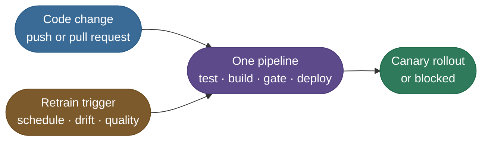
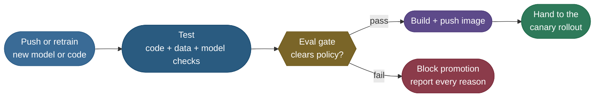

# CI/CD for ML and Continuous Training: the pipeline that can say no

> Continuous integration and delivery, extended for models: the same test, build and deploy
> stages software uses, plus an evaluation gate that decides whether a model may advance.

**Why it matters:** "what is different about CI/CD for ML?" is one of the most common MLOps interview questions.

- **What gets probed:** the extra things under test (data and model, not only code), what the gate compares, and where continuous training plugs in.
- **The trap:** answering with software CI alone. A green test suite says nothing about whether the new model is better than the one serving.
- **The strong answer:** a committed gate policy, evaluated on the same holdout as production, whose verdict is the pipeline's exit code.

We carry **one model** through the page: `iris-classifier`, with **v6 in production** and four candidates, v7 to v10, asking to replace it.

## The gap between a notebook and a release

A model that works in a notebook leans on assumptions production removes one by one.

| In your notebook | In production | What the pipeline adds |
|---|---|---|
| You remember which data and seed you used | "Which data trained the model serving right now?" | **Lineage** in a [model registry](/ai-ml/ai-ml-learning-resources/operations-and-lifecycle/governance-and-economics/model-registry-and-governance/model-registry-and-governance) |
| `import sklearn` is whatever you installed | The server has another version and the pickle will not load | A **pinned, [packaged](/ai-ml/ai-ml-learning-resources/inference-and-serving/packaging-and-serving/model-packaging-and-containerization/model-packaging-and-containerization)** artifact |
| You re-run a cell to "deploy" | A new version must replace the old with zero downtime | **[Release strategies](/ai-ml/ai-ml-learning-resources/operations-and-lifecycle/release-and-deployment/ab-testing-shadow-and-canary-deployment/ab-testing-shadow-and-canary-deployment)** |
| If it breaks, you fix the cell | If it breaks, users are hurt until someone reverts | **[Rollback](/ai-ml/ai-ml-learning-resources/operations-and-lifecycle/release-and-deployment/rollback-and-recovery-for-ml-systems/rollback-and-recovery-for-ml-systems)** and monitoring |

Two properties make a model harder to ship than ordinary software:

- **The artifact is a large binary blob.** You cannot read a diff of weights and see what changed.
- **Correctness is statistical.** No unit test proves "accurate enough"; it has to be **measured** on held-out data and compared.

The whole pipeline below is built around those two facts.

## Three loops, one pipeline

**CI/CD/CT** names three automations that share the same machinery but start for different reasons.

- **Continuous integration (CI):** every code change is merged, built and tested automatically.
- **Continuous delivery (CD):** every change that passes is releasable, and release is a routine, gated step.
- **Continuous training (CT):** a schedule, a drift signal or a quality drop retrains the model, and the candidate enters the **same** gated pipeline.



The two inputs differ; the path does not. A retrained model gets **no shortcut** past the gate a code change faces.

- The loop that decides **when** to retrain is its own subject: [Continuous Training](/ai-ml/ai-ml-learning-resources/operations-and-lifecycle/lifecycle-and-reproducibility/continuous-training/continuous-training).
- The graph of steps that produces the candidate is [ML Pipelines and Orchestration](/ai-ml/ai-ml-learning-resources/operations-and-lifecycle/data-and-training-platforms/ml-pipelines-and-orchestration/ml-pipelines-and-orchestration).

## The delivery pipeline ML inherits

The software half is a pattern decades old, and it is worth seeing in its canonical form first.


*Continuous Delivery process diagram by Jez Humble (SVG by Grégoire Détrez), [Wikimedia Commons](https://commons.wikimedia.org/wiki/File:Continuous_Delivery_process_diagram.svg), licensed [CC BY-SA 4.0](https://creativecommons.org/licenses/by-sa/4.0/).*

Read the three runs top to bottom:

- **Top run:** the build fails, the pipeline halts, and feedback reaches the team within minutes.
- **Middle run:** the build passes but automated acceptance tests fail, so nothing reaches release.
- **Bottom run:** every stage is green, and only then does approval promote the change.

An ML pipeline keeps every lane and inserts one more between "tests pass" and "release".

## The evaluation gate: the one stage with two exits

The gate is where ML diverges from software: a **measured verdict**, not a green checkmark, decides whether the model advances.



Everything before the diamond is ordinary CI. The diamond reads an evaluation report and exits in one of two directions.

- **Gate before build:** a blocked model never produces an image, so there is nothing to deploy by accident.
- **Every reason reported:** an engineer sees all failed checks at once, not one per pipeline run.
- **Where the report comes from:** [Model Evaluation and Benchmarks](/ai-ml/ai-ml-learning-resources/evaluation/model-evaluation-and-benchmarks/model-evaluation-and-benchmarks) produces the metrics; [Experiment Tracking](/ai-ml/ai-ml-learning-resources/operations-and-lifecycle/lifecycle-and-reproducibility/experiment-tracking/experiment-tracking) records which run produced them.

## Four things an ML pipeline tests

Software tests the code. A model release can be wrong in **four** different places, so the pipeline checks four layers.

| Layer | Example check | The failure it catches |
|---|---|---|
| **Code** | unit tests on preprocessing and serving logic | a bug in a feature transformation |
| **Data** | schema, ranges, null rates, train/serve skew checks | the input distribution silently changed |
| **Model** | accuracy floor, no regression against production, fairness slices | a worse model sneaking into production |
| **Serving** | smoke test: the container boots and `/predict` answers under the latency budget | a good model behind a broken service |

The **Model** row is the gate. The other three are necessary, but only this one can say "the code is fine and the model is still worse".

## The gate policy: floor, no regression, latency

A candidate advances only when **all three** checks hold, each measured on the same holdout as production.

- **Absolute floor:** the candidate's accuracy is at least a minimum the product can live with.
- **No regression:** it is no worse than production by more than a small budget $\delta$.
- **Latency budget:** its 95th-percentile latency (p95) fits the serving budget.

$$\text{promote} \iff a_c \ge a_{\min} \;\wedge\; a_c \ge a_{\text{prod}} - \delta \;\wedge\; \ell^{95}_c \le \ell_{\max}$$

- $a_c$, $a_{\text{prod}}$: candidate and production accuracy on the **same** holdout.
- $a_{\min} = 0.90$: the floor. $\delta = 0.01$: the regression budget. $\ell_{\max} = 150$ ms: the p95 budget.

With production v6 at $a_{\text{prod}} = 0.92$, the regression check lets a candidate through at $0.92 - 0.01 = 0.91$ or better.

| Candidate | Accuracy | p95 | Floor ($\ge 0.90$) | No regression ($\ge 0.91$) | Latency ($\le 150$) | Verdict |
|---|---|---|---|---|---|---|
| v7 | 0.94 | 120 ms | pass | pass | pass | **PROMOTE** |
| v8 | 0.95 | 210 ms | pass | pass | **fail** | **BLOCK** |
| v9 | 0.90 | 110 ms | pass | **fail** | pass | **BLOCK** |
| v10 | 0.88 | 100 ms | **fail** | **fail** | pass | **BLOCK** |

v8 is the case engineers argue with, because it is the most accurate model in the table.

- **Why the gate is right:** a service that is 60 ms slower at p95 is a worse product for every user, even at one point more accuracy.
- **What to do instead:** fix the failing axis (distil, quantize, batch), then run the gate again. Never loosen the policy to let it through.

> **Note:**
> - The regression check needs production **re-evaluated on today's holdout**, not a number copied from last quarter's report.
> - If the eval set quietly changed, an old score lets a real regression pass looking like an improvement.

## The gate as code

The policy is small enough to read in one sitting, and committing it to the repository makes changing the bar a reviewed pull request.

```python
"""Deployment gate for iris-classifier (CPU, offline, standard library only).

A candidate may advance to the canary only if it clears three checks against the model
currently in production, both measured on the same holdout: an absolute accuracy floor,
no regression beyond a small budget, and a p95 latency budget. Every failed check is
reported, and each verdict carries the exit code a CI job returns (0 promotes, 1 blocks).

Run:  uv run --python 3.12 python deploy_gate.py
"""
from __future__ import annotations

import json
from dataclasses import dataclass, field

PROMOTE_EXIT_CODE = 0
BLOCK_EXIT_CODE = 1


@dataclass(frozen=True)
class GatePolicy:
    """The promotion contract. It lives in the repository, so changing the bar is a
    reviewed pull request rather than a message in a chat channel."""

    min_accuracy: float = 0.90
    max_regression: float = 0.01
    max_p95_latency_ms: float = 150.0


@dataclass(frozen=True)
class EvalReport:
    """What the offline evaluation job measures for one model version on the holdout."""

    name: str
    accuracy: float
    p95_latency_ms: float


@dataclass(frozen=True)
class GateVerdict:
    """The machine-readable decision CI keys off."""

    candidate: str
    production: str
    checks: dict[str, dict[str, float | bool]]
    reasons: list[str] = field(default_factory=list)

    @property
    def is_promoted(self) -> bool:
        return not self.reasons

    def to_json(self) -> str:
        return json.dumps({
            "candidate": self.candidate,
            "prod": self.production,
            "checks": self.checks,
            "decision": "PROMOTE" if self.is_promoted else "BLOCK",
            "reasons": self.reasons,
            "exit_code": PROMOTE_EXIT_CODE if self.is_promoted else BLOCK_EXIT_CODE,
        })


def evaluate_gate(candidate: EvalReport, production: EvalReport,
                  policy: GatePolicy) -> GateVerdict:
    """Run every check and collect every failure, not just the first one."""
    clears_floor = candidate.accuracy >= policy.min_accuracy
    allowed_accuracy = production.accuracy - policy.max_regression
    has_no_regression = candidate.accuracy >= allowed_accuracy
    fits_latency = candidate.p95_latency_ms <= policy.max_p95_latency_ms

    reasons = []
    if not clears_floor:
        reasons.append(f"accuracy {candidate.accuracy:.3f} < floor {policy.min_accuracy:.3f}")
    if not has_no_regression:
        reasons.append(f"regression: {candidate.accuracy:.3f} vs prod "
                       f"{production.accuracy:.3f} (allowed drop {policy.max_regression:.3f})")
    if not fits_latency:
        reasons.append(f"p95 latency {candidate.p95_latency_ms:.0f}ms > budget "
                       f"{policy.max_p95_latency_ms:.0f}ms")

    checks = {
        "floor": {"acc": candidate.accuracy, "min": policy.min_accuracy, "pass": clears_floor},
        "no_regression": {"acc": candidate.accuracy, "prod_acc": production.accuracy,
                          "allowed_drop": policy.max_regression, "pass": has_no_regression},
        "latency": {"p95_ms": candidate.p95_latency_ms,
                    "budget_ms": policy.max_p95_latency_ms, "pass": fits_latency},
    }
    return GateVerdict(candidate.name, production.name, checks, reasons)


def main() -> None:
    policy = GatePolicy()
    production = EvalReport("iris-classifier:v6", accuracy=0.92, p95_latency_ms=115)
    candidates = [
        EvalReport("iris-classifier:v7", accuracy=0.94, p95_latency_ms=120),
        EvalReport("iris-classifier:v8", accuracy=0.95, p95_latency_ms=210),
        EvalReport("iris-classifier:v9", accuracy=0.90, p95_latency_ms=110),
        EvalReport("iris-classifier:v10", accuracy=0.88, p95_latency_ms=100),
    ]

    print(f"policy: acc>={policy.min_accuracy}  max_regression={policy.max_regression}  "
          f"p95<={policy.max_p95_latency_ms:.0f}ms   (prod {production.name} "
          f"acc={production.accuracy})\n")
    print(f"{'candidate':<22}{'acc':>6}{'p95(ms)':>9}  decision")
    print("-" * 62)
    verdicts = [evaluate_gate(candidate, production, policy) for candidate in candidates]
    for candidate, verdict in zip(candidates, verdicts):
        decision = "PROMOTE" if verdict.is_promoted else "BLOCK"
        print(f"{candidate.name:<22}{candidate.accuracy:>6.2f}"
              f"{candidate.p95_latency_ms:>9.0f}  {decision}")
        for reason in verdict.reasons:
            print(f"{'':<37}- {reason}")

    print("\nverdicts as CI sees them (one JSON line per candidate):")
    for verdict in verdicts:
        print(verdict.to_json())


if __name__ == "__main__":
    main()
```

Running it prints the decision table, then the verdicts CI keys off:

```text
policy: acc>=0.9  max_regression=0.01  p95<=150ms   (prod iris-classifier:v6 acc=0.92)

candidate                acc  p95(ms)  decision
--------------------------------------------------------------
iris-classifier:v7      0.94      120  PROMOTE
iris-classifier:v8      0.95      210  BLOCK
                                     - p95 latency 210ms > budget 150ms
iris-classifier:v9      0.90      110  BLOCK
                                     - regression: 0.900 vs prod 0.920 (allowed drop 0.010)
iris-classifier:v10     0.88      100  BLOCK
                                     - accuracy 0.880 < floor 0.900
                                     - regression: 0.880 vs prod 0.920 (allowed drop 0.010)

verdicts as CI sees them (one JSON line per candidate):
{"candidate": "iris-classifier:v7", "prod": "iris-classifier:v6", "checks": {"floor": {"acc": 0.94, "min": 0.9, "pass": true}, "no_regression": {"acc": 0.94, "prod_acc": 0.92, "allowed_drop": 0.01, "pass": true}, "latency": {"p95_ms": 120, "budget_ms": 150.0, "pass": true}}, "decision": "PROMOTE", "reasons": [], "exit_code": 0}
{"candidate": "iris-classifier:v8", "prod": "iris-classifier:v6", "checks": {"floor": {"acc": 0.95, "min": 0.9, "pass": true}, "no_regression": {"acc": 0.95, "prod_acc": 0.92, "allowed_drop": 0.01, "pass": true}, "latency": {"p95_ms": 210, "budget_ms": 150.0, "pass": false}}, "decision": "BLOCK", "reasons": ["p95 latency 210ms > budget 150ms"], "exit_code": 1}
{"candidate": "iris-classifier:v9", "prod": "iris-classifier:v6", "checks": {"floor": {"acc": 0.9, "min": 0.9, "pass": true}, "no_regression": {"acc": 0.9, "prod_acc": 0.92, "allowed_drop": 0.01, "pass": false}, "latency": {"p95_ms": 110, "budget_ms": 150.0, "pass": true}}, "decision": "BLOCK", "reasons": ["regression: 0.900 vs prod 0.920 (allowed drop 0.010)"], "exit_code": 1}
{"candidate": "iris-classifier:v10", "prod": "iris-classifier:v6", "checks": {"floor": {"acc": 0.88, "min": 0.9, "pass": false}, "no_regression": {"acc": 0.88, "prod_acc": 0.92, "allowed_drop": 0.01, "pass": false}, "latency": {"p95_ms": 100, "budget_ms": 150.0, "pass": true}}, "decision": "BLOCK", "reasons": ["accuracy 0.880 < floor 0.900", "regression: 0.880 vs prod 0.920 (allowed drop 0.010)"], "exit_code": 1}
```

What each part is doing:

- **`GatePolicy`** is the contract. Its three numbers are the only knobs, and they sit in version control.
- **`evaluate_gate`** computes every check before deciding, which is why v10 reports **both** its floor and its regression failure.
- **`GateVerdict.to_json`** is the artifact CI stores. A real job ends with `sys.exit(verdict exit_code)`, so the pipeline halts on `1`.
- **v9 at exactly 0.90** clears the floor (`>=`) but not the regression bar of 0.91: two checks, two different questions.

> **Tip:** The [Continuous Training](/ai-ml/ai-ml-learning-resources/operations-and-lifecycle/lifecycle-and-reproducibility/continuous-training/continuous-training) page sketches the same gate as orchestrator pseudocode. This is the runnable version of that `beats_incumbent and passes_quality_gates` line.

## Wiring the gate into CI

The CI configuration is orchestration around those stages; the policy lives in the gate script, not in the YAML.

```yaml
# REFERENCE .github/workflows/deploy-model.yml — test -> evaluate -> gate -> build -> roll out.
name: deploy-model
on: { push: { branches: [main] } }
jobs:
  ship:
    runs-on: ubuntu-latest
    steps:
      - uses: actions/checkout@v4
      - run: pip install -r requirements.txt
      - run: pytest tests/                          # code + data + serving checks
      - run: python evaluate.py --out report.json   # candidate AND production on one holdout
      - run: python gate.py report.json             # non-zero exit blocks every later step
      - run: docker build -t registry/iris:${{ github.sha }} .
      - run: docker push registry/iris:${{ github.sha }}
      - run: kubectl argo rollouts set image iris iris=registry/iris:${{ github.sha }}
```

The order carries the design:

- **Evaluate both models in one job.** The report holds candidate and production scores from the same data, which is what the regression check needs.
- **Gate before `docker build`.** GitHub Actions stops at the first failing step, so a blocked model never becomes an image.
- **The last step hands off, it does not release.** Setting the image on an Argo Rollouts resource starts the canary described in [A/B Testing, Shadow and Canary Deployment](/ai-ml/ai-ml-learning-resources/operations-and-lifecycle/release-and-deployment/ab-testing-shadow-and-canary-deployment/ab-testing-shadow-and-canary-deployment).

## Common misconceptions

- **"CI/CD for ML is just CI/CD with a training step."** The training step is the least of it; the gate that compares against production is the part software never needed.
- **"A higher accuracy should always ship."** The gate is multi-objective. v8 was the most accurate candidate and was correctly blocked.
- **"Continuous training means continuously deploying."** CT automates producing and evaluating a candidate. Whether it reaches users is still this gate, then a canary.
- **"The gate replaces the canary."** Offline evaluation cannot see production traffic, memory leaks or latency under real load. The gate earns a model the right to a canary, nothing more.

## What-if: turning the gate's knobs

Each knob trades a different failure for another.

| Change | What happens | Failure it invites |
|---|---|---|
| Regression budget $\delta \to 0$ | Any candidate within evaluation noise of production is blocked | Retrains stall; an honest 0.919 against 0.920 never ships |
| Regression budget $\delta \to 0.05$ | Slow erosion passes: five releases can each drop 0.01 | Death by a thousand acceptable regressions |
| Remove the latency check | v8 ships | p95 rises for every user; the serving bill rises with it |
| Compare against a stored production score | The gate runs faster | A changed holdout lets a real regression through |
| Gate on the mean only, no slices | One number looks fine | A subgroup regresses badly and nobody sees it |

## Pitfalls

| Symptom you see | Likely cause | Fix |
|---|---|---|
| **The gate blocks a model that "looks better"** | More accurate but slower, or it regresses on a slice | Read every reason; fix the failing axis, never loosen the gate |
| **A regression shipped although the gate passed** | Production's score was copied from an old report on a different holdout | Re-evaluate production and candidate side by side on every run |
| **The gate flaps between pass and block on reruns** | Holdout too small, so the noise is larger than $\delta$ | Grow the holdout, or report a confidence interval and gate on its bound |
| **Someone edited the threshold to unblock a release** | Policy lives in CI variables or a chat thread | Keep the policy in the repository and require review to change it |
| **Staging passed, production fails** | Environment drift: different libraries, drivers or configuration | Build both from the same image and the same [infrastructure as code](/ai-ml/ai-ml-learning-resources/operations-and-lifecycle/lifecycle-and-reproducibility/reproducibility/reproducibility) |

## Key takeaways

- An ML pipeline is software CI/CD **plus an evaluation gate** with two exits.
- The gate checks a **floor, no regression against production, and a latency budget**, all on the same holdout.
- The policy is **code**: committed, reviewed, and reported with every failed reason.
- Code changes and retrains share **one pipeline**; continuous training gets no shortcut.
- Passing the gate earns a **canary**, not a full release.

## Production implementation

Runnable services in this estate that implement what this page teaches:

- **[ml-platform](/python/python-production-examples/ml-platform/readme)** — the registry's promotion state machine refuses a candidate that fails its evaluation gate and reports why, before any rollout begins.
- **[mlops-lifecycle](/python/cross-service-workflows/mlops-lifecycle)** — a workflow that drives train, register, compare and promote end to end and exits non-zero when a step misbehaves, the way a CI gate does.

## References

The curated link library for this topic — videos, courses, articles, papers and internal cross-links — lives in a companion file so it can be reused as a standalone reference list:

**→ [CI/CD for ML and Continuous Training — references](/ai-ml/ai-ml-learning-resources/operations-and-lifecycle/release-and-deployment/cicd-for-ml-and-continuous-training/cicd-for-ml-and-continuous-training#references-further-reading)**
