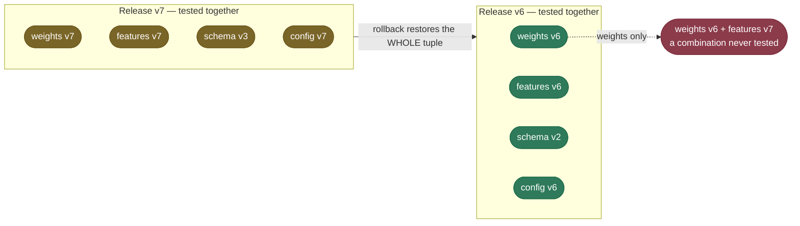

# Rollback and Recovery for ML Systems: restore the tuple, beat the clock

> Rolling back a service means redeploying the previous binary. Rolling back a model means
> restoring a set of artifacts together, fast enough that users barely notice.

**Why it matters:** users experience the **time to recovery**, not the failure rate.

- **What gets probed:** what exactly must be restored, how the rollback is triggered, and how fast each path is.
- **Where ML differs from web services:** skew reintroduced by a partial rollback, feature-store schema migrations, a base model whose serving stack moved on, caches built by the new version.
- **The strong answer:** names the artifact set, the immutability rule, the traffic switch, and a **rollback trigger agreed before the rollout**.

We continue with `iris-classifier`: **v7 is on a canary** from [A/B Testing, Shadow and Canary Deployment](/ai-ml/ai-ml-learning-resources/operations-and-lifecycle/release-and-deployment/ab-testing-shadow-and-canary-deployment/ab-testing-shadow-and-canary-deployment), and v6 is still warm.

## What you are actually rolling back

A model in production is never just weights. It is a **tuple** of artifacts that were tested together.

- **Model weights** — the registered version.
- **Feature transformations and preprocessing code** — the exact code that turns raw inputs into features.
- **Feature-store schema** — the columns and types the model reads.
- **Prompt or system message** — for language models, part of the model's behaviour.
- **Configuration** — thresholds, routing rules, the flags that select among the above.
- **Derived state** — caches, key-value caches, embedding indexes built by the new version.



The dashed arrow is the classic failure: restore the weights alone and you "roll back" into a combination nobody ever evaluated.

> **Note:**
> - Immutability makes the tuple restorable: every artifact is **versioned and never overwritten**.
> - The pieces that make that possible are taught in [Data and Model Versioning](/ai-ml/ai-ml-learning-resources/operations-and-lifecycle/lifecycle-and-reproducibility/data-and-model-versioning/data-and-model-versioning) and [Model Registry and Governance](/ai-ml/ai-ml-learning-resources/operations-and-lifecycle/governance-and-economics/model-registry-and-governance/model-registry-and-governance).

## The golden rule: faster and more automatic than rollout

The tuple answers **what** to restore. The other half of recovery is **when**, and how fast.

- **Rollback must be faster than rollout.** A canary can take 30 minutes to ramp; undoing it must take seconds to minutes.
- **Rollback must be more automatic than rollout.** A person can approve a promotion; nobody should have to wake up to approve a revert.
- **The trigger is decided before the rollout:** a metric, a threshold and a duration, written into the rollout, not debated during the incident.

## The incident, minute by minute

Here is one incident from start to finish, replayed under two policies from the runnable loop below.

- **Traffic:** 10,000 requests a minute; v7 opens at 5% and ramps to 25% at minute 10.
- **The defect:** a code path only real load exercises. From minute 10, v7's error rate climbs 0.3 points a minute.
- **The objective:** a service-level objective (SLO) of at most 2% errors.


The same clock as an event log:

| Minute | Event | v7 traffic | v7 error rate |
|---|---|---|---|
| 0 | canary opens | 5% | 0.4% |
| 10 | stage green, ramp | 25% | 0.4% |
| **16** | **first minute over the 2% SLO** | 25% | **2.2%** |
| 17 | second consecutive breach | 25% | 2.5% |
| **18** | **third breach: controller sets v7's weight to 0%** | 25% → 0% | 2.8% |
| 36 | where a human acting 20 minutes after the first breach would roll back | 25% → 0% | 8.2% |

Two numbers carry the lesson:

- **Automated:** rollback 2 minutes after the first breach, **380** failed requests served by v7.
- **Human:** rollback 20 minutes after the first breach, **2,922** failed requests: **7.7×** the damage.

## An automated rollback loop you can run

The loop is deliberately small: a schedule, an error model, a breach counter, and one rule that fires.

```python
"""Automated rollback loop for iris-classifier (CPU, offline, standard library only).

Replays one canary incident minute by minute. v7 opens at 5% of 10,000 requests a minute,
ramps to 25% at minute 10, and a defect that only real load exercises pushes its error
rate up 0.3 points a minute from there. The controller fires a rollback once the error rate
has stayed above the 2% service-level objective for three consecutive minutes, and the
same incident is replayed with a human who takes twenty minutes to notice and act.

Run:  uv run --python 3.12 python auto_rollback.py
"""
from __future__ import annotations

from dataclasses import dataclass

REQUESTS_PER_MINUTE = 10_000
SLO_ERROR_PCT = 2.0
BASELINE_ERROR_PCT = 0.4
ERROR_CLIMB_PER_MINUTE = 0.3
CANARY_PCT = 5
RAMPED_PCT = 25
RAMP_MINUTE = 10
BREACH_MINUTES_TO_FIRE = 3
HUMAN_RESPONSE_MINUTES = 20
SIMULATION_MINUTES = 40


@dataclass(frozen=True)
class Minute:
    minute: int
    traffic_pct: int
    error_pct: float
    event: str

    @property
    def errored_requests(self) -> float:
        return REQUESTS_PER_MINUTE * self.traffic_pct / 100 * self.error_pct / 100


@dataclass(frozen=True)
class Incident:
    policy: str
    timeline: tuple[Minute, ...]
    first_breach_minute: int
    rollback_minute: int

    @property
    def errored_requests(self) -> float:
        return sum(minute.errored_requests for minute in self.timeline)


def v7_error_pct(minute: int) -> float:
    """v7's error rate: flat at baseline until the ramp, then climbing under load."""
    if minute < RAMP_MINUTE:
        return BASELINE_ERROR_PCT
    return round(BASELINE_ERROR_PCT + ERROR_CLIMB_PER_MINUTE * (minute - RAMP_MINUTE), 2)


def scheduled_traffic_pct(minute: int) -> int:
    return CANARY_PCT if minute < RAMP_MINUTE else RAMPED_PCT


def replay(policy: str, human_delay_minutes: int | None) -> Incident:
    """Replay the incident. None means the controller acts; a number means a human does."""
    timeline: list[Minute] = []
    consecutive_breaches = 0
    first_breach = rollback_at = -1
    for minute in range(SIMULATION_MINUTES):
        if rollback_at >= 0:
            timeline.append(Minute(minute, 0, 0.0, "v6 serves everyone"))
            continue
        traffic = scheduled_traffic_pct(minute)
        error = v7_error_pct(minute)
        is_breach = error > SLO_ERROR_PCT
        consecutive_breaches = consecutive_breaches + 1 if is_breach else 0
        if is_breach and first_breach < 0:
            first_breach = minute
        event = "ramp 5% -> 25%" if minute == RAMP_MINUTE else ""
        if is_breach:
            event = f"over SLO ({consecutive_breaches} in a row)"
        fires_automatically = (human_delay_minutes is None
                               and consecutive_breaches == BREACH_MINUTES_TO_FIRE)
        human_acts = (human_delay_minutes is not None and first_breach >= 0
                      and minute == first_breach + human_delay_minutes)
        if fires_automatically or human_acts:
            rollback_at = minute
            event = "ROLLBACK: v7 weight -> 0%"
        timeline.append(Minute(minute, traffic, error, event))
    return Incident(policy, tuple(timeline), first_breach, rollback_at)


def print_event_log(incident: Incident) -> None:
    print(f"\n== {incident.policy} ==")
    print(f"{'min':>3} | {'v7 traffic':>10} | {'v7 error':>8} | event")
    print("-" * 56)
    last_listed_breach = incident.first_breach_minute + BREACH_MINUTES_TO_FIRE - 1
    has_elided = False
    for minute in incident.timeline:
        if not minute.event or minute.event == "v6 serves everyone":
            continue
        is_repeat_breach = (minute.event.startswith("over SLO")
                            and minute.minute > last_listed_breach)
        if is_repeat_breach:
            if not has_elided:
                print("... | still over SLO, still serving 25% ...")
                has_elided = True
            continue
        print(f"{minute.minute:>3} | {minute.traffic_pct:>9}% | "
              f"{minute.error_pct:>7.1f}% | {minute.event}")
    detection = incident.rollback_minute - incident.first_breach_minute
    print(f"first breach at minute {incident.first_breach_minute}, rollback at minute "
          f"{incident.rollback_minute} ({detection} min later); "
          f"errored requests served by v7: {incident.errored_requests:,.0f}")


def main() -> None:
    automated = replay("automated trigger: 3 consecutive minutes over SLO", None)
    human = replay(f"human on call: acts {HUMAN_RESPONSE_MINUTES} min after first breach",
                   HUMAN_RESPONSE_MINUTES)
    print(f"traffic {REQUESTS_PER_MINUTE:,} req/min   SLO: error rate <= {SLO_ERROR_PCT}%   "
          f"canary {CANARY_PCT}% -> {RAMPED_PCT}% at minute {RAMP_MINUTE}")
    print_event_log(automated)
    print_event_log(human)
    ratio = human.errored_requests / automated.errored_requests
    print(f"\nwaiting for a human cost {ratio:.1f}x the errored requests of the automated trigger")


if __name__ == "__main__":
    main()
```

Its output:

```text
traffic 10,000 req/min   SLO: error rate <= 2.0%   canary 5% -> 25% at minute 10

== automated trigger: 3 consecutive minutes over SLO ==
min | v7 traffic | v7 error | event
--------------------------------------------------------
 10 |        25% |     0.4% | ramp 5% -> 25%
 16 |        25% |     2.2% | over SLO (1 in a row)
 17 |        25% |     2.5% | over SLO (2 in a row)
 18 |        25% |     2.8% | ROLLBACK: v7 weight -> 0%
first breach at minute 16, rollback at minute 18 (2 min later); errored requests served by v7: 380

== human on call: acts 20 min after first breach ==
min | v7 traffic | v7 error | event
--------------------------------------------------------
 10 |        25% |     0.4% | ramp 5% -> 25%
 16 |        25% |     2.2% | over SLO (1 in a row)
 17 |        25% |     2.5% | over SLO (2 in a row)
 18 |        25% |     2.8% | over SLO (3 in a row)
... | still over SLO, still serving 25% ...
 36 |        25% |     8.2% | ROLLBACK: v7 weight -> 0%
first breach at minute 16, rollback at minute 36 (20 min later); errored requests served by v7: 2,922

waiting for a human cost 7.7x the errored requests of the automated trigger
```

What each part is doing:

- **`BREACH_MINUTES_TO_FIRE = 3`** is hysteresis. One noisy minute cannot trigger a rollback, at the price of two extra minutes of exposure.
- **`replay`** runs the identical incident twice; only the policy differs, so the 7.7× is caused by the policy alone.
- **`errored_requests`** counts traffic share times error rate each minute, which is why a climbing error rate punishes delay more than linearly.
- **The error model is a stand-in.** In production the same counter reads a monitoring query, as in [Model Monitoring and Observability](/ai-ml/ai-ml-learning-resources/operations-and-lifecycle/monitoring-and-reliability/model-monitoring-and-observability/model-monitoring-and-observability).

## Three ways back, ranked by speed

Once the trigger fires, the mechanism decides how long users keep hitting v7.

| Path | What moves | Typical time for `iris-classifier` | Needs |
|---|---|---|---|
| **Registry alias flip** | the `production` alias from v7 back to v6 | **~2–5 s** | serving resolves the alias on load or refresh |
| **Traffic weight to 0% / blue-green flip** | the router's split | seconds | v6 still deployed and warm |
| **Redeploy the previous image** (`kubectl rollout undo`) | pods are rescheduled and reload the model | minutes | the old image still in the registry |
| **Rebuild, push and roll out** | a whole new build of the old code | **~8–12 min** | nothing, which is why it is slowest |

- **The two fast paths need v6 alive:** keep the previous version warm until the new one has baked.
- **The alias flip only moves a pointer.** Pods that already hold v7 in memory keep serving it until they reload, so pair the flip with a reload signal.
- **Why the registry is a separate layer** from deployment: the pointer move is two orders of magnitude faster than the rebuild ([Model Registry and Governance](/ai-ml/ai-ml-learning-resources/operations-and-lifecycle/governance-and-economics/model-registry-and-governance/model-registry-and-governance)).

## Measuring whether recovery works

Rollback is judged by two of the DevOps Research and Assessment (DORA) metrics.

- **Change failure rate:** the share of deployments that need a rollback or a fix.
- **Failed deployment recovery time:** how long from the failure to service restored.
- **The ML twist:** count a silent quality regression as a failure, even when no error rate moved.

## Common misconceptions

- **"Rolling back the model means redeploying the old weights."** It means restoring the whole tuple, including features, schema and configuration.
- **"A human should always approve a rollback."** Approval belongs on promotion. Reverting to a known-good version is the safe default.
- **"The rollback trigger can be decided during the incident."** Under pressure people wait for "one more minute of data"; that minute is the damage.
- **"Blue-green makes rollback free."** It makes the switch fast; it does not restore a migrated schema or a rebuilt cache.

## Pitfalls

| Symptom you see | Likely cause | Fix |
|---|---|---|
| **Rolled back, predictions still wrong** | Weights reverted but feature code was not: training/serving skew reintroduced | Version and restore features, preprocessing and weights as one release |
| **Old model crashes after rollback** | A feature-store schema migration the old model cannot read | Expand, migrate, contract: keep old columns until the old model is retired |
| **Rollback to the base model fails** | The serving stack was upgraded with the fine-tune and no longer loads the base | Pin the serving runtime into the release tuple |
| **Latency spikes right after rollback** | Caches or embedding indexes built by v7 are invalid under v6 | Key caches by model version; rebuild or discard on revert |
| **Canary errors climb, nobody is paged** | No automated trigger wired to the SLO | Tie the breach to an automatic abort and rehearse it |
| **Rollback flaps back and forth** | A single-minute trigger on a noisy metric | Require consecutive breaches or a sustained window |
| **The first real rollback takes an hour** | The path was never exercised | Roll back on purpose in staging, and in production during calm hours |

## Key takeaways

- A model rollback restores a **tuple**: weights, features, schema, prompt, configuration and derived state.
- Rollback must be **faster and more automatic** than rollout, with the trigger agreed in advance.
- In the replay, an automated trigger cost **380** failed requests; waiting 20 minutes for a human cost **2,922**.
- Rank the paths: **alias flip or traffic weight** in seconds, redeploy in minutes, rebuild slowest.
- Keep the previous version **warm** until the new one has fully baked.

## Production implementation

Runnable services in this estate that implement what this page teaches:

- **[ml-platform](/python/python-production-examples/ml-platform/readme)** — a registry whose promotion archives the incumbent rather than deleting it, so reverting is a state transition on a version that still exists.
- **[mlops-lifecycle](/python/cross-service-workflows/mlops-lifecycle)** — ramps a canary to 100%, rolls the deployment back, and asserts all traffic returns to the incumbent.

## References

The curated link library for this topic — videos, courses, articles, papers and internal cross-links — lives in a companion file so it can be reused as a standalone reference list:

**→ [Rollback and Recovery for ML Systems — references](/ai-ml/ai-ml-learning-resources/operations-and-lifecycle/release-and-deployment/rollback-and-recovery-for-ml-systems/rollback-and-recovery-for-ml-systems#references-further-reading)**
